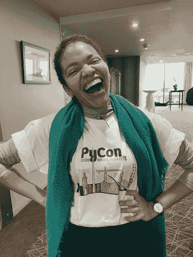

# 本周 PyDev:莱斯·卡瓦略

> 原文：[https://www.blog.pythonlibrary.org/2022/01/10/pydev-of-the-week-lais-carvalho/](https://www.blog.pythonlibrary.org/2022/01/10/pydev-of-the-week-lais-carvalho/)

本周我们欢迎 Lais Carvalho ( [@lais_bsc](https://twitter.com/lais_bsc) )成为我们本周的 PyDev！Lais 活跃在爱尔兰的多个 Python 用户组中，并帮助组织了多个 Python 会议。她也在最近的一集《T2》Python Bytes 中，所以一定要去看看！

如果你想了解 Lais 正在做的项目，请直接访问 GitHub。

让我们花一些时间来更好地了解 Lais！

你能告诉我们一些关于你自己的事情吗(爱好、教育等)。)

我叫 Lais Carvalho，是一家咨询公司 Quansight 的开发人员和社区倡导者，该公司为大多数可用的开源库提供支持，特别是在 Python 领域。我刚从 IT(信息技术)专业毕业，学了两年工程。我也是 [Python 爱尔兰](https://python.ie/)的志愿者，并帮助组织了一些 Python 会议。我最喜欢的是 EuroPython(欧洲最大的 Python 会议)和 PyJamas，这是一个邀请每个人穿着睡衣出席的在线活动。

**你为什么开始使用 Python？**

I started using Python in my first year of engineering university. I was struggling to learn WolframAlpha to check if my handmade calculations were correct, but everything used to be so hard and take so long. That was when chatting to one of our teachers, he mentioned I might prefer to use Python for that. I thought “well, it doesn't cost me much to try” and have become a fan since then, which I believe was in 2014.

**What other programming languages do you know and which is your favorite?**

I am not a programmer, which means that my main line of work is with people (not code) but I can build small things using Java and Python. My R skills are not something to be proud of but I can make beautiful graphs and pretend I understand data analysis well enough. I would like to try and learn GoLang or Julia next.

My favourite *do-it-all* language is Python due to its versatility. But languages are tools, one is welcome to choose whichever (s)he knows best in order to get the job done. To expand on the metaphor, it is elementary that a plier will not be the most effective to hammer nails on a wall, but it might do a fine job on acceptable time if the amount of nails is small or the time is limited and hammers are not available.

**What projects are you working on now?**

I am currently on medical license due to a cancer diagnosis received two weeks before my thesis delivery deadline. I am now finished with the treatment (in theory) and waiting to hear results back from the hospital. Keeping fingers crossed.

Before that, I was working on updating the documentation of one of Quansight’s Open Source libraries named [QHub](https://docs.qhub.dev/en/stable/index.html).

**Which Python libraries are your favorite (core or 3rd party)?**

There are so many wonderful ones, which makes this a very challenging question but in summary, I quite like *requests*, making HTTP requests human-friendly since 2011\. In addition, the more scientific ones like NumPy and SciPy, and the classy Manim for mathematical animations. Aw yes, and Flask for web apps! Not to mention the standard stuff, Python is all wonderful.

**How did you become so active with Python user groups?**

I started volunteering for PyCon Ireland in my second year in college (2019), because I believed networking was the most effective way to get into the industry. At the event, I met so many wonderful people and everyone had a project or initiative in need of help, so I volunteered. I remember being extremely excited about partaking in such an inclusive and fun community, so much so that when COVID restrictions arrived I became almost fully dedicated to the user groups. It was a good way to cope with lockdown and to meet wonderful people that ended up becoming close-personal friends of mine.

**What advice do you have for people who would like to start their own local Python user groups?**

Look around and see if there are people interested in joining you. Look for inspiration in existing groups and persevere. This is a huge community we are part of and there will always be someone willing to help in some way. Be vocal, ask for help, and don’t give up. Finally, if you are thinking about starting your own Python User Group in Ireland, come and speak to us at Python Ireland, we would be happy to help in any way we can.

**Is there anything else you’d like to say?**

I have just recorded an episode of [Python Bytes](https://pythonbytes.fm/episodes/show/263/it-s-time-to-stop-using-python-3.6) that you can find on their website or on Spotify. Wanna ask me something? DM me on Twitter at [@lais_bsc](https://twitter.com/lais_bsc).

Python Ireland:

*   A Speakers [Coaching Session](https://www.meetup.com/pythonireland/events/281468322/) is happening later this month and if you want to improve your public speaking skills, it is a great opportunity to do so.
*   Also, our monthly meetups happen on the second Wednesday of each month, online for now (due to COVID regulations) but working on coming back in person. The recorded sessions are added to the [YouTube](https://www.youtube.com/pythonireland) channel.
*   For more information, follow us on Twitter. [@pythonireland](https://twitter.com/pythonireland)

PyLadies Dublin:

*   All the PyLadies workgroups are incredible and they also need volunteers. If you’re looking for a safe place to join the Python Community, I would seriously recommend PyLadies! And the [Dublin cohort](https://twitter.com/PyLadiesDub) is led by the wonderful [Vicky](https://twitter.com/whykay).

EuroPython will start looking for volunteers for the in person event as well soon

Pyjamas happens in December, want to be notified about it? Follow us on twitter [@PyjamasConf](https://twitter.com/PyjamasConf) and subscribe to our [YouTube channel](https://www.youtube.com/c/Pyjamasconf).

**Thanks for doing the interview, Lais!**