# An Intro to Python Editors

> 原文：[https://www.blog.pythonlibrary.org/2021/09/26/python-editors/](https://www.blog.pythonlibrary.org/2021/09/26/python-editors/)

The Python programming language comes with its own built-in Integrated Development Environment (IDE) called **IDLE**. The name, IDLE, supposedly came from the actor, Eric Idle, who was a part of the Monty Python troupe, which is what Python itself is named after.

IDLE comes with Python on Windows and some Linux variants. You may need to install IDLE separately on your particular flavor of Linux or on Mac if you plan to use the Python that came with the operating system. You should check out the Python website for full instructions on how to do so as each operating system is different.

Here are some of the reasons that Integrated Development Environments are useful:

*   They provide syntax highlighting which helps prevent coding errors
*   Autocomplete of variable names and built-in names
*   Breakpoints and debugging.

On that last point, breakpoints tell the debugger where to pause execution. Debugging is the process of going through your code step-by-step to figure out how it works or to fix an issue with your code.

IDLE itself has other attributes that are useful, such as access to Python documentation, easy access to the source code via the Class Browser, and much more. However, IDLE is not the only way to code in Python. There are many useful IDEs out there. You can also use a text editor if you prefer. Notepad, SublimeText, Vim, etc., are examples of text editors. Text editors do not have all the features that a full-fledged IDE has, but tend to have the advantage of being simpler to use.

Here is a shortlist of IDEs that you can use to program in Python:

*   PyCharm
*   Wing Python IDE
*   VS Code (also called Visual Studio Code)
*   Spyder
*   Eclipse with PyDev

PyCharm and WingIDE both have free and paid versions of their programs. The paid versions have many more features, but if you are just starting out, their free offerings are quite nice. VS Code and Spyder are free. VS Code can also be used for coding in many other languages. Note that to use VS Code effectively with Python, you will need to install a Python extension. You can also use the PyDev plugin for Eclipse to program in Python.

Other popular editors for Python include SublimeText, vim, emacs, and even Notepad++. These editors may not be 100% up-to-date on the syntax of the language, but you can use them for multiple programming languages.

But let's back up a bit and talk about Python's basic console, also known as the REPL, which stands for Read Evaluate Print Loop.

## What About the REPL?

REPL or READ, EVAL, PRINT, LOOP is basically Python's interpreter. Python allows you to type code into an interpreter which will run your code live and let you learn about the language. You can access the interpreter, or REPL, by running Python in your terminal (if you are on Mac or Linux) or command console (if you are on Windows).

On Windows, you can go to the Start menu and search for `cmd` or "Command Prompt" to open the console or terminal:

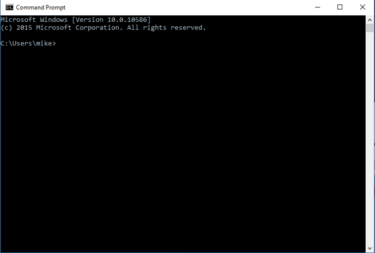

Once you have the terminal open you can try typing `python`. You should see something like this:

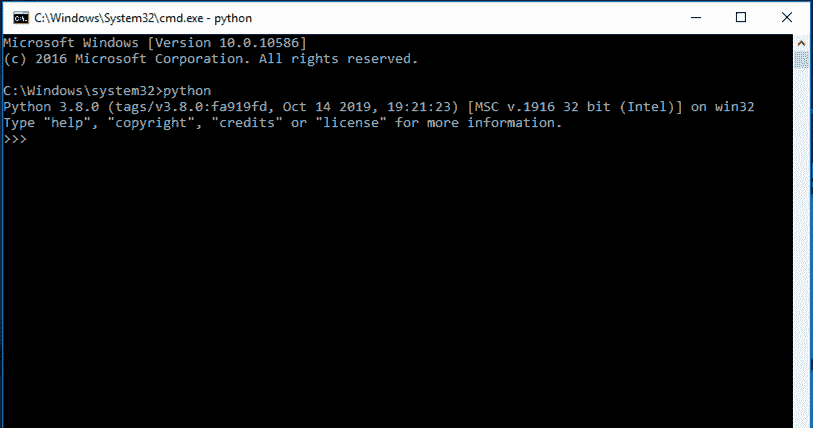

If this doesn't work and you get an "Unrecognized Command" or some other error, then Python may not be installed or configured correctly. On Windows, you may need to add Python to your system's path or you can just type out the full path to Python in your command console. For example, if you installed Python in `C:\Python\Python38`, then you can run it using `cmd.exe` like you did above, but instead of typing `python`, you would type `C:\Python\Python38\python`.

If you need to get help in the REPL, you can type `help()`:

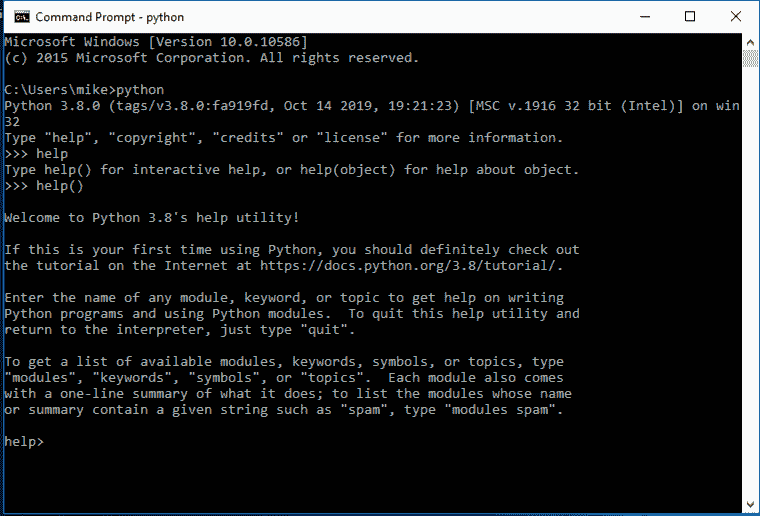

You can type live Python code into the REPL and it will be immediately evaluated, which means the code will run as soon as you press enter.

Here's how you would print out "Hello World" and add some numbers in the REPL:

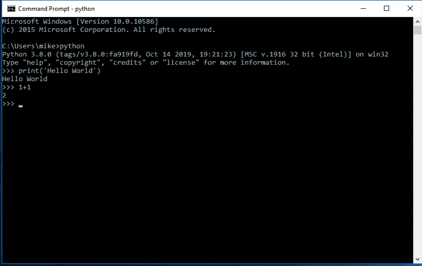

Python comes with its own code editor called IDLE. Let's learn about that next!

## Getting Started with IDLE

IDLE is a good place to start learning Python. Once you have it installed, you can start it up and the initial screen will look like this:

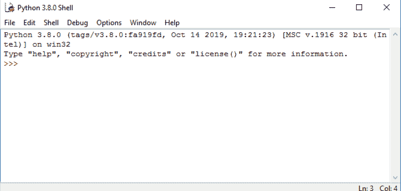

This is a REPL. You can enter code here and it will be evaluated as soon as you press the Return or Enter key.

If you want to actually write a full program, then you will need to open up the editor view by going to **File** --> **New**.

You should now have the following dialog on your screen:

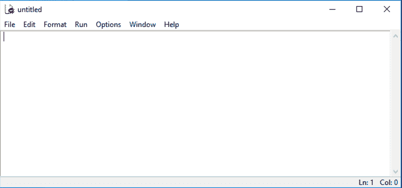

You can enter your code here and save it.

### Running Your Code

Let's write a small bit of code in our code editor and then run it. Enter the following code and then save the file by going to **File** --> **Save**.

```py
print('Hello World')
```

To run this code in IDLE, go to the **Run** menu and choose the first option labeled **Run Module**:

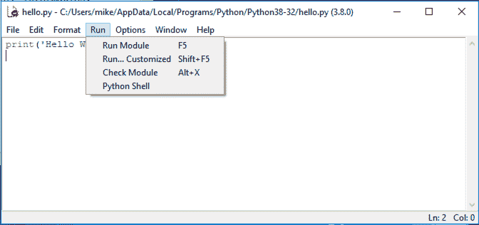

When you do this, IDLE will switch to the Shell and show you the output of your program, if there is any:

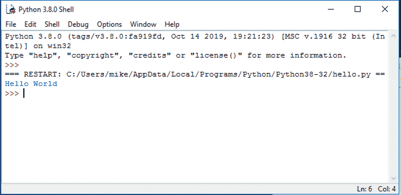

You can also use the **Run** menu's **Check Module** option to check your code for syntax errors.

### Accessing Help / Documentation

Sometimes you need help. Fortunately IDLE has some built-in help about itself and the Python language, too! You can access help about IDLE by going to the **Help** menu and choosing **IDLE Help**:

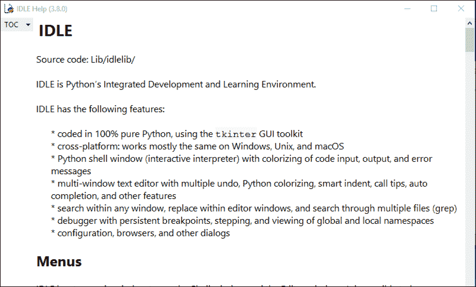

If you'd rather look up how something works in the Python language, then go to the **Help** menu and choose **Python Docs** or press F1 on your keyboard:

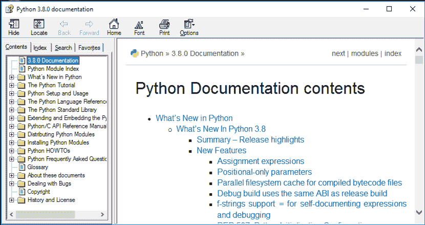

This will show you Python's official documentation. Depending on your O/S this may load local help files, or start a browser to show the official on-line help documents.

### Restarting the Shell

Let's go back to the Shell screen of IDLE rather than the editor. It has several other functions that are worth going over. The first is that you can restart the shell.

Restarting the shell is useful when you need to start over with a clean slate but don't want to close and reopen the program. To restart the shell, go to the **Shell** menu and choose **Restart Shell**:

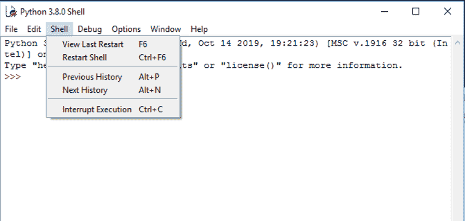

If you haven't restarted the shell before, then your screen will look like this:

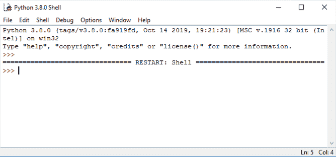

This tells you that your shell has restarted.

### Module Browser

IDLE comes with a handy tool called the **Module Browser**. This tool can be found in the **File** menu.

When you open it, you will see the following:

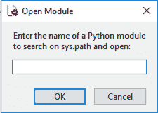

Modules in Python are code that the Python core development team has created for you. You can use the **Module Browser** to browse the source code of Python itself.

Try entering the following into the dialog above: **os**. Then press OK.

You should now see the following:

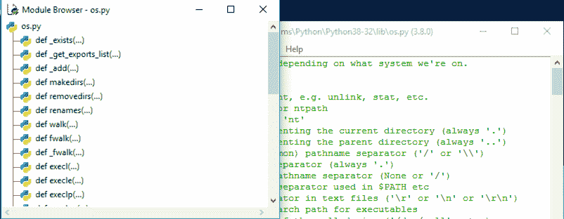

This allows you to browse the source code for `os.py`. You can double-click anything in the **Module Browser** and it will jump to the beginning of where that code is defined in IDLE's code editor.

### Path Browser

Another useful tool that you can use in IDLE is the **Path Browser**. The **Path Browser** allows you to see where Python is installed and also what paths Python uses to import modules from. You will learn more about importing and modules later on in this book.

You can open it by going to **File** and then **Path Browser**:

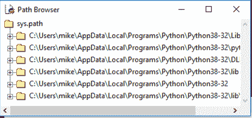

The **Path Browser** is a good way to diagnose issues with importing modules. It can show you that you might not have Python configured correctly. Or it might show you that you have installed a 3rd party module in the wrong location.

## Getting Started with PyCharm Community Edition

PyCharm is a commercial Python IDE from a company called JetBrains. They have a professional version, which costs money, and a community edition, which is free. PyCharm is one of the most popular choices for creating and editing Python programs.

PyCharm Professional has tons of features and is a great debugger. However, if you are a beginner, you may find all the functionality in this software to be a bit overwhelming.

To get a copy of PyCharm Community Edition, you can go to the following website:

[https://www.jetbrains.com/pycharm/](https://www.jetbrains.com/pycharm/)

The Community Edition does not have all the features that PyCharm Professional has. But that is okay when you are new to Python. If you would like to try PyCharm, go ahead and download and install the software.

When you run PyCharm it may ask you to import settings. You can ignore that or import settings if you have used PyCharm previously and already have some.

Next, you will probably need to accept their privacy policy / EULA. Depending on the operating system, you may also get asked what theme to apply. The default is Darkula on Windows.

At this point you should see the following Welcome banner:

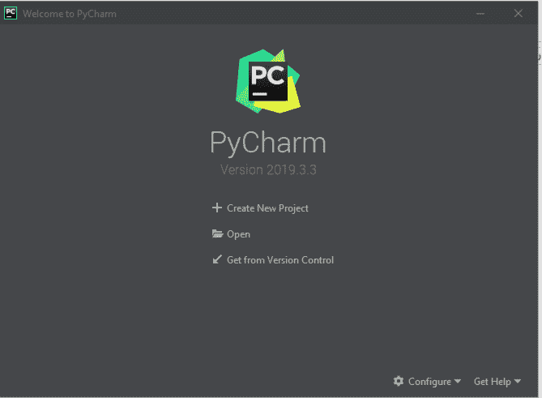

PyCharm prefers that you work in a project rather than opening a simple file. Projects are typically collections of related files or scripts. You can set up a new project here or open a pre-existing one.

Once you have gone through that process, your screen should look like this:

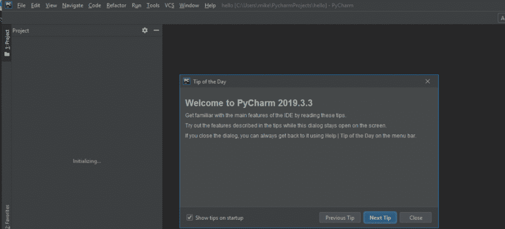

### Creating a Python Script

To create a new Python script in PyCharm, you can go to **File** and choose **New**. Then pick **Python File** from the choices presented:

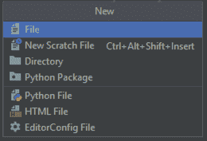

Give the file a name, such as **hello.py**. Now PyCharm should look like this:

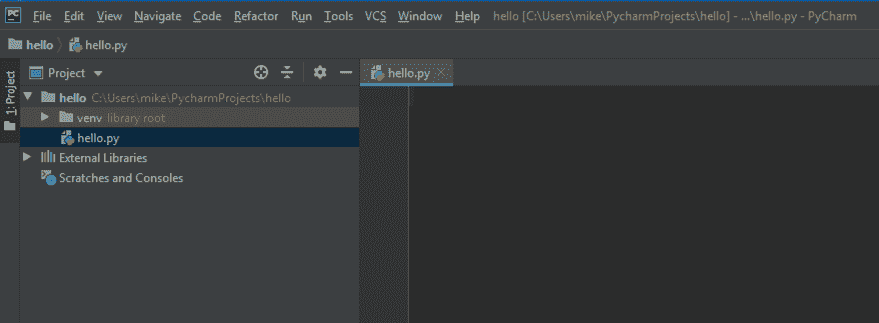

### Running Code in PyCharm

Let's add some code to your file:

```py
print('Hello PyCharm')
```

To run your code, go to the **Run** menu and choose **Run**. PyCharm might ask you to set up a debug configuration before running it. You can save the defaults and continue.

You should now see the following at the bottom of PyCharm:

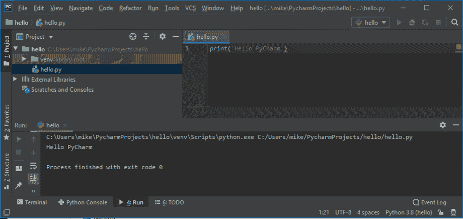

### PyCharm Features

PyCharm has tons of features. In fact, it has so many that you could write an entire book on them. For the purposes of this book, you should know that PyCharm will give you suggestions about your code based on PEP8, which is Python's code style guide. You will learn more about that in the next chapter. It will also highlight many other things about your code.

You can usually hover over any code that looks weird to you and a tooltip will appear that will explain the issue or warning.

The debugger that ships with PyCharm is useful for figuring out why your code doesn't work. You can use it to walk through your code line-by-line.

PyCharm's documentation is quite good, so if you get stuck, check their documentation.

## Getting Started with Wing Personal

Wingware's Python IDE is written in Python and PyQt. It is my personal favorite IDE for Python. You can get it in Professional (paid), Personal (free) or 101 (really stripped-down version, but also free). Their website explains the differences between the 3 versions.

You can get Wingware here:

[https://wingware.com/](https://wingware.com/)

After you have downloaded and installed the software, go ahead and run it. You will need to accept the License Agreement to load up the IDE.

Once it is fully loaded, you will see something like this:

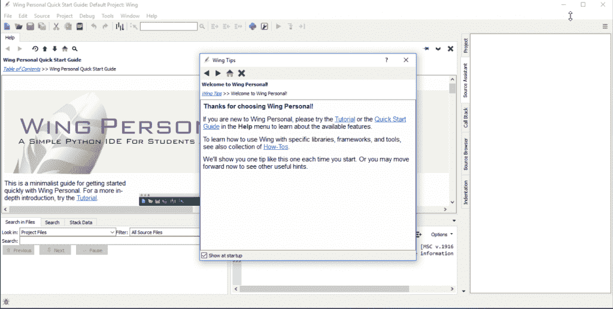

### Running Code in Wingware

Let's create some code in Wing. You can open a new file by going to the **File** menu and choosing **New**:

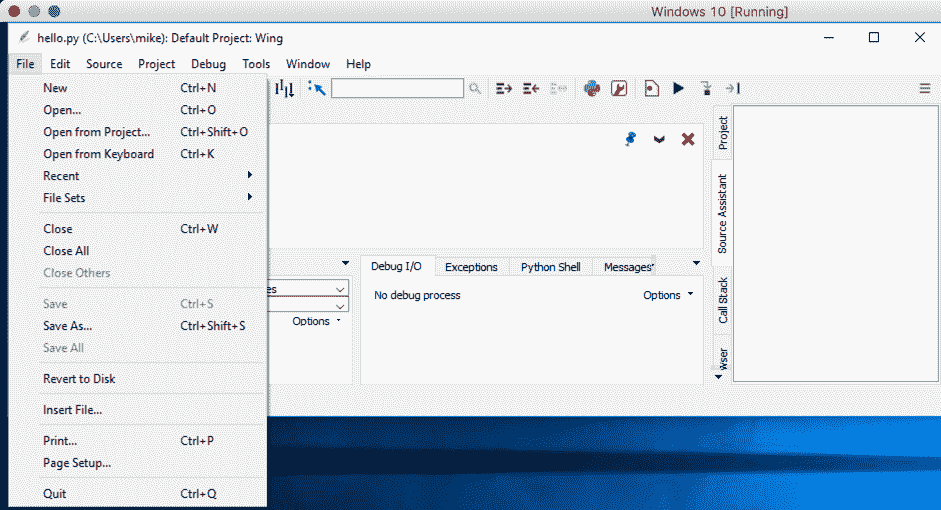

Now enter the following code:

```py
print('Hello Wingware')
```

Save the code to disk by going to **File** and then **Save**.

To run this code, you can go to the **Debug** menu, press F5 or click the green "play" button in the toolbar. You will see a debug message dialog:

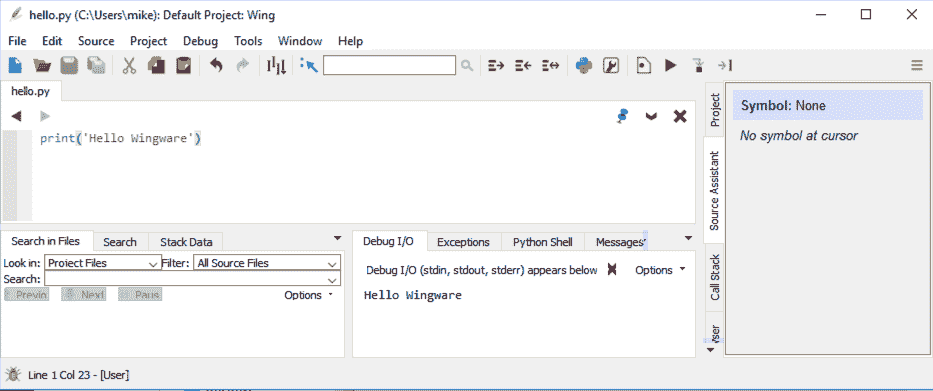

Hit OK and the code will run. You will see the output in the **Debug I/O** tab if there is any.

Note that Wing does not require you to create a project to run a single Python file. You can create projects if you want to though.

### Wing Features

Wing has an incredible debugger. However, you cannot use it to its full extent in the free versions of the software. But there is a **Source Assistant** tab in the Personal edition that is very useful. It will show you information about the functions / modules that you have loaded as you use them. This makes learning new modules much easier.

Wing will also show you various issues with your code while you type, although PyCharm seems to do more in this area than Wing does.

Both products have plugins and you can write your own for both IDEs as well.

## Getting Started with Visual Studio Code

Visual Studio Code, or VS Code for short, is a general-purpose programming editor. Unlike PyCharm and WingIDE, it is designed to work with lots of languages. PyCharm and WingIDE will let you write in other languages too, but their primary focus is on Python.

VS Code is made by Microsoft and it is free. You can download it here:

[https://code.visualstudio.com/](https://code.visualstudio.com/)

Once you have it downloaded and installed, you will need to install support for Python from the VS Code marketplace.

If you open up VS Code, the screen will look something like this:

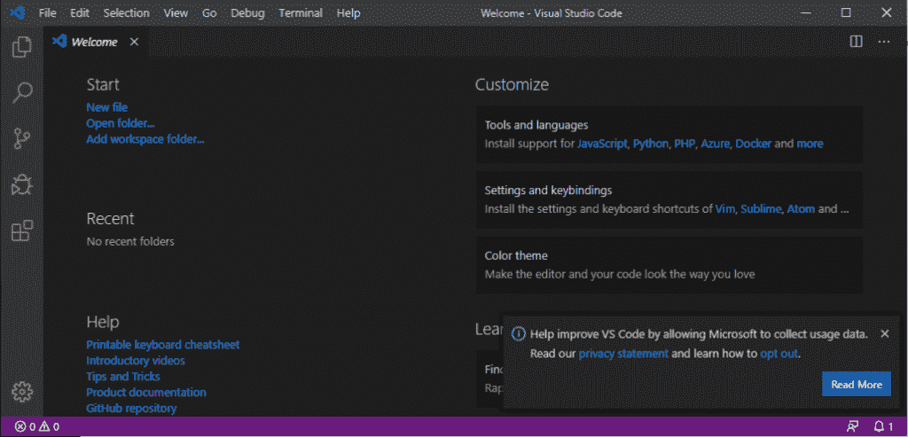

Under **Customize** you can see there is an option for installing Python. If that isn't there, you can click on the **Extensions** button that is on the left and search for Python there:

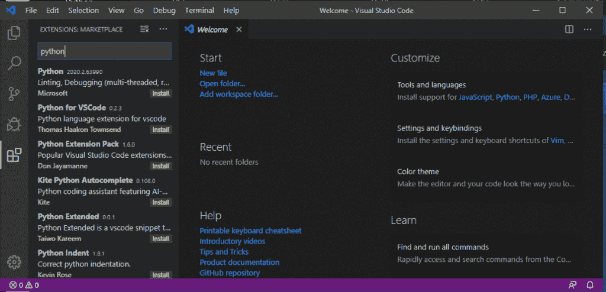

Go ahead and install the Python extension so that VS Code will recognize Python correctly.

### Running Code in VS Code

Open a folder in the **File Explorer** tab and then you can right-click in there to create a new file. Alternatively, you can go to the **File** menu and choose **New File** and do it that way.

Once that is done, you can enter the following code and save it:

```py
print('Hello VS Code')
```

Then right-click anywhere in the editor and select the **Run Python File in Terminal** selection. This will cause your code to run and you will see the following:

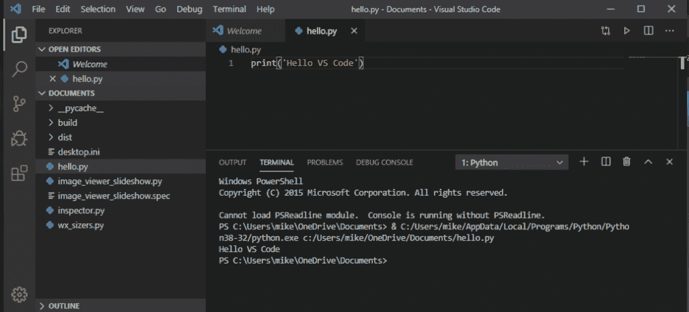

**Note:** I didn't have the **PSReadline** module installed when I ran this code which is why you see the error in the console above.

### VS Code Features

VS Code can run all kinds of different languages. However, for the purposes of Python, Microsoft has a team of Python developers that are constantly improving this IDE and adding new features. There are tons of extensions that you can install to enhance the editor's functionality.

One of the coolest extensions that you can install is **Live Share**, which lets you do real-time collaboration between developers. It basically shares your coding session with others. Since this IDE is the newest of the bunch and its feature set is changing a lot, you will need to research it on your own time.

## Wrapping Up

There are lots of Python code editors to choose from. IDLE is nice in that it comes with Python and is written in Python, so you can actually learn a lot just by looking at its source code. PyCharm and VS Code are very popular right now. Wing IDE used to be more popular than it is today, but I think it is still really great. All of these tools are good, but you should give them a try to see which one works the best for you.

## Related Reading

Want to learn more Python basics? Then check out the following tutorials:

*   Python 101: [An Intro to Working with JSON](https://www.blog.pythonlibrary.org/2020/09/15/python-101-an-intro-to-working-with-json/)

*   Python 101 – [Creating Multiple Processes](https://www.blog.pythonlibrary.org/2020/07/15/python-101-creating-multiple-processes/)

*   Python 101 – [Debugging Your Code with pdb](https://www.blog.pythonlibrary.org/2020/07/07/python-101-debugging-your-code-with-pdb/)