# python 101-Jupyter 笔记本简介

> 原文：<https://www.blog.pythonlibrary.org/2021/09/19/python-101-an-intro-to-jupyter-notebook/>

Jupyter Notebook 是一个开源的网络应用程序，它允许你创建和共享包含代码、公式、可视化和格式化文本的文档。默认情况下，Jupyter Notebook 开箱即可运行 Python。此外，Jupyter Notebook 通过扩展支持许多其他编程语言。您可以使用 Jupyter 笔记本进行数据清理和转换、数值模拟、统计建模、数据可视化、机器学习等等！

在本章中，您将了解以下内容:

*   安装 Jupyter 笔记本电脑
*   创建笔记本
*   添加内容
*   添加降价内容
*   添加扩展
*   将笔记本导出为其他格式

本章并不是 Jupyter 笔记本的全面教程。相反，它将向您展示如何使用笔记本的基本知识，以及为什么它可能有用。如果你对这项技术感兴趣，你可能想看看我写的关于这个主题的书，Jupyter 笔记本 101。

我们开始吧！

## 安装 Jupyter 笔记本电脑

Jupyter Notebook 没有附带 Python。您需要使用`pip`来安装它。如果你用的是 **Anaconda** 而不是官方的 Python，那么 Jupyter Notebook 预装了 Anaconda。

以下是如何用`pip`安装 Jupyter 笔记本电脑:

```
python3 -m pip install jupyter

```

当你安装 Jupyter Notebook 的时候，它会安装很多其他的依赖项。您可能希望将 Jupyter Notebook 安装到 Python 虚拟环境中。更多信息见第 21 章。

安装完成后，您就可以创建 Jupyter 笔记本了！

## 创建笔记本

创建笔记本是一个基本概念。Jupyter Notebook 通过自己的服务器运行，该服务器包含在您的安装中。为了能够使用 Jupyter 做任何事情，您必须首先通过运行以下命令启动这个 **Jupyter 笔记本服务器**:

```
jupyter notebook
```

该命令将启动您的默认浏览器或打开一个新的选项卡，这取决于您的浏览器是否已经运行。在这两种情况下，您将很快看到一个指向以下 URL 的新选项卡:[http://localhost:8888/tree](http://localhost:8888/tree)。您的浏览器应该会加载如下所示的页面:

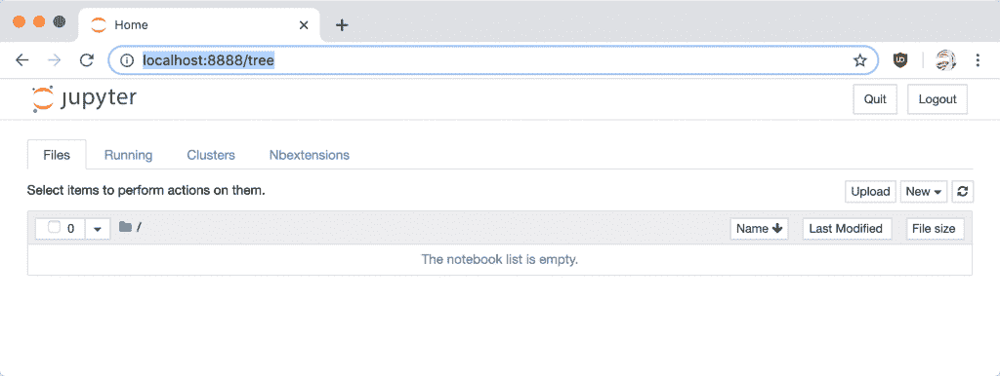

Jupyter 服务器

在这里，您可以通过点击右侧的**新建**按钮来创建笔记本:

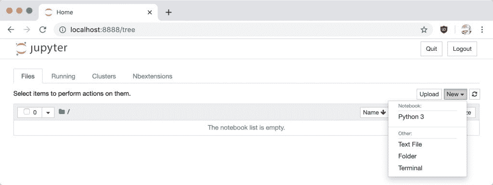

创建 Jupyter 笔记本

您可以使用此菜单以及文本文件、文件夹和浏览器内终端会话来创建笔记本。现在，你应该选择 **Python 3** 选项。

完成后，将会打开一个新的选项卡，其中会加载您的新笔记本:

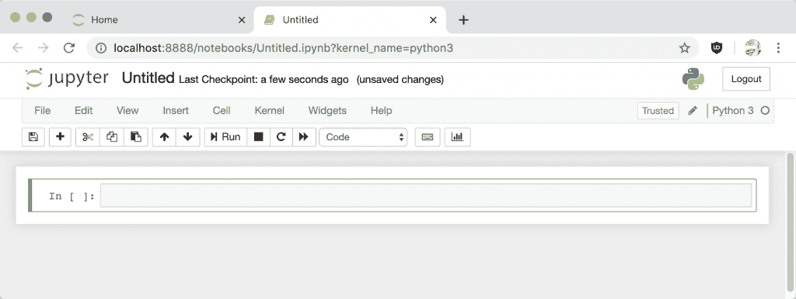

一个新笔记本

现在，让我们了解一下如何与笔记本互动！

### 命名您的笔记本

笔记本上面写着*无标题*。要解决这个问题，你需要做的就是点击单词*无标题*，一个浏览器内对话框就会出现:

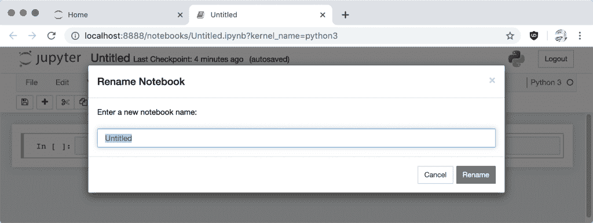

重命名笔记本

重命名笔记本时，它还会重命名保存该笔记本的文件，以便与您为其指定的名称相匹配。你可以把这个笔记本命名为“Hello World”。

### 运行单元

Jupyter 笔记本电池是奇迹发生的地方。这是您可以创建内容和交互式代码的地方。默认情况下，笔记本将在代码模式下创建单元格。这意味着它将允许您在创建笔记本时选择的任何内核中编写代码。内核指的是你在创建 Jupyter 笔记本时选择的编程语言。您在创建这个笔记本时选择了 Python 3，因此您可以在单元格中编写 Python 3 代码。

现在单元格是空的，所以它什么也不做。让我们添加一些代码来改变这种情况:

```
print('Hello from Python!')
```

要执行一个单元格的内容，你需要**运行**那个单元格。选择单元后，有三种运行方式:

*   点击顶部按钮行中的**运行**按钮
*   从笔记本菜单导航至`Cell -> Run Cells`
*   使用键盘快捷键: **Shift+Enter**

运行该单元格时，输出应该如下所示:

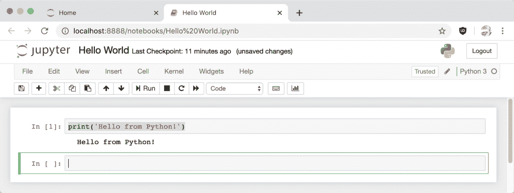

运行 Jupyter 笔记本电池

Jupyter 笔记本细胞记得他们运行的顺序。如果您没有按顺序运行单元格，您可能会因为没有按正确的顺序导入内容而导致错误。然而，当您按顺序运行单元格时，您可以在一个单元格中写入导入，并在后面的单元格中使用这些导入。笔记本使得将代码的逻辑片段放在一起变得简单。事实上，您可以在代码单元之间放置解释单元、图表等，而代码单元仍将彼此共享。

当您运行一个单元格时，单元格旁边会有一些括号，这些括号中会填入一个数字。这表示单元运行的顺序。在本例中，当运行第一个单元格时，括号中填入了数字 1。因为笔记本中的所有代码单元都在同一个全局名称空间上操作，所以能够跟踪代码单元的执行顺序非常重要。

### 了解菜单

Jupyter 笔记本中有一个菜单，您可以使用它来处理您的笔记本。菜单在笔记本的顶部。以下是您的菜单选项:

*   文件
*   编辑
*   视角
*   插入
*   细胞
*   核心
*   小工具
*   帮助

让我们看一下这些菜单。开始使用 Jupyter 时，您不需要了解这些菜单中的每个选项，因此这将是一个高层次的概述。

**文件**菜单用于打开笔记本或创建新的笔记本。您也可以在此重命名笔记本。笔记本的一个很好的特性是你可以创建**检查点**。检查点允许您回滚到以前的状态。要创建检查点，进入*文件*菜单，选择*保存和检查点*选项。

*编辑*菜单包含常规的剪切、复制和粘贴命令，您可以在单元格级别使用这些命令。您还可以从这里删除、拆分或合并单元格。最后，您可以使用此菜单对单元格重新排序。

你会发现这里的一些选项是灰色的。项目呈灰色的原因是因为该选项不适用于笔记本中当前选定的单元格。例如，如果您选择了一个代码单元格，您将无法插入图像。尝试将单元格类型更改为 Markdown，以查看选项如何变化。

*视图*菜单用于切换页眉和工具栏的可见性。这也是你打开或关闭*线号*的地方。

*插入*菜单用于在当前选中单元格的上方或下方插入单元格。

*单元格*菜单对于运行一个单元格、一组单元格或笔记本中的任何内容都很有用！您可以在这里更改单元格类型，但您可能会发现工具栏比菜单更直观。

*单元格*菜单的另一个有用的特性是，你可以用它来清除单元格的输出。许多人与他人分享他们的笔记本。如果你想这样做，清除细胞的输出是有用的，这样你的朋友或同事就可以自己运行细胞并发现它们是如何工作的。

*内核*菜单用于操作内核本身。内核指的是编程语言插件。您偶尔需要重启、重新连接或关闭您的内核。您还可以更改笔记本中运行的内核。

你不会经常使用内核菜单。然而，当您需要在 Jupyter Notebook 中进行一些调试时，重启内核比重启整个服务器更方便。

*微件*菜单用于清除和保存微件状态。小部件是向笔记本添加动态内容的一种方式，如按钮或滑块。这些是在幕后用 JavaScript 编写的。

最后一个菜单是*帮助*菜单。您可以在这里了解笔记本电脑的特殊快捷键。它还提供了用户界面浏览和大量参考资料，您可以使用它们来学习如何更好地与您的笔记本进行交互。

现在让我们学习如何在笔记本中创建内容！

## 添加内容

您可以为笔记本电脑选择两种主要的内容类型:

*   密码
*   降价

从技术上讲，还有两种细胞类型可供选择。一个是 **Raw NBConvert** ，仅用于使用`nbconvert`命令行工具时的特殊用例。此工具用于将您的笔记本转换为其他格式，如 PDF。

另一种是**标题**，实际上已经不用了。如果您选择这种单元格类型，您将收到以下对话框:


标题类型

您已经看到了如何使用默认的单元格类型，**代码**。所以下一节将关注**降价**。

### 创建降价内容

Markdown 单元格类型允许您设置文本格式。您可以创建标题，添加图像和链接，以及用斜体、粗体等格式设置您的文本。

这一章不会涵盖你可以用 Markdown 做的所有事情，但是它会教你一些基础知识。让我们来看看如何做几件不同的事情！

### 格式化您的文本

如果你想在文本中添加斜体，你可以使用单下划线或单星号。如果你想加粗你的文本，那么你可以将星号或下划线的数量增加一倍。

这里有几个例子:

```
You can italicize like *this* or _this_

Or bold like **this** or __this__
```

尝试将您的笔记本单元格设置为 Markdown，并将上面的文本添加到其中。然后，您会看到笔记本会自动为您设置文本格式:

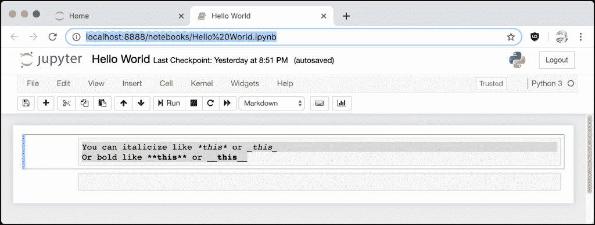

格式化文本

当您运行单元格时，它会很好地格式化文本:

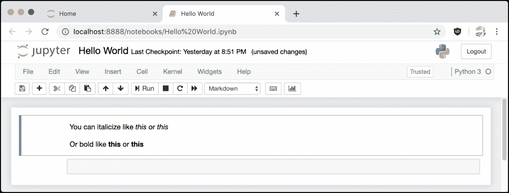

格式化文本(运行后)

如果您需要再次编辑该单元格，您可以双击该单元格，它将返回到编辑模式。

现在让我们来看看如何添加标题级别！

### 使用标题

标题非常适合在笔记本中创建分区，就像在 Microsoft Word 中创建网页或文档一样。要在 Markdown 中创建标题，您可以使用一个或多个`#`符号。

以下是一些例子:

```
# Heading 1
## Heading 2
### Heading 3
#### Heading 4
```

如果您将上面的代码添加到笔记本中的一个 Markdown 单元格中，它将如下所示:

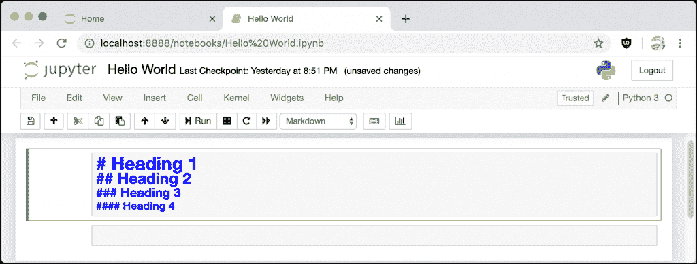

降价标题

您可以看到，笔记本已经为您生成了一种预览，方法是稍微收缩每个标题级别的文本。

当您运行该单元时，您将看到如下内容:

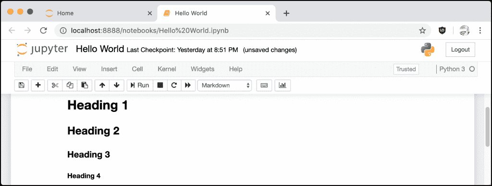

降价标题(运行后)

正如你所看到的，Jupyter 很好地将你的文本格式化为不同层次的标题，这有助于你的文本结构。

### 添加列表

在 Markdown 中，创建一个列表或项目符号非常简单。要创建一个列表，需要在行首添加一个星号(`*`)或破折号(`-`)。

这里有一个例子:

```
* List item 1
 * sub item 1
 * sub item 2
* List item 2
* List item 3

```

让我们将此代码添加到您的笔记本中:

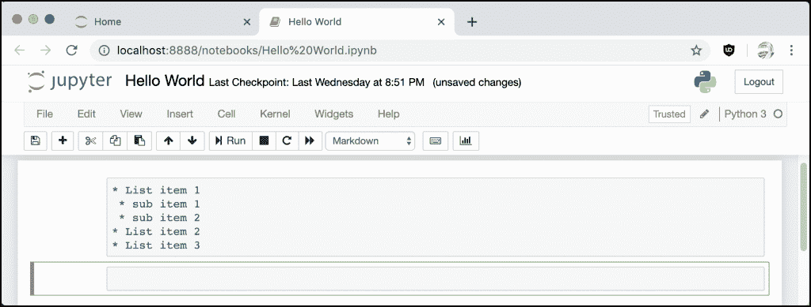

在 Markdown 中添加列表

这一次，您实际上没有得到列表的预览，所以让我们运行单元格来看看您得到了什么:

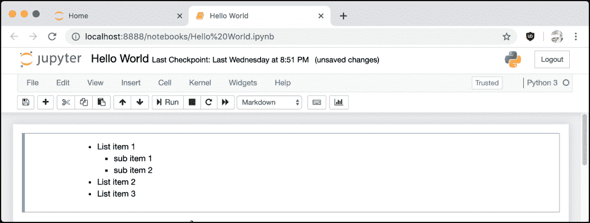

Markdown 中的列表(运行后)

看起来不错！现在让我们来看看如何让你的代码语法高亮！

### 突出显示代码语法

笔记本已经允许你显示和运行代码，它们甚至显示语法高亮。然而，这只适用于 Jupyter Notebook 中安装的内核或语言。

如果您想显示未安装的另一种语言的代码，或者如果您想突出显示语法，而不允许用户运行代码，那么您可以使用 Markdown。

要在 Markdown 中创建一个代码块，您需要使用 3 个反勾号，后跟您想要显示的语言。如果您想要突出显示内联代码，请用单个反勾号将代码段括起来。但是，请记住，内联代码不支持语法突出显示。

笔记本里有两个例子:

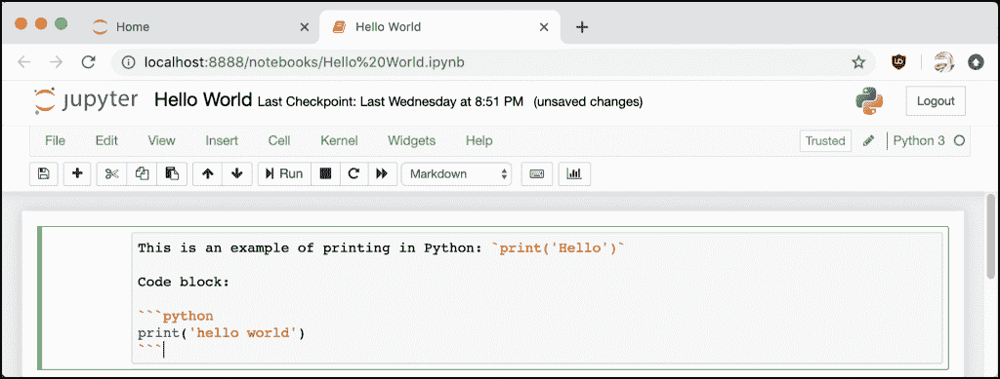

降价中的语法突出显示

当您运行单元格时，笔记本会将降价转换为以下内容:

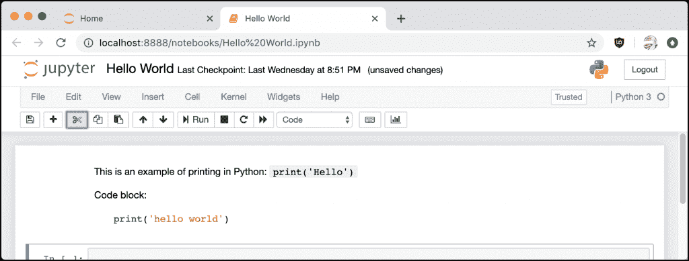

语法突出显示(运行后)

这里您可以看到代码现在是如何突出显示语法的。

现在让我们学习如何生成一个超链接！

### 创建超链接

在 Markdown 中创建超链接非常容易。语法如下:

```
[text](URL)
```

所以如果你想链接到谷歌，你可以这样做:

```
[Google](https://www.google.com)
```

下面是笔记本中的代码:

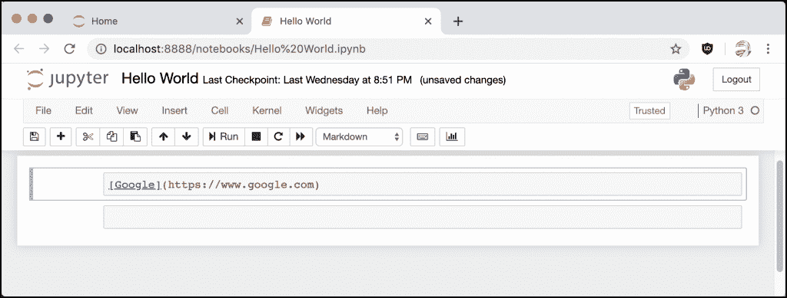

超链接降价

当您运行单元格时，您会看到降价变成了一个常规的超链接:

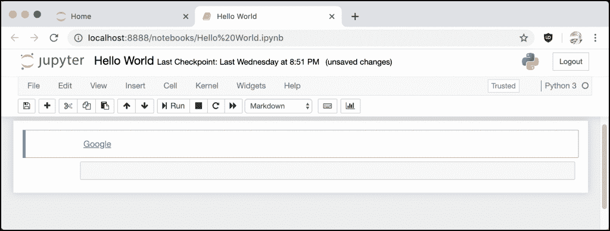

超链接降价(运行后)

正如你所看到的，减价已经变成了一个传统的超链接。

接下来让我们来了解一下 Jupyter extensions！

## 添加扩展

Jupyter 笔记本开箱即可拥有大量功能。如果你需要更多的东西，你也可以从一个大的扩展生态系统中通过扩展添加新的特性。有四种不同类型的扩展可用:

*   核心
*   IPython 内核
*   笔记本
*   笔记本服务器

大多数时候，你会想安装一个笔记本扩展。

Jupyter Notebook 的扩展在技术上是一个 JavaScript 模块，它将被加载到笔记本的前端，以添加新的功能或使笔记本看起来不同。如果你懂 JavaScript，你可以自己写扩展！

如果你需要给 Jupyter Notebook 添加一些新的东西，你应该使用谷歌看看是否有人写了一些对你有用的东西。最流行的扩展实际上是一个名为**jupyter _ contrib _ nb extensions**的大型扩展集，您可以从这里获得:

*   [https://github . com/ipython-contrib/jupyter _ contrib _ nb extensions](https://github.com/ipython-contrib/jupyter_contrib_nbextensions)

大多数好的扩展可以使用`pip`来安装。例如，要安装上面提到的那个，您可以运行以下命令:

```
$ pip install jupyter_contrib_nbextensions
```

有几个和`pip`不兼容。在这些情况下，您可以使用 Jupyter 本身来安装扩展:

```
$ jupyter nbextension install NAME_OF_EXTENSION
```

虽然这安装了扩展供 Jupyter 使用，但它并没有激活扩展。如果您使用此方法安装扩展，则需要先启用它，然后才能使用它。

要启用扩展，您需要运行以下命令:

```
$ jupyter nbextension enable NAME_OF_EXTENSION
```

如果您在运行 Jupyter Notebook 时安装了扩展，您可能需要重新启动内核或整个服务器才能使用新的扩展。

您可能希望获得**Jupyter nb extensions Configurator**扩展来帮助您管理您的扩展。这是一个简洁的扩展，用于在笔记本用户界面中启用和禁用其他扩展。它还显示您当前已经安装的扩展。

## 将笔记本导出为其他格式

在您创建了一个令人惊叹的笔记本后，您可能想与其他不像您这样精通计算机的人分享它。Jupyter Notebook 支持将笔记本转换为其他格式:

*   超文本标记语言
*   乳液
*   便携文档格式
*   RevealJS
*   降价
*   重组后的文本
*   可执行脚本

您可以使用最初安装 Jupyter Notebook 时安装的`nbconvert`工具转换笔记本。要使用`nbconvert`，您可以执行以下操作:

```
$ jupyter nbconvert <notebook file> --to <output format>

```

假设您想将笔记本转换为 PDF 格式。为此，您应该这样做:

```
$ jupyter nbconvert my_notebook.ipynb --to pdf

```

当它将笔记本转换成 PDF 时，您会看到一些输出。`nbconvert`工具还会显示转换过程中遇到的任何警告或错误。如果该过程成功完成，您将在笔记本文件所在的文件夹中拥有一个`my_notebook.pdf`文件

Jupyter 笔记本也提供了一种更简单的方式来转换您的笔记本。你可以从笔记本本身的*文件*菜单中选择。您可以选择`Download as`选项进行转换。

根据您所在的平台，您可能需要安装 LaTeX 或其他依赖项，以使某些导出格式正常工作。

## 包扎

Jupyter 笔记本是一种学习如何使用 Python 或机器学习的有趣方式。这是一种很好的组织数据的方式，这样你就可以和别人分享了。您可以使用它来创建演示文稿、展示您的作品以及运行您的代码。

在本文中，您了解了以下内容:

*   安装 Jupyter 笔记本电脑
*   创建笔记本
*   添加内容
*   添加降价内容
*   添加扩展
*   将笔记本导出为其他格式

你应该试试 Jupyter 笔记本。这是一个有用的编码环境，非常值得您花费时间。

## 相关文章

在以下文章中了解更多关于 Jupyter 笔记本的功能:

*   向[长期运行的 Jupyter 笔记本单元格添加通知](https://www.blog.pythonlibrary.org/2019/12/04/adding-notifications-to-long-running-jupyter-notebook-cells/)

*   [使用 Jupyter 笔记本小工具](https://www.blog.pythonlibrary.org/2018/10/24/working-with-jupyter-notebook-widgets/)

*   [创建具有交互功能的 Jupyter 笔记本小部件](https://www.blog.pythonlibrary.org/2018/10/23/creating-jupyter-notebook-widgets-with-interact/)

*   [Jupyter 笔记本调试](https://www.blog.pythonlibrary.org/2018/10/17/jupyter-notebook-debugging/)