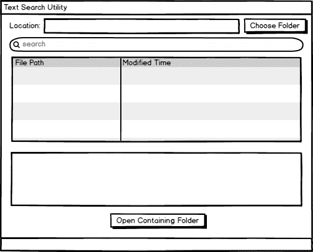
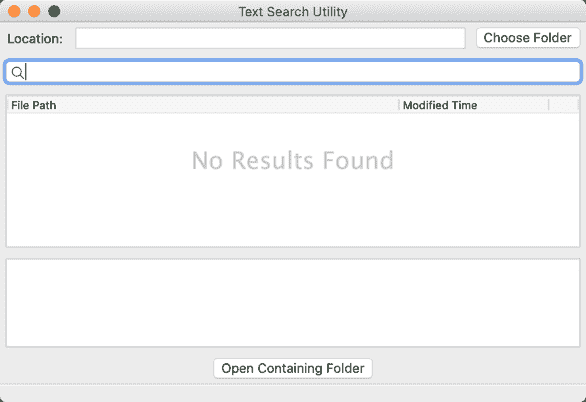
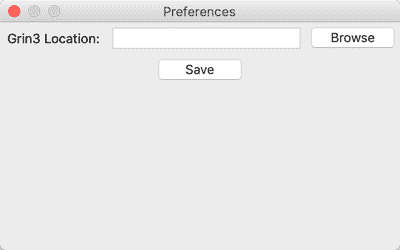

# 用 wxPython 创建文本搜索 GUI

> 原文：<https://www.blog.pythonlibrary.org/2021/09/04/creating-a-text-search-gui-with-wxpython/>

在前面的教程中，您学习了如何使用 wxPython 创建文件搜索 GUI。在本文中，您将学习如何使用 wxPython 创建一个文本搜索实用程序。

如果你想了解更多关于创建 GUI 应用程序的知识，你应该看看我的书**用 wxPython** 在 [Leanpub](https://leanpub.com/creatingapplicationswithwxpython/) 、 [Gumroad](https://gum.co/Eogsr) 或 [Amazon](https://www.amazon.com/dp/0996062890) 上创建 GUI 应用程序。

你可以在 [GitHub](https://github.com/driscollis/applications_with_wxpython/tree/master/chapter11_search_utility) 上下载这篇文章的源代码。注意:本文依赖于来自[的用 wxPython](https://www.blog.pythonlibrary.org/2021/09/02/creating-a-file-search-gui-with-wxpython/) 创建文件搜索 GUI 的一些代码。

现在，让我们开始吧！

## 文本搜索实用程序

文本搜索工具是一种可以在其他文件中搜索单词或短语的工具，比如流行的 GNU **grep** 工具。有一些工具也可以搜索 Microsoft Word、PDF 文件内容等等。您将只专注于搜索文本文件。除了常规文本文件之外，这些文件还包括 XML、HTML、Python 文件和其他代码文件。

有一个很好的 Python 包为我们做文本搜索，名为`grin`。因为这本书使用的是 Python 3，你会想要使用`grin3`，因为这是与 Python 3 兼容的`grin`的版本。

您可以在此阅读关于该套餐的所有信息:

*   [https://pypi.org/project/grin3/](https://pypi.org/project/grin3/)

您将在这个包的顶部添加一个轻量级用户界面，允许您使用它来搜索文本文件。

## 安装依赖项

您可以使用`pip`安装`grin3`:

```
pip install grin3
```

一旦安装完毕，你将能够在 Mac 或 Linux 上从命令行运行`grin`或`grind`。如果您在 Windows 上，您可能需要将它添加到您的路径中。

**警告:**`grin3`之前的版本是`grin`。如果你把它安装到 Python 3 中并试图运行它，你会看到错误，因为`grin`与**Python 3 不兼容。你需要卸载`grin`，然后安装`grin3`。**

现在你可以设计你的用户界面了！

## 设计文本搜索工具

您可以从本章前面的文件搜索实用程序中获取代码，并修改用户界面以用于文本搜索。您现在不关心搜索词是否区分大小写，所以您可以删除这个小部件。你也可以去掉子目录复选框，因为默认情况下`grin`会搜索子目录，这也是你想要的。

您仍然可以按文件类型过滤，但是为了简单起见，让我们也删除它。但是，您需要一种方法来显示找到的文件以及包含找到的文本的行。为此，除了`ObjectListView`小部件之外，您还需要添加一个多行文本控件。

记住所有这些，这里是模型:



是时候开始编码了！

## 创建文本搜索实用程序

新的文本搜索工具将分为三个模块:

*   主模块
*   搜索线程模块
*   偏好模块

**主**模块将包含主用户界面的代码。 **search_thread** 模块将包含使用`grin`搜索文本的逻辑。最后，**首选项**将用于创建一个对话框，您可以用它来保存`grin`可执行文件的位置。

现在您可以开始创建**主**模块。

### 主模块

**主**模块不仅保存用户界面，它还会检查以确保你已经安装了`grin`以便它能够工作。它还将启动首选项对话框，并向用户显示搜索结果(如果有)。

下面是前几行代码:

```
# main.py

import os
import sys
import subprocess
import time
import wx

from configparser import ConfigParser, NoSectionError
from ObjectListView import ObjectListView, ColumnDefn
from preferences import PreferencesDialog
from pubsub import pub
from search_thread import SearchThread
```

这个**主**模块与之前版本的**主**模块有许多相同的导入。然而在这一个中，你将使用 Python 的`configparser`模块以及创建一个`PreferencesDialog`和一个`SearchThread`。其余的导入应该是不言自明的。

您需要复制`SearchResult`类，并像这样修改它:

```
class SearchResult:

    def __init__(self, path, modified_time, data):
        self.path = path
        self.modified = time.strftime('%D %H:%M:%S',
                                      time.gmtime(modified_time))
        self.data = data

```

该类现在接受一个新的参数`data`，它保存一个字符串，该字符串包含在文件中找到搜索词的所有位置的引用。当用户选择一个搜索结果时，您将向用户显示该信息。

但是首先，您需要创建 UI:

```
class MainPanel(wx.Panel):

    def __init__(self, parent):
        super().__init__(parent)
        self.search_results = []
        self.main_sizer = wx.BoxSizer(wx.VERTICAL)
        self.create_ui()
        self.SetSizer(self.main_sizer)
        pub.subscribe(self.update_search_results, 'update')

        module_path = os.path.dirname(os.path.abspath( __file__ ))
        self.config = os.path.join(module_path, 'config.ini')
        if not os.path.exists(self.config):
            message = 'Unable to find grin3 for text searches. ' \
                       'Install grin3 and open preferences to ' \
                       'configure it:  pip install grin3'
            self.show_error(message)

```

像以前一样，`MainPanel`建立一个空的`search_results`列表。它还通过调用`create_ui()`创建了 UI，并添加了一个`pubsub`订阅。但是添加了一些新代码来获取脚本的路径并检查配置文件。如果配置文件不存在，你向用户显示一条消息，告诉他们需要安装`grin3`并使用**首选项**菜单配置应用程序。

现在让我们看看用户界面代码是如何变化的:

```
def create_ui(self):
    # Create a widgets for the search path
    row_sizer = wx.BoxSizer()
    lbl = wx.StaticText(self, label='Location:')
    row_sizer.Add(lbl, 0, wx.ALL | wx.CENTER, 5)
    self.directory = wx.TextCtrl(self, style=wx.TE_READONLY)
    row_sizer.Add(self.directory, 1, wx.ALL | wx.EXPAND, 5)
    open_dir_btn = wx.Button(self, label='Choose Folder')
    open_dir_btn.Bind(wx.EVT_BUTTON, self.on_choose_folder)
    row_sizer.Add(open_dir_btn, 0, wx.ALL, 5)
    self.main_sizer.Add(row_sizer, 0, wx.EXPAND)

```

这段代码将创建一个水平的`row_sizer`并添加三个小部件:一个标签、一个保存要搜索的文件夹的文本控件和一个选择该文件夹的按钮。这一系列小部件与其他代码示例中的小部件相同。

事实上，下面的搜索控制代码也是如此:

```
# Add search bar
self.search_ctrl = wx.SearchCtrl(
    self, style=wx.TE_PROCESS_ENTER, size=(-1, 25))
self.search_ctrl.Bind(wx.EVT_SEARCHCTRL_SEARCH_BTN, self.on_search)
self.search_ctrl.Bind(wx.EVT_TEXT_ENTER, self.on_search)
self.main_sizer.Add(self.search_ctrl, 0, wx.ALL | wx.EXPAND, 5)

```

同样，您创建了一个`wx.SearchCtrl`实例，并将其绑定到相同的事件和相同的事件处理程序。事件处理程序的代码会有所不同，但是您很快就会看到变化。

让我们先完成小部件代码:

```
# Search results widget
self.search_results_olv = ObjectListView(
    self, style=wx.LC_REPORT | wx.SUNKEN_BORDER)
self.search_results_olv.SetEmptyListMsg("No Results Found")
self.search_results_olv.Bind(wx.EVT_LIST_ITEM_SELECTED,
                             self.on_selection)
self.main_sizer.Add(self.search_results_olv, 1, wx.ALL | wx.EXPAND, 5)
self.update_ui()

self.results_txt = wx.TextCtrl(
    self, style=wx.TE_MULTILINE | wx.TE_READONLY)
self.main_sizer.Add(self.results_txt, 1, wx.ALL | wx.EXPAND, 5)

show_result_btn = wx.Button(self, label='Open Containing Folder')
show_result_btn.Bind(wx.EVT_BUTTON, self.on_show_result)
self.main_sizer.Add(show_result_btn, 0, wx.ALL | wx.CENTER, 5)

```

当用户在`ObjectListView`小部件中选择一个搜索结果时，触发`on_selection`事件处理程序。您获取选择，然后将文本控件值设置为`data`属性。`data`属性是字符串的`list`，因此您需要使用字符串的`join()`方法，通过换行符`\n`将所有这些行连接在一起。您希望每一行都在自己的行上，以便于阅读结果。

您可以将文件搜索实用程序中的`on_show_result()`方法复制到这个程序中，因为该方法不需要任何更改。

下一个要写的新代码是`on_search()`方法:

```
def on_search(self, event):
    search_term = self.search_ctrl.GetValue()
    self.search(search_term)

```

这次的`on_search()`方法要简单得多，因为您只需要获取`search_term`。在这个版本的应用程序中没有任何过滤器，这无疑减少了代码混乱。一旦你有了要搜索的术语，你就打电话给`search()`。

说到这里，这是下一个要创建的方法:

```
def search(self, search_term):
    """
    Search for the specified term in the directory and its
    sub-directories
    """
    folder = self.directory.GetValue()
    config = ConfigParser()
    config.read(self.config)
    try:
        grin = config.get("Settings", "grin")
    except NoSectionError:
        self.show_error('Settings or grin section not found')
        return

    if not os.path.exists(grin):
        self.show_error(f'Grin location does not exist {grin}')
        return
    if folder:
        self.search_results = []
        SearchThread(folder, search_term)

```

`search()`代码将获得`folder`路径并创建一个`config`对象。然后，它将尝试打开配置文件。如果配置文件不存在或无法读取“设置”部分，您将显示一条错误消息。如果“Settings”部分存在，但`grin`可执行文件的路径不存在，您将显示不同的错误消息。但是如果你通过了这两个关卡，文件夹本身也设置好了，那么你就可以开始`SearchThread`了。该代码保存在另一个模块中，所以您必须等待了解这一点。

现在，让我们看看`show_error()`方法中发生了什么:

```
def show_error(self, message):
    with wx.MessageDialog(None, message=message,
                          caption='Error',
                          style= wx.ICON_ERROR) as dlg:
        dlg.ShowModal()

```

这个方法将创建一个`wx.MessageDialog`并向用户显示一个错误，并向用户传递一个`message`。该函数对于显示错误非常方便。如果你想显示其他类型的消息，你可以稍微更新一下。

当搜索完成时，它将发出一条`pubsub`消息，这将导致以下代码执行:

```
def update_search_results(self, results):
    """
    Called by pubsub from thread
    """
    for key in results:
        if os.path.exists(key):
            stat = os.stat(key)
            modified_time = stat.st_mtime
            result = SearchResult(key, modified_time, results[key])
            self.search_results.append(result)

    if results:
        self.update_ui()
    else:
        search_term = self.search_ctrl.GetValue()
        self.search_results_olv.ClearAll()
        msg = f'No Results Found for: "{search_term}"'
        self.search_results_olv.SetEmptyListMsg(msg)

```

这个方法接受一个`dict`搜索结果。然后，它遍历`dict`中的键，并验证路径是否存在。如果是的话，那么您使用`os.stat()`来获取关于文件的信息并创建一个`SearchResult`对象，然后将它`append()`到您的`search_results`。

当搜索没有返回结果时，您将希望清除搜索结果小部件，并通知用户他们的搜索没有找到任何结果。

`update_ui()`代码与前面的代码几乎完全相同:

```
def update_ui(self):
    self.search_results_olv.SetColumns([
        ColumnDefn("File Path", "left", 800, "path"),
        ColumnDefn("Modified Time", "left", 150, "modified")
    ])
    self.search_results_olv.SetObjects(self.search_results)

```

这里唯一的区别是列比文件搜索工具中的要宽一些。这是因为在测试过程中发现的许多结果往往是相当长的字符串。

`wx.Frame`的代码也发生了变化，因为您现在可以添加一个菜单:

```
class Search(wx.Frame):

    def __init__(self):
        super().__init__(None, title='Text Search Utility',
                         size=(1200, 800))
        pub.subscribe(self.update_status, 'status')
        panel = MainPanel(self)
        self.create_menu()
        self.statusbar = self.CreateStatusBar(1)
        self.Show()

    def update_status(self, search_time):
        msg = f'Search finished in {search_time:5.4} seconds'
        self.SetStatusText(msg)

```

这里你创建了一个`Search`框架，并设置了一个比其他工具更宽的尺寸。您还将创建面板、订户和菜单。`update_status()`方法和上次一样。

真正新的一点是对`create_menu()`的调用，这也是接下来要做的:

```
def create_menu(self):
    menu_bar = wx.MenuBar()

    # Create file menu
    file_menu = wx.Menu()

    preferences = file_menu.Append(
        wx.ID_ANY, "Preferences",
        "Open Preferences Dialog")
    self.Bind(wx.EVT_MENU, self.on_preferences,
              preferences)

    exit_menu_item = file_menu.Append(
        wx.ID_ANY, "Exit",
        "Exit the application")
    menu_bar.Append(file_menu, '&File')
    self.Bind(wx.EVT_MENU, self.on_exit,
              exit_menu_item)

    self.SetMenuBar(menu_bar)

```

在这段代码中，您创建了`MenuBar`并添加了一个`file_menu`。在该菜单中，添加两个菜单项；一个用于`preferences`，一个用于退出应用程序。

您可以首先创建退出代码:

```
def on_exit(self, event):
    self.Close()

```

如果用户进入**文件**菜单并选择“退出”，该代码将会执行。当他们这样做时，你的应用程序将`Close()`。由于框架是最顶层的窗口，当它关闭时，它也会自我毁灭。

该类中的最后一段代码用于创建首选项对话框:

```
def on_preferences(self, event):
    with PreferencesDialog() as dlg:
        dlg.ShowModal()

```

在这里，您实例化了`PreferencesDialog`并显示给用户。当用户关闭对话框时，它将被自动销毁。

您需要将以下代码添加到文件的末尾，以便代码能够运行:

```
if __name__ == '__main__':
    app = wx.App(False)
    frame = Search()
    app.MainLoop()

```

当您完成了该应用程序的其余部分的编码后，它将如下所示:



注意，当您进行搜索时，`grin`允许正则表达式，所以您也可以在 GUI 中输入它们。

下一步是创建线程代码！

### 搜索线程模块

**search_thread** 模块包含使用`grin3`可执行文件在文件中搜索文本的逻辑。在这个模块中，您只需要一个`Thread`的子类，因为您将总是搜索子目录。

第一步是创建导入:

```
# search_thread.py

import os
import subprocess
import time
import wx

from configparser import ConfigParser
from pubsub import pub
from threading import Thread
```

对于**搜索线程**模块，您需要访问`os`、`subprocess`和`time`模块。新的模块是`subprocess`模块，因为您将启动一个外部应用程序。这里的另一个新增功能是`ConfigParser`，它用于从配置文件中获取可执行文件的路径。

让我们继续创建`SearchThread`本身:

```
class SearchThread(Thread):

    def __init__(self, folder, search_term):
        super().__init__()
        self.folder = folder
        self.search_term = search_term
        module_path = os.path.dirname(os.path.abspath( __file__ ))
        self.config = os.path.join(module_path, 'config.ini')
        self.start()

```

`__init__()`方法接受目标`folder`和`search_term`来寻找。它还重新创建了`module_path`来导出`config`文件的位置。

最后一步是`start()`线程。当这个方法被调用时，它调用了`run()`方法。

让我们忽略下一个:

```
def run(self):
    start = time.time()
    config = ConfigParser()
    config.read(self.config)
    grin = config.get("Settings", "grin")
    cmd = [grin, self.search_term, self.folder]
    output = subprocess.check_output(cmd, encoding='UTF-8')
    current_key = ''
    results = {}
    for line in output.split('\n'):
        if self.folder in line:
            # Remove the colon off the end of the line
            current_key = line[:-1]
            results[current_key] = []
        elif not current_key:
            # key not set, so skip it
            continue
        else:
            results[current_key].append(line)
    end = time.time()
    wx.CallAfter(pub.sendMessage,
                 'update',
                 results=results)
    wx.CallAfter(pub.sendMessage, 'status', search_time=end-start)

```

在这里，您添加一个`start`时间，并获得应该在此时创建的`config`。接下来，您创建一个命令的`list`。`grin`实用程序将搜索词和要搜索的目录作为其主要参数。实际上，您可以添加其他参数来使搜索更有针对性，但这需要额外的 UI 元素，并且您的目标是保持该应用程序美观简单。

下一步是调用获取命令列表的`subprocess.check_output()`。你还把`encoding`设置为 UTF-8。这告诉`subprocess`模块返回一个字符串，而不是字节串，它还验证返回值是否为零。

现在需要对返回的结果进行解析。您可以通过在换行符上拆分来循环遍历每一行。每个文件路径应该是唯一的，所以它们将成为您的`results`字典的关键字。请注意，您需要删除该行的最后一个字符，因为键的末尾有一个冒号。这会使路径无效，所以删除它是个好主意。然后，对于路径后面的每一行数据，将它附加到字典中特定键的值上。

完成后，您通过`pubsub`发送两条消息来更新 UI 和状态栏。

现在是时候创建最后一个模块了！

### 首选项模块

**首选项**模块包含创建`PreferencesDialog`所需的代码，这将允许您配置`grin`可执行文件在您机器上的位置。

让我们从进口开始:

```
# preferences.py

import os
import wx

from configparser import ConfigParser

```

幸运的是，模块的导入部分很短。你只需要`os`、`wx`和`configparser`模块就能完成这项工作。

既然你已经弄清楚了那部分，你可以通过进入**文件- >首选项**菜单来创建对话框本身:

```
class PreferencesDialog(wx.Dialog):

    def __init__(self):
        super().__init__(None, title='Preferences')
        module_path = os.path.dirname(os.path.abspath( __file__ ))
        self.config = os.path.join(module_path, 'config.ini')
        if not os.path.exists(self.config):
            self.create_config()

        config = ConfigParser()
        config.read(self.config)
        self.grin = config.get("Settings", "grin")

        self.main_sizer = wx.BoxSizer(wx.VERTICAL)
        self.create_ui()
        self.SetSizer(self.main_sizer)

```

在这里，您创建了`__init__()`方法并获得了`module_path`，这样您就可以找到`config`。然后验证`config`是否存在。如果没有，那么创建配置文件，但是不要设置可执行文件的位置。

您确实试图通过`config.get()`获得它的位置，但是如果它在文件中是空白的，那么您将得到一个空字符串。

最后三行设置了一个 sizer 并调用`create_ui()`。

接下来您应该编写最后一个方法:

```
def create_ui(self):
    row_sizer = wx.BoxSizer()
    lbl = wx.StaticText(self, label='Grin3 Location:')
    row_sizer.Add(lbl, 0, wx.ALL | wx.CENTER, 5)
    self.grin_location = wx.TextCtrl(self, value=self.grin)
    row_sizer.Add(self.grin_location, 1, wx.ALL | wx.EXPAND, 5)
    browse_button = wx.Button(self, label='Browse')
    browse_button.Bind(wx.EVT_BUTTON, self.on_browse)
    row_sizer.Add(browse_button, 0, wx.ALL, 5)
    self.main_sizer.Add(row_sizer, 0, wx.EXPAND)

    save_btn = wx.Button(self, label='Save')
    save_btn.Bind(wx.EVT_BUTTON, self.save)
    self.main_sizer.Add(save_btn, 0, wx.ALL | wx.CENTER, 5)

```

在这段代码中，您创建了一行小部件。一个标签、一个保存可执行文件路径的文本控件和一个浏览该路径的按钮。您将所有这些添加到 sizer 中，然后 sizer 嵌套在`main_sizer`中。然后在对话框底部添加一个“保存”按钮。

下面是从头开始创建配置的代码:

```
def create_config(self):
    config = ConfigParser()
    config.add_section("Settings")
    config.set("Settings", 'grin', '')

    with open(self.config, 'w') as config_file:
        config.write(config_file)

```

当配置不存在时，将调用该代码。它实例化一个`ConfigParser`对象，然后向其添加适当的部分和设置。然后将它写到磁盘的适当位置。

`save()`方法可能是下一段最重要的代码:

```
def save(self, event):
    grin_location = self.grin_location.GetValue()
    if not grin_location:
        self.show_error('Grin location not set!')
        return
    if not os.path.exists(grin_location):
        self.show_error(f'Grin location does not exist {grin_location}')
        return

    config = ConfigParser()
    config.read(self.config)
    config.set("Settings", "grin", grin_location)
    with open(self.config, 'w') as config_file:
        config.write(config_file)
    self.Close()

```

在这里，您从文本控件中获得了`grin`应用程序的位置，如果没有设置，就会显示一个错误。如果该位置不存在，也会显示错误。但是，如果设置了它并且它确实存在，那么您打开配置文件备份并保存配置文件的路径，供主应用程序使用。一旦保存完成，你`Close()`对话框。

最后一个常规方法用于显示错误:

```
def show_error(self, message):
    with wx.MessageDialog(None, message=message,
                          caption='Error',
                          style= wx.ICON_ERROR) as dlg:
        dlg.ShowModal()

```

这段代码实际上和你在**主**模块中的`show_error()`方法完全一样。每当你在代码中看到这样的事情，你知道你应该重构它。这个方法可能应该进入它自己的模块，然后导入到**主**和**首选项**模块。不过你可以自己想办法做到这一点。

最后，您需要为这个类创建唯一的事件处理程序:

```
def on_browse(self, event):
    """
    Browse for the grin file
    """
    wildcard = "All files (*.*)|*.*"
    with wx.FileDialog(None, "Choose a file",
                       wildcard=wildcard,
                       style=wx.ID_OPEN) as dialog:
        if dialog.ShowModal() == wx.ID_OK:
            self.grin_location.SetValue(dialog.GetPath())

```

当用户按下“浏览”按钮去寻找可执行文件 **grin** 时，这个事件处理器被调用。当他们找到文件时，他们可以选择它，文本控件将被设置到它的位置。

现在你已经把对话框全部编码好了，下面是它的样子:



## 包扎

现在您知道了如何使用 Python 和 wxPython GUI 工具包创建文本搜索实用程序。

以下是您可以添加的一些增强功能:

*   添加停止搜索的功能
*   防止多个搜索同时发生
*   添加其他过滤器

您还可以通过添加对更多 grin 命令行选项的支持来增强它。查看 grin 的文档以获得关于该主题的更多信息。