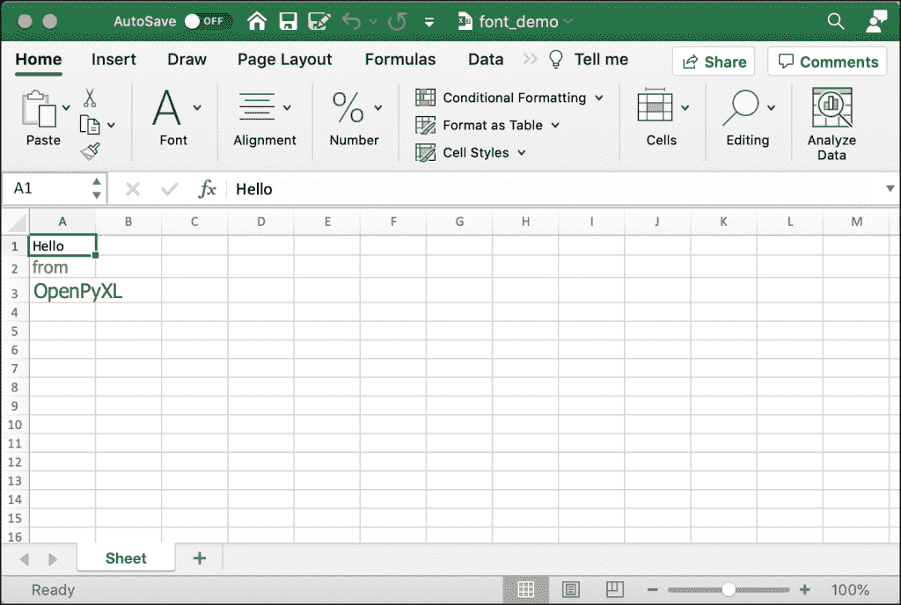
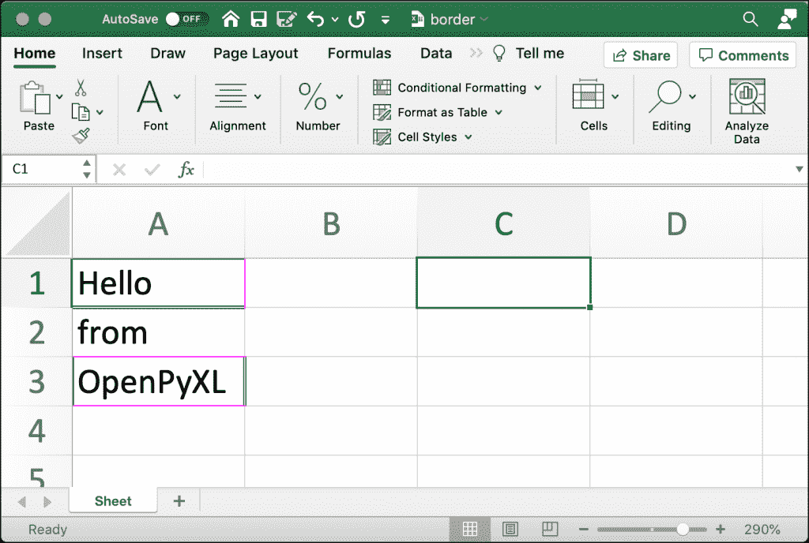
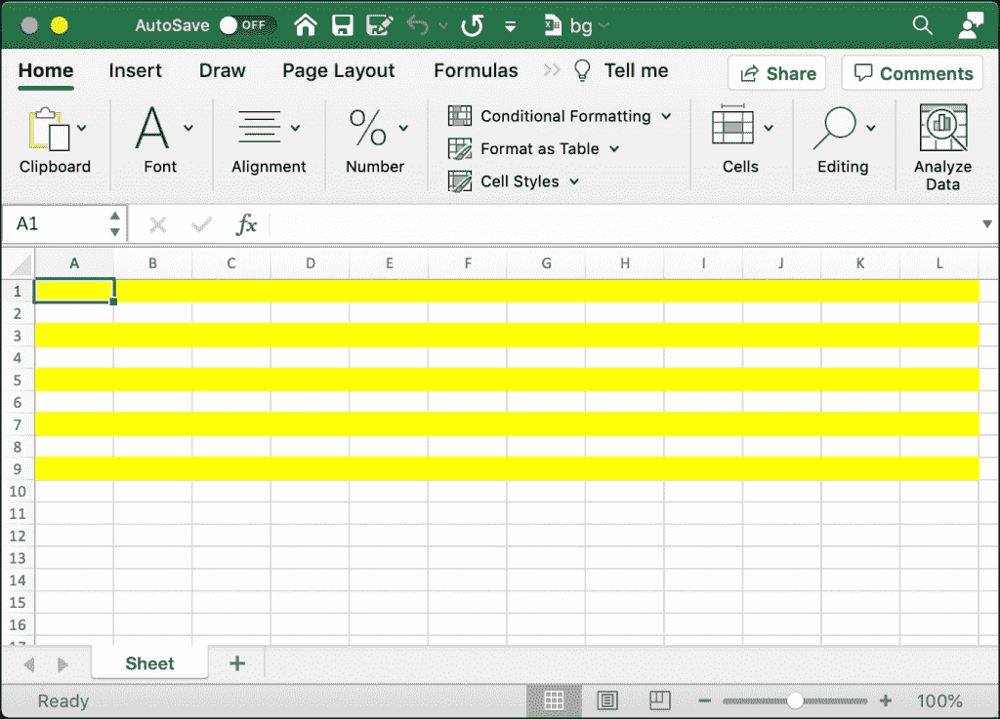
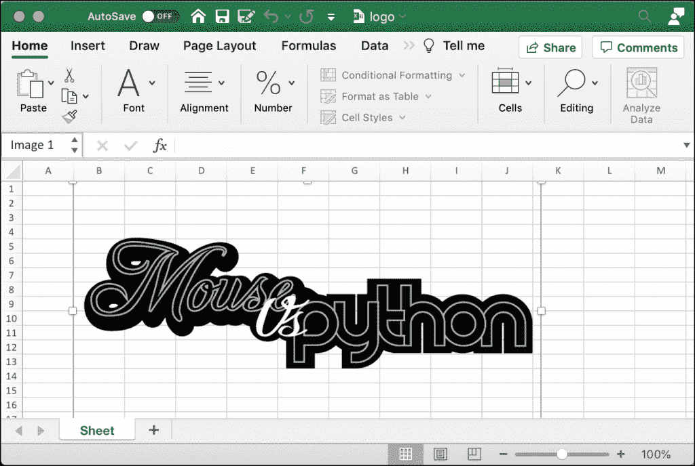
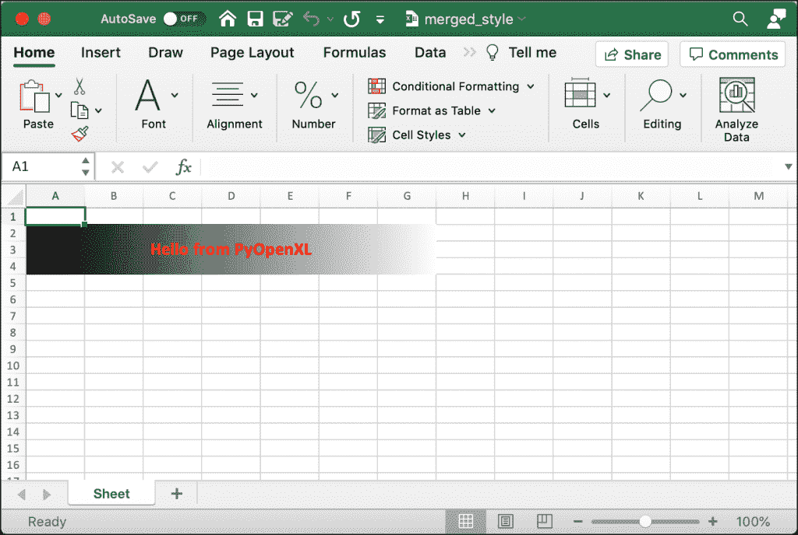
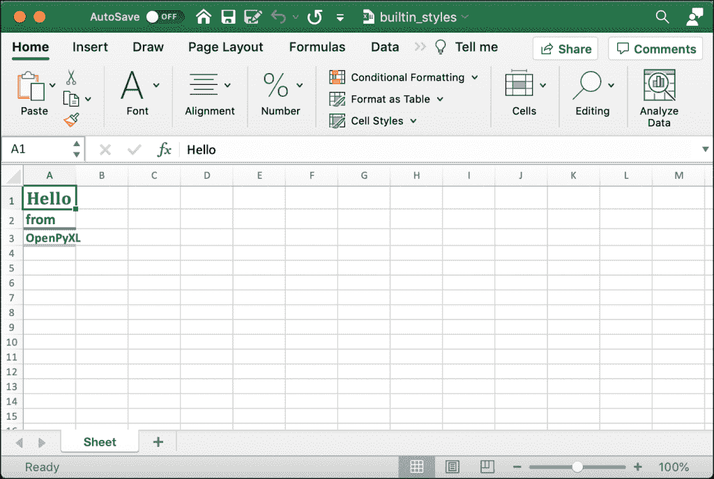
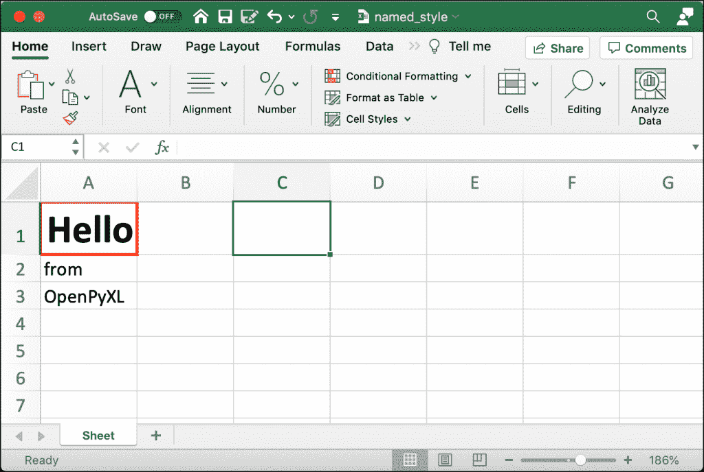

# 用 OpenPyXL 和 Python 设计 Excel 单元格样式

> 原文：<https://www.blog.pythonlibrary.org/2021/08/11/styling-excel-cells-with-openpyxl-and-python/>

OpenPyXL 让你能够以多种不同的方式来设计你的单元格。样式单元格会给你的电子表格带来活力！您的电子表格可以有一些流行和活力，这将有助于他们区别于他人。但是，不要过分！如果每个单元格都有不同的字体和颜色，你的电子表格会看起来一团糟。

您应该谨慎使用您在本文中学到的技能。你仍然有漂亮的电子表格可以和你的同事分享。如果你想了解更多关于 OpenPyXL 支持的样式，你应该查看他们的[文档](https://openpyxl.readthedocs.io/en/stable/styles.html)。

在本文中，您将了解以下内容:

*   使用字体
*   设置校准
*   添加边框
*   更改单元格背景色
*   将图像插入单元格
*   样式合并单元格
*   使用内置样式
*   创建自定义命名样式

既然您已经知道了将要学习的内容，那么是时候开始了解如何使用 OpenPyXL 处理字体了！

## 使用字体

你在电脑上使用字体来设计你的文本。字体控制您在屏幕上看到的或打印出来的文本的大小、粗细、颜色和样式。你的电脑可以使用成千上万种字体。微软在其 Office 产品中包含了许多字体。

当你想用 OpenPyXL 设置字体时，你需要从`openpyxl.styles`导入`Font`类。下面是导入的方法:

```
from openpyxl.styles import Font
```

`Font`类接受许多参数。根据 OpenPyXL 的文档，下面是`Font`类的完整参数列表:

```
class openpyxl.styles.fonts.Font(name=None, sz=None, b=None, i=None, charset=None, u=None, 
    strike=None, color=None, scheme=None, family=None, size=None, bold=None, italic=None, 
    strikethrough=None, underline=None, vertAlign=None, outline=None, shadow=None, 
    condense=None, extend=None)
```

以下列表显示了您最有可能使用的参数及其默认值:

*   名称= '口径'
*   尺寸=11
*   粗体=假
*   斜体=假
*   比较=无
*   下划线= '无'
*   罢工=假
*   color='FF000000 '

这些设置允许你设置大部分你需要的东西来使你的文本看起来更好。注意，OpenPyXL 中的颜色名称使用十六进制值来表示 RGB(红、绿、蓝)颜色值。您可以设定文本是否应该是粗体、斜体、下划线或删除线。

要了解如何在 OpenPyXL 中使用字体，请创建一个名为`font_sizes.py`的新文件，并向其中添加以下代码:

```
# font_sizes.py

import openpyxl
from openpyxl.styles import Font

def font_demo(path):
    workbook = openpyxl.Workbook()
    sheet = workbook.active
    cell = sheet["A1"]
    cell.font = Font(size=12)
    cell.value = "Hello"

    cell2 = sheet["A2"]
    cell2.font = Font(name="Arial", size=14, color="00FF0000")
    sheet["A2"] = "from"

    cell2 = sheet["A3"]
    cell2.font = Font(name="Tahoma", size=16, color="00339966")
    sheet["A3"] = "OpenPyXL"

    workbook.save(path)

if __name__ == "__main__":
    font_demo("font_demo.xlsx")
```

这段代码在三个不同的单元格中使用了三种不同的字体。在 **A1** 中，使用默认的 Calibri。然后在 **A2** 中，你将字体大小设置为 Arial，并将大小增加到 14 磅。最后，在 **A3** 中，你将字体改为 Tahoma，字号改为 16 磅。

对于第二种和第三种字体，您还可以更改文本颜色。在 **A2** 中，你设置颜色为红色，在 **A3** 中，你设置颜色为绿色。

当您运行这段代码时，您的输出将如下所示:



尝试更改代码以使用其他字体或颜色。如果你想大胆一点，你应该试着把你的文字加粗或者斜体。

现在，您已经准备好学习文本对齐了。

## 设置校准

您可以使用`openpyxl.styles.Alignment`在 OpenPyXL 中设置对齐方式。使用这个类来旋转文本，设置文本换行和缩进。

下面是`Alignment`类使用的缺省值:

*   水平= '常规'
*   垂直= '底部'
*   text_rotation=0
*   wrap_text=False
*   shrink_to_fit=False
*   缩进=0

你该练习一下了。打开 Python 编辑器，创建一个名为`alignment.py`的新文件。然后向其中添加以下代码:

```
# alignment.py

from openpyxl import Workbook
from openpyxl.styles import Alignment

def center_text(path, horizontal="center", vertical="center"):
    workbook = Workbook()
    sheet = workbook.active
    sheet["A1"] = "Hello"
    sheet["A1"].alignment = Alignment(horizontal=horizontal,
                                      vertical=vertical)
    sheet["A2"] = "from"
    sheet["A3"] = "OpenPyXL"
    sheet["A3"].alignment = Alignment(text_rotation=90)
    workbook.save(path)

if __name__ == "__main__":
    center_text("alignment.xlsx")
```

当您运行这段代码时，您将在 **A1** 中水平和垂直居中字符串。然后你使用默认的 **A2** 。最后，对于 **A3** ，你将文本旋转 90 度。

尝试运行这段代码，您将会看到如下内容:


那看起来不错！如果你花时间尝试不同的`text_rotation`值，那将是最好的。然后尝试用不同的值改变`horizontal`和`vertical`参数。很快，你就能像专业人士一样调整你的文本了！

现在，您已经准备好学习如何为单元格添加边框了！

## 添加边框

OpenPyXL 让您能够设计单元格的边框。您可以为单元格的四边指定不同的边框样式。

您可以使用以下任何边框样式:

*   dashDot
*   dashDotDot
*   '虚线'
*   '虚线'
*   双份
*   头发
*   '中等'
*   “中型 DashDot”
*   ' mediumDashDotDot '，
*   '中间虚线'
*   '倾斜圆点'
*   '厚'
*   “瘦”

打开 Python 编辑器，创建一个名为`border.py`的新文件。然后在文件中输入以下代码:

```
# border.py

from openpyxl import Workbook
from openpyxl.styles import Border, Side

def border(path):
    pink = "00FF00FF"
    green = "00008000"
    thin = Side(border_style="thin", color=pink)
    double = Side(border_style="double", color=green)

    workbook = Workbook()
    sheet = workbook.active

    sheet["A1"] = "Hello"
    sheet["A1"].border = Border(top=double, left=thin, right=thin, bottom=double)
    sheet["A2"] = "from"
    sheet["A3"] = "OpenPyXL"
    sheet["A3"].border = Border(top=thin, left=double, right=double, bottom=thin)
    workbook.save(path)

if __name__ == "__main__":
    border("border.xlsx")
```

这段代码将为单元格 **A1** 和 **A3** 添加一个边框。 **A1** 的顶部和底部使用“双”边框样式并且是绿色的，而单元格的侧面使用“细”边框样式并且是粉红色的。

单元格 **A3** 使用了相同的边框，但是将它们交换了位置，因此两边现在是绿色的，顶部和底部是粉红色的。

您可以通过在要使用的`border_style`和`color`中创建`Side`对象来获得这种效果。然后你将这些`Side`对象传递给一个`Border`类，它允许你单独设置一个单元格的四个边。要将`Border`应用于单元格，必须设置单元格的`border`属性。

当您运行此代码时，您将看到以下结果:



这张图片被放大了很多，所以你可以很容易地看到细胞的边界。如果您尝试用本节开始时提到的一些其他边框样式来修改这段代码，那将是最好的，这样您就可以看到您还能做些什么。

## 更改单元格背景色

您可以通过更改背景色来突出显示一个单元格或一组单元格。在大多数情况下，突出显示单元格比更改文本的字体或颜色更引人注目。OpenPyXL 提供了一个名为`PatternFill`的类，可以用来改变单元格的背景颜色。

`PatternFill`类接受以下参数(默认值如下所示):

*   patternType =无
*   fgColor=Color()
*   bgColor=Color()
*   fill _ type =无
*   start _ color =无
*   end _ color =无

有几种不同的填充类型可供您使用。以下是当前支持的填充类型列表:

*   '无'
*   “固体”
*   “天黑了”
*   深灰色
*   '黑暗网格'
*   '黑暗水平'
*   “黑暗格子”
*   '黑暗'
*   '暗垂直'
*   灰色 0625 '
*   灰色 125 '
*   “闪电”
*   “浅灰色”
*   ' lightGrid '
*   '水平光线'
*   “灯架”
*   “lightUp”
*   '垂直光线'
*   “中等灰色”

现在，您已经有了足够的信息，可以尝试使用 OpenPyXL 设置单元格的背景色。在 Python 编辑器中打开一个新文件，并将其命名为`background_colors.py`。然后将这段代码添加到新文件中:

```
# background_colors.py

from openpyxl import Workbook
from openpyxl.styles import PatternFill

def background_colors(path):
    workbook = Workbook()
    sheet = workbook.active
    yellow = "00FFFF00"
    for rows in sheet.iter_rows(min_row=1, max_row=10, min_col=1, max_col=12):
        for cell in rows:
            if cell.row % 2:
                cell.fill = PatternFill(start_color=yellow, end_color=yellow,
                                        fill_type = "solid")
    workbook.save(path)

if __name__ == "__main__":
    background_colors("bg.xlsx")
```

这个例子将遍历 9 行 12 列。如果单元格位于奇数行，它会将每个单元格的背景色设置为黄色。背景颜色发生变化的单元格将从列 **A** 到列 **L** 。

当您想要设置单元格的背景颜色时，您可以将单元格的`fill`属性设置为`PatternFill`的一个实例。在这个例子中，您指定了一个`start_color`和一个`end_color`。您还将`fill_type`设置为“实心”。OpenPyXL 还支持使用一个`GradientFill`作为背景。

尝试运行这段代码。运行后，您将得到一个新的 Excel 文档，如下所示:



以下是您可以用这段代码尝试的一些想法:

*   更改受影响的行数或列数
*   更改您要更改的颜色
*   更新代码，用不同的颜色给偶数行着色
*   尝试其他填充类型

一旦你完成了背景颜色的实验，你就可以学习在你的单元格中插入图像了！

## 将图像插入单元格

OpenPyXL 使得在 Excel 电子表格中插入图像变得简单明了。为了实现这种神奇的效果，您使用了`Worksheet`对象的`add_image()`方法。该方法接受两个参数:

*   `img` -您正在插入的图像文件的路径
*   `anchor` -提供一个单元格作为图像的左上锚点(可选)

在本例中，您将使用鼠标与 Python 徽标:


这本书的 [GitHub 库](https://github.com/driscollis/automating_excel_with_python)有图片供您使用。

下载完图像后，创建一个新的 Python 文件，并将其命名为`insert_image.py`。然后添加以下内容:

```
# insert_image.py

from openpyxl import Workbook
from openpyxl.drawing.image import Image

def insert_image(path, image_path):
    workbook = Workbook()
    sheet = workbook.active
    img = Image("logo.png")
    sheet.add_image(img, "B1")
    workbook.save(path)

if __name__ == "__main__":
    insert_image("logo.xlsx", "logo.png")
```

在这里，您传递您想要插入的图像的路径。要插入图像，您需要调用`add_image()`。在本例中，您将使用单元格 **B1** 作为锚单元格进行硬编码。然后保存您的 Excel 电子表格。

如果你打开你的电子表格，你会看到它是这样的:



您可能不需要经常在 Excel 电子表格中插入图像，但这是一项非常好的技能。

## 样式合并单元格

合并单元格是将两个或多个相邻单元格合并成一个的单元格。如果要用 OpenPyXL 设置合并单元格的值，必须使用合并单元格最左上角的单元格。

您还必须使用这个特定的单元格来设置整个合并单元格的样式。您可以将在单个单元格中使用的所有样式和字体设置用于合并的单元格。但是，您必须将样式应用于左上角的单元格，以便它应用于整个合并的单元格。

如果你看到一些代码，你就会明白这是如何工作的。继续创建一个名为`style_merged_cell.py`的新文件。现在在您的文件中输入以下代码:

```
# style_merged_cell.py

from openpyxl import Workbook
from openpyxl.styles import Font, Border, Side, GradientFill, Alignment

def merge_style(path):
    workbook = Workbook()
    sheet = workbook.active
    sheet.merge_cells("A2:G4")
    top_left_cell = sheet["A2"]

    light_purple = "00CC99FF"
    green = "00008000"
    thin = Side(border_style="thin", color=light_purple)
    double = Side(border_style="double", color=green)

    top_left_cell.value = "Hello from PyOpenXL"
    top_left_cell.border = Border(top=double, left=thin, right=thin,
                                  bottom=double)
    top_left_cell.fill = GradientFill(stop=("000000", "FFFFFF"))
    top_left_cell.font = Font(b=True, color="FF0000", size=16)
    top_left_cell.alignment = Alignment(horizontal="center",
                                        vertical="center")
    workbook.save(path)

if __name__ == "__main__":
    merge_style("merged_style.xlsx")
```

在这里，您创建了一个从 **A2** (左上角的单元格)到 **G4** 的合并单元格。然后设置单元格的值、边框、填充、字体和对齐方式。

当您运行这段代码时，您的新电子表格将如下所示:



那看起来不是很好吗？您应该花些时间在合并的单元格上尝试一些不同的样式。比如说，可以用比这里用的灰色更好的渐变。

现在您已经准备好了解 OpenPyXL 的内置样式了！

## 使用内置样式

OpenPyXL 附带了多个您也可以使用的内置样式。你应该去官方文档而不是复制本书中所有的内置风格，因为这将是最新的风格名称来源。

然而，值得注意的是一些风格。例如，以下是您可以使用的数字格式样式:

*   '逗号'
*   逗号[0]'
*   '货币'
*   货币[0]'
*   '百分比'

您也可以应用文本样式。以下是这些风格的列表:

*   '标题'
*   标题 1 '
*   标题 2 '
*   标题 3 '
*   标题 4 '
*   '超链接'
*   '跟随的超链接'
*   '链接单元格'

OpenPyXL 还有其他几个内置的样式组。您应该查阅文档以了解所有支持的不同样式。

现在您已经了解了一些可以使用的内置样式，是时候编写一些代码了！创建一个新文件，命名为`builtin_styls.py`。然后输入以下代码:

```
# builtin_styles.py

from openpyxl import Workbook

def builtin_styles(path):
    workbook = Workbook()
    sheet = workbook.active
    sheet["A1"].value = "Hello"
    sheet["A1"].style = "Title"

    sheet["A2"].value = "from"
    sheet["A2"].style = "Headline 1"

    sheet["A3"].value = "OpenPyXL"
    sheet["A3"].style = "Headline 2"

    workbook.save(path)

if __name__ == "__main__":
    builtin_styles("builtin_styles.xlsx")
```

这里，您对三个不同的单元格应用了三种不同的样式。你具体用“标题”、“标题 1”、“标题 2”。

当您运行这段代码时，您将得到一个类似如下的电子表格:



和往常一样，您应该尝试一些其他的内置样式。尝试它们是决定它们做什么以及它们是否对你有用的唯一方法。

但是等等！如果你想创造自己的风格呢？这是您将在下一节中介绍的内容！

## 创建自定义命名样式

您也可以使用 OpenPyXL 创建自定义的设计样式。要创建你的风格，你必须使用`NamedStyle`类。

`NamedStyle`类接受以下参数(也包括默认值):

*   name= "正常"
*   font=Font()
*   fill=PatternFill()
*   border=Border()
*   对齐=对齐()
*   数字格式=无
*   保护=保护()
*   builtinId =无
*   隐藏=假
*   xfId =无

你应该总是给你的`NamedStyle`提供你自己的`name`，以保持它的唯一性。继续创建一个新文件，命名为`named_style.py`。然后向其中添加以下代码:

```
# named_style.py

from openpyxl import Workbook
from openpyxl.styles import Font, Border, Side, NamedStyle

def named_style(path):
    workbook = Workbook()
    sheet = workbook.active

    red = "00FF0000"
    font = Font(bold=True, size=22)
    thick = Side(style="thick", color=red)
    border = Border(left=thick, right=thick, top=thick, bottom=thick)
    named_style = NamedStyle(name="highlight", font=font, border=border)

    sheet["A1"].value = "Hello"
    sheet["A1"].style = named_style

    sheet["A2"].value = "from"
    sheet["A3"].value = "OpenPyXL"

    workbook.save(path)

if __name__ == "__main__":
    named_style("named_style.xlsx")
```

在这里，您创建了一个`Font()`、`Side()`和`Border()`实例，并将其传递给您的`NamedStyle()`。一旦创建了自定义样式，就可以通过设置单元格的`style`属性将其应用于单元格。应用自定义样式的方式与应用内置样式的方式相同！

您对单元格 **A1** 应用了自定义样式。

当您运行这段代码时，您将得到一个类似如下的电子表格:



现在轮到你了！编辑代码以使用`Side`样式，这将改变你的边框。或者创建多个`Side`实例，这样就可以使单元格的每一边都是唯一的。尝试不同的字体或添加自定义背景颜色！

## 包扎

使用 OpenPyXL 可以对单元格做很多不同的事情。本文中的信息使您能够以漂亮的方式格式化数据。

在本文中，您了解了以下主题:

*   使用字体
*   设置校准
*   添加边框
*   更改单元格背景色
*   将图像插入单元格
*   样式合并单元格
*   使用内置样式
*   创建自定义命名样式

您可以利用在本文中学到的信息来制作漂亮的电子表格。您可以通过更改单元格的背景颜色或字体来突出显示激动人心的数据。您还可以通过使用内置样式来更改单元格的格式。去试一试吧。

尝试本文中的代码，看看 OpenPyXL 在处理单元格时是多么强大和有价值。

## 相关阅读

*   [使用 OpenPyXL 和 Python 读取电子表格](https://www.blog.pythonlibrary.org/2021/07/20/reading-spreadsheets-with-openpyxl-and-python/)
*   [使用 OpenPyXL 和 Python 创建电子表格](https://www.blog.pythonlibrary.org/2021/07/27/creating-spreadsheets-with-openpyxl-and-python/)
*   [用 Python 自动化 Excel】(图书)](https://driscollis.gumroad.com/l/openpyxl)