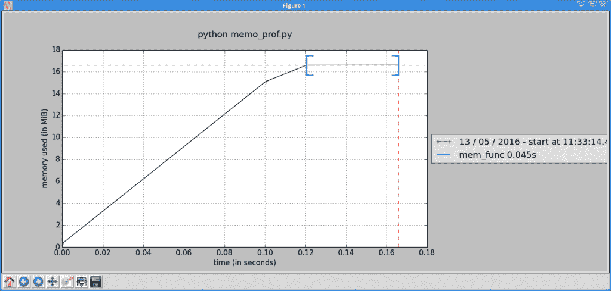
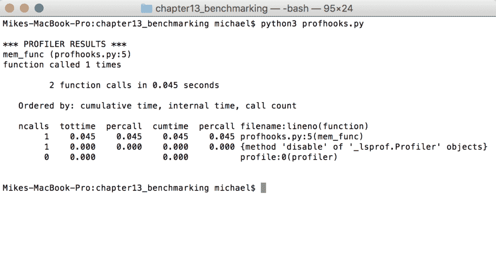

# Python 的分析工具概述

> 原文：<https://www.blog.pythonlibrary.org/2020/04/14/an-overview-of-profiling-tools-for-python/>

剖析一个人的代码意味着什么？基准测试或分析背后的主要思想是计算出代码执行的速度以及瓶颈在哪里。做这种事情的主要原因是为了优化。您会遇到这样的情况，由于业务需求发生了变化，您需要代码运行得更快。当这种情况发生时，您将需要找出代码的哪些部分降低了速度。

本文将只讨论如何使用各种工具来分析您的代码。它不会实际优化你的代码。我们开始吧！

### 使用 timeit

Python 附带了一个名为 **timeit** 的模块。你可以用它来计时小代码片段。 **timeit** 模块使用特定于平台的时间函数，因此您将获得尽可能精确的计时。

timeit 模块有一个命令行界面，但是也可以导入。我们将从如何从命令行使用 timeit 开始。打开终端，尝试以下示例:

```
python -m timeit -s "[ord(x) for x in 'abcdfghi']"
100000000 loops, best of 3: 0.0115 usec per loop

python -m timeit -s "[chr(int(x)) for x in '123456789']"
100000000 loops, best of 3: 0.0119 usec per loop
```

这是怎么回事？当你在命令行上调用 Python 并给它传递“-m”选项时，你是在告诉它查找一个模块并把它作为主程序使用。“-s”告诉 timeit 模块运行一次安装程序。然后，它将代码运行 n 次循环，并返回 3 次运行的最佳平均值。对于这些愚蠢的例子，你不会看到太大的区别。

您的输出可能会略有不同，因为它取决于您的计算机的规格。

让我们编写一个简单的函数，看看您是否可以从命令行计时:

```
# simple_func.py
def my_function():
    try:
        1 / 0
    except ZeroDivisionError:
        pass

```

这个函数所做的就是产生一个错误，这个错误很快就会被忽略。是的，又是一个很傻的例子。要让 timeit 在命令行上运行这段代码，您需要将代码导入到它的名称空间中，因此要确保您已经将当前的工作目录更改到了这个脚本所在的文件夹中。然后运行以下命令:

```
python -m timeit "import simple_func; simple_func.my_function()"
1000000 loops, best of 3: 1.77 usec per loop
```

在这里，您导入函数，然后调用它。注意，我们用分号分隔导入和函数调用，Python 代码用引号括起来。现在我们准备学习如何在实际的 Python 脚本中使用 timeit。

### 导入 timeit 进行测试

在代码中使用 timeit 模块也很容易。您将使用之前相同的愚蠢脚本，并在下面向您展示如何操作:

```
# simple_func2.py
def my_function():
    try:
        1 / 0
    except ZeroDivisionError:
        pass

if __name__ == "__main__":
    import timeit
    setup = "from __main__ import my_function"
    print(timeit.timeit("my_function()", setup=setup))
```

在这里，您可以检查脚本是否正在直接运行(即没有导入)。如果是，那么您导入 **timeit** ，创建一个设置字符串以将函数导入 timeit 的名称空间，然后我们调用 **timeit.timeit** 。您会注意到，我们用引号将对函数的调用传递出去，然后是设置字符串。这真的就是全部了！现在让我们学习如何编写我们自己的计时器装饰器。

### 使用室内装饰

编写自己的定时器也很有趣，尽管它可能没有使用 timeit 精确，这取决于用例。不管怎样，您将编写自己的自定义函数计时装饰器！

代码如下:

```
import random
import time

def timerfunc(func):
    """
    A timer decorator
    """
    def function_timer(*args, **kwargs):
        """
        A nested function for timing other functions
        """
        start = time.time()
        value = func(*args, **kwargs)
        end = time.time()
        runtime = end - start
        msg = "The runtime for {func} took {time} seconds to complete"
        print(msg.format(func=func.__name__,
                         time=runtime))
        return value
    return function_timer

@timerfunc
def long_runner():
    for x in range(5):
        sleep_time = random.choice(range(1,5))
        time.sleep(sleep_time)

if __name__ == '__main__':
    long_runner()
```

对于这个例子，您从 Python 的标准库中导入了**随机**和**时间**模块。然后创建我们的装饰函数。你会注意到它接受一个函数，并且在它里面有另一个函数。嵌套函数会在调用传入函数之前抢占时间。然后等待函数返回，并获取结束时间。现在你知道这个函数运行了多长时间，所以你把它打印出来。当然，装饰器还需要返回函数调用的结果和函数本身，所以这就是最后两条语句的意义所在。

下一个函数是用我们的计时装饰器来装饰的。你会注意到它使用 random 来“随机”睡眠几秒钟。这只是为了演示一个长时间运行的程序。实际上，您可能希望对连接到数据库(或运行大型查询)、网站、运行线程或做其他需要一段时间才能完成的事情的功能进行计时。

每次运行这段代码，结果都会略有不同。试试看，自己看吧！

### 创建计时上下文管理器

一些程序员喜欢使用上下文管理器来为小代码片段计时。所以让我们创建自己的定时器上下文管理器类！

```
import random
import time

class MyTimer():

    def __init__(self):
        self.start = time.time()

    def __enter__(self):
        return self

    def __exit__(self, exc_type, exc_val, exc_tb):
        end = time.time()
        runtime = end - self.start
        msg = 'The function took {time} seconds to complete'
        print(msg.format(time=runtime))

def long_runner():
    for x in range(5):
        sleep_time = random.choice(range(1,5))
        time.sleep(sleep_time)

if __name__ == '__main__':
    with MyTimer():
        long_runner()
```

在这个例子中，我们使用类的 **__init__** 方法来启动我们的计时器。 **__enter__** 方法除了返回自身之外不需要做任何其他事情。最后， **__exit__** 方法包含了所有有趣的部分。这里我们获取结束时间，计算总运行时间并打印出来。

代码的结尾实际上展示了一个使用我们的上下文管理器的例子，其中我们在自定义上下文管理器中包装了上一个例子中的函数。

### 使用配置文件

Python 自带内置的代码分析器。有 **profile** 模块和 **cProfile** 模块。profile 模块是纯 Python 的，但是它会给你分析的任何东西增加很多开销，所以通常推荐你使用 cProfile，它有一个相似的接口，但是要快得多。

在本文中，我们不会深入讨论这个模块的很多细节，但是让我们来看几个有趣的例子，这样您就可以了解它能做什么。

```
>>> import cProfile
>>> cProfile.run("[x for x in range(1500)]")
         4 function calls in 0.001 seconds

   Ordered by: standard name

   ncalls  tottime  percall  cumtime  percall filename:lineno(function)
        1    0.000    0.000    0.000    0.000 <string>:1(<listcomp>)
        1    0.000    0.000    0.000    0.000 <string>:1(<module>)
        1    0.001    0.001    0.001    0.001 {built-in method builtins.exec}
        1    0.000    0.000    0.000    0.000 {method 'disable' of '_lsprof.Profiler' objects}
```

让我们把它分解一下。第一行显示有 4 个函数调用。下一行告诉我们结果是如何排序的。根据文档，标准名称是指最右边的列。这里有许多列。

*   **ncalls** 是发出的呼叫数。
*   **tottime** 是给定函数花费的总时间。
*   **percall** 指总时间除以 ncalls 的商
*   **累计时间**是在该功能和所有子功能中花费的累计时间。甚至对递归函数也很准确！
*   第二个 **percall** 列是累计时间除以原始调用的商
*   **filename:line no(function)**提供每个函数各自的数据

您可以在命令行上调用 cProfile，方式与我们使用 timeit 模块的方式非常相似。主要的区别在于，您将向它传递一个 Python 脚本，而不仅仅是传递一个代码片段。下面是一个调用示例:

```
python -m cProfile test.py
```

在您自己的一个模块上尝试一下，或者在 Python 的一个模块上尝试一下，看看效果如何。

### 线条轮廓图

有一个很棒的第三方项目叫做 [line_profiler](https://pypi.org/project/line-profiler/) ，它被设计用来分析每一行执行所花费的时间。它还包括一个名为 **kernprof** 的脚本，用于使用 line_profiler 分析 Python 应用程序和脚本。只需使用 **pip** 安装包即可。方法如下:

```
pip install line_profiler
```

为了实际使用 **line_profiler** ，我们需要一些代码来进行分析。但首先，我需要解释当你在命令行调用 line_profiler 时，它是如何工作的。您实际上将通过调用 kernprof 脚本来调用 line_profiler。我第一次使用它的时候觉得有点混乱，但这就是它的工作方式。

下面是使用它的正常方法:

```
kernprof -l silly_functions.py
```

这将在完成时打印出以下消息:*将概要结果写入 silly_functions.py.lprof* 。这是一个不能直接查看的二进制文件。当您运行 **kernprof** 时，它实际上会将 **LineProfiler** 的一个实例注入到您的脚本的 **__builtins__** 名称空间中。该实例将被命名为 **profile** ，并被用作装饰器。

考虑到这一点，您可以实际编写您的脚本:

```
# silly_functions.py
import time

@profile
def fast_function():
    print("I'm a fast function!")

@profile
def slow_function():
    time.sleep(2)
    print("I'm a slow function")

if __name__ == '__main__':
    fast_function()
    slow_function()
```

所以现在你有两个修饰函数，它们是用没有导入的东西修饰的。如果您真的试图运行这个脚本，您将得到一个 **NameError** ，因为“profile”没有被定义。所以在你分析完你的代码之后，一定要记得移除你的装饰者！

让我们后退一步，学习如何实际查看我们的分析器的结果。有两种方法我们可以使用。第一种是使用 line_profiler 模块读取我们的结果文件:

```
python -m line_profiler silly_functions.py.lprof
```

另一种方法是在详细模式下通过传递 is **-v** 来使用 kernprof:

```
kernprof -l -v silly_functions.py
```

无论您使用哪种方法，您最终都会看到类似以下内容打印到您的屏幕上:

```
I'm a fast function!
I'm a slow function
Wrote profile results to silly_functions.py.lprof
Timer unit: 1e-06 s

Total time: 3.4e-05 s
File: silly_functions.py
Function: fast_function at line 3

Line #      Hits         Time  Per Hit   % Time  Line Contents
==============================================================
     3                                           @profile
     4                                           def fast_function():
     5         1           34     34.0    100.0      print("I'm a fast function!")

Total time: 2.001 s
File: silly_functions.py
Function: slow_function at line 7

Line #      Hits         Time  Per Hit   % Time  Line Contents
==============================================================
     7                                           @profile
     8                                           def slow_function():
     9         1      2000942 2000942.0    100.0      time.sleep(2)
    10         1           59     59.0      0.0      print("I'm a slow function")
```

源代码被打印出来，每一行都有计时信息。这里有六列信息。让我们来看看每一个是什么意思。

*   **行号** -被分析的代码的行号
*   **命中**——特定行被执行的次数
*   **Time** -执行该行所花费的总时间(以计时器为单位)。在输出的开头可以看到计时器单元
*   **每次点击**——一行代码执行的平均时间(以计时器为单位)
*   **%**
*   **行内容** -实际执行的源代码

如果您碰巧是 IPython 用户，那么您可能想知道 IPython 有一个神奇的命令( **%lprun** )，它允许您指定要分析的函数，甚至是要执行的语句。

### 内存分析器

另一个很棒的第三方剖析包是 [**内存剖析**](https://pypi.org/project/memory-profiler/) 。 **memory_profiler** 模块可用于监控进程中的内存消耗，或者您可以使用它对代码的内存消耗进行逐行分析。因为 Python 中没有包含它，所以您必须安装它。为此，您可以使用 **pip** :

```
pip install memory_profiler
```

一旦安装完毕，我们需要一些代码来运行它。 **memory_profiler** 实际上与 line_profiler 的工作方式非常相似，当您运行它时， **memory_profiler** 会将它自己的一个实例注入到 **__builtins__** 命名的 profile 中，您应该将它用作您正在分析的函数的装饰器。

这里有一个简单的例子:

```
# memo_prof.py 
@profile
def mem_func():
    lots_of_numbers = list(range(1500))
    x = ['letters'] * (5 ** 10)
    del lots_of_numbers
    return None

if __name__ == '__main__':
    mem_func()
```

在本例中，您创建了一个包含 1500 个整数的列表。然后创建一个包含 9765625 (5 的 10 次方)个字符串实例的列表。最后，您删除第一个列表并返回。与 **line_profiler** 不同的是， **memory_profiler** 不需要运行另一个脚本来进行实际的分析。相反，您可以运行 Python 并在命令行上使用它的 **-m** 参数来加载模块并根据我们的脚本运行它:

```
python -m memory_profiler memo_prof.py 
Filename: memo_prof.py

Line #    Mem usage    Increment   Line Contents
================================================
     1   16.672 MiB    0.000 MiB   @profile
     2                             def mem_func():
     3   16.707 MiB    0.035 MiB       lots_of_numbers = list(range(1500))
     4   91.215 MiB   74.508 MiB       x = ['letters'] * (5 ** 10)
     5   91.215 MiB    0.000 MiB       del lots_of_numbers
     6   91.215 MiB    0.000 MiB       return None
```

这一次，这些列非常简单明了。我们有自己的行号，然后是执行该行后使用的内存量。接下来我们有一个增量字段，它告诉我们当前行与前一行的内存差异。最后一列是代码本身。

**memory_profiler** 还包括 **mprof** ，它可以用来创建完整的随时间变化的内存使用报告，而不是逐行创建。它非常容易使用；看一看:

```
$ mprof run memo_prof.py 
mprof: Sampling memory every 0.1s
running as a Python program...
```

mprof 还可以创建一个图表，显示应用程序如何随时间消耗内存。要得到图表，你需要做的就是:

```
$ mprof plot
```

对于我们之前创建的愚蠢示例，我得到了下面的图表:



你应该试着自己运行一个更复杂的例子，看看更有趣的情节。

### 个人资料查看

本文中您将看到的最后一个第三方包叫做 [**profilehooks**](https://pypi.org/project/profilehooks/) 。它是一个装饰器的集合，专门为剖析函数而设计。要安装**配置文件**，只需执行以下操作:

```
pip install profilehooks
```

现在我们已经安装好了，让我们重新使用上一节中的例子，并稍微修改一下以使用 **profilehooks** :

```
# profhooks.py
from profilehooks import profile

@profile
def mem_func():
    lots_of_numbers = list(range(1500))
    x = ['letters'] * (5 ** 10)
    del lots_of_numbers
    return None

if __name__ == '__main__':
    mem_func()
```

使用 **profilehooks** 所要做的就是导入它，然后修饰你想要分析的函数。如果您运行上面的代码，您将得到类似于以下发送到 stdout 的输出:



这个包的输出似乎遵循 Python 标准库中的 cProfile 模块的输出。您可以参考本章前面对这些列的描述来了解它们的含义。 **profilehooks** 包还有两个装饰器。我们要看的第一个叫做**时间呼叫**。它给出了函数的过程运行时间:

```
# profhooks2.py
from profilehooks import timecall

@timecall
def mem_func():
    lots_of_numbers = list(range(1500))
    x = ['letters'] * (5 ** 10)
    del lots_of_numbers
    return None

if __name__ == '__main__':
    mem_func()
```

当您运行这段代码时，您将看到类似于以下输出的内容:

```
mem_func (c:\path_to_script\profhooks2.py:3):
  0.141 seconds
```

decorator 所做的只是计算函数的执行时间，但没有分析的开销。这有点像使用 **timeit** 。

**profilehooks** 提供的最后一个装饰器被称为**覆盖率**。它应该打印出单个函数的行覆盖。我自己并不觉得这个很有用，但是欢迎你自己尝试一下。

最后我想提一下，你也可以在命令行上使用 Python 的 **-m** 标志运行 **profilehooks** :

```
python -m profilehooks mymodule.py
```

profilehooks 包很酷，有很大的潜力。

### 包扎

您在这篇文章中涵盖了很多信息。您学习了如何使用 Python 的内置模块， **timeit** 和 **cProfile** 来分别计时和分析您的代码。您还学习了如何编写自己的计时代码，并将其用作装饰器或上下文管理器。然后我们继续前进，看了一些第三方软件包；即 **line_profiler** 、**memory _ profiler***和 **profilehooks** 。此时，您应该已经开始对自己的代码进行基准测试了。试一试，看看是否能找到自己的瓶颈。