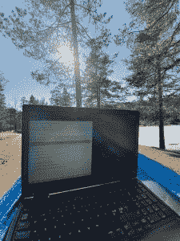

# 本周的 PyDev:Geir Arne Hjelle

> 原文：<https://www.blog.pythonlibrary.org/2019/06/24/pydev-of-the-week-geir-arne-hjelle/>

本周，我们欢迎盖尔·阿恩·Hjelle([@ gahjelle](http://@gahjelle))成为我们本周的 PyDev！盖尔是真正的 Python 的[的定期撰稿人。你也可以在](https://realpython.com/team/gahjelle/) [Github](https://github.com/gahjelle/) 上找到他的一些作品。现在，让我们花点时间来了解一下 Geir！

你能告诉我们一些关于你自己的情况吗(爱好、教育等)

当然可以。我在挪威北部一个岛上的美丽村庄长大。我的家人已经搬到了南方，但我仍然经常去北方拜访朋友，享受大自然。我一直喜欢玩数字，所以我很自然地在大学里学习了数学。我在特隆赫姆的挪威科技大学攻读硕士和博士学位。在读博士期间，我还在我最喜欢的大城市巴塞罗那呆了一年。直到今天，我每年都会在巴塞罗那待上一两周。

完成学业后，我在密苏里州的圣路易斯住了三年，从事邮政工作。华盛顿大学博士。后来我搬回了挪威，目前我住在奥斯陆，从事数据科学方面的工作，主要是使用 Python。

我也花了相当多的空闲时间在编程上。我为真正的 Python 编写教程，并帮助 T2 教孩子们如何编写代码。我喜欢在户外。在挪威，冬天有很多滑雪的机会，夏天有很多徒步旅行的机会。此时此刻，我正躺在奥斯陆郊外森林里的吊床上晒太阳。最后，我应该指出，我喜欢和朋友聚在一起玩棋盘游戏。

**你为什么开始使用 Python？**

有趣的是，实际上我花了很长时间才熟悉 Python。我几乎一生都在做某种编码工作。早在 80 年代，我就在 Commodore 64 上开始学习 BASIC，我认为我最自豪的成就是发现了`GOTO`是邪恶的。我还记得用魔法线`IF PLAYER="Geir Arne" THEN SCORE=SCORE+100`破解了我的一个游戏，这在某种程度上证明了了解一些基本编程的力量(以及随之而来的责任)。

我第一次接触 Python 是在一次暑期实习中，当时我和一个非常熟悉 Python 的人一起工作。这就是 Python 1.6，它看起来已经非常强大了。当时我正在处理 Java、C 和 C++，具有讽刺意味的是，Python 的简单性让我感到困惑。没有“main()”方法，它是如何工作的？进口方面到底发生了什么？最后，我回到了我的谨慎代码。

终于在 2012 年左右重新拿起了 Python。当时，我正使用 Matlab 作为建模工具。Matlab 很擅长做它擅长的事情，但我也开始感觉到它的一些局限性。在一次内部黑客马拉松上，我和一位同事想要创建一个工具来自动生成一些报告，我们决定在这个项目中尝试 Python。这一次，它点击得更好。我对我们创建工具的简单快捷印象深刻。在下一次黑客马拉松上，我们做了一个概念验证，展示了如何将 Python 集成到 Matlab 模型管道中。虽然我们得到了高层的一些支持，但不幸的是，这在 PoC 阶段就结束了。

作为 2014 年的新年决心，我挑战自己更好地学习 Python。幸运的是，那一年几件事一起发生了。我开始了一份新工作，在那里我可以使用 Python 作为我的主要语言。我还参加了一些会议，了解了更多关于 Python 社区和生态系统的知识。我学到的越多，对语言设计的印象就越深刻。该语言的核心非常简单和一致，同时非常灵活。与此同时，支持工具和包在过去几年里已经真正成熟了。我看到了一个很大的进步，就在我使用 Python 的这几年里。

你还知道哪些编程语言，你最喜欢哪一种？

在这一点上，Python 显然是我的最爱，也是我需要高效工作时会用到的语言。然而，还有一些其他的语言，我有非常美好的回忆。读书期间，我第一次开始使用 Linux，偶然遇到了 Awk。我拿起了奥莱利的经典 Sed & Awk 书——主要是因为封面上的怪异动物——立刻成了粉丝。Awk 与通过管道将小型专用工具连接在一起的整个 Unix 哲学无缝地合作。最后，我用 Awk 创建了几个小工具，包括我在硕士论文中使用的一个创建分形的小语言。

我对 [Scratch](https://scratch.mit.edu/) 也印象深刻。虽然它可能具有玩具语言的外观，但它支持所有“严肃的”编程概念。我从事儿童编程教学已经有几年了，Scratch 是一个非常棒的平台。孩子们通常在打开网页的 5 分钟内就起床自己编码了。在一个小时内，他们创造了自己的游戏。实际上，我也用 Scratch 做过一些半严肃的项目。然而，我发现的主要限制是没有很好地支持正确的数据结构(我仍然更喜欢用键盘来编码)。

最后，我希望有一天有时间更恰当地学习一门纯函数式语言。我想哲学真的激起了我大脑中数学部分的兴趣。有一个有趣的项目叫做 [Coconut](http://coconut-lang.org) ，它在 Python 之上添加了函数式编程语法。另一个我希望有时间了解更多的平台是[二郎](https://www.erlang.org)和它的现代表亲[仙丹](https://elixir-lang.org)。可伸缩性和并发特性看起来真的很棒。

你现在在做什么项目？

我最近开始在一家数据科学和机器学习咨询公司工作。在那里，我参与了几个不同的项目，从构建客户分析模型到基于视频的足球建模。之前，我与挪威测绘局合作，在那里我们正在[建造一个工具](https://kartverket.github.io/where/)来帮助监测地球是如何在太空中翻滚的。我真的很喜欢以有趣和有用的方式将编程和建模结合起来的项目。

在我的常规工作之外，我正在为我为 Real Python 写的两篇文章做最后的润色:一篇关于导入是如何工作的(回答我自己以前的所有问题)，另一篇比较类、上下文管理器和装饰器。今年我很幸运地去了 PyCon US，在那里我做了一个关于使用一种插件保持代码模块化的演讲。我正在润色提供这些插件的 [pyplugs](https://pypi.org/project/pyplugs/) 包的文档和一些代码。

哪些 Python 库是你最喜欢的(核心或第三方)？

我非常感谢这些年来为 Python 数据科学堆栈所做的所有努力，我所做的大部分工作在某种程度上都涉及到了 [numpy](https://www.numpy.org) 。这个令人惊叹的库确实是 Python 成为数据科学首选语言的核心。

让我也提一下另一个不太为人所知的库:[品脱](https://pint.readthedocs.io/)是一个用于处理单元和物理量的包。它包装了`numpy`,以便您可以向数组中添加单位，或者您可以使用它直接进行简单的单位转换。你知道一杯药剂师茶大约是 0.14 盎司吗？

`[python]
>>> import pint
>>> u = pint.UnitRegistry()`

> > > ad = 1 * u .药剂师 _dram
> > > ad.to("盎司")
 <quantity></quantity> 

**你是如何开始接触真正的 Python 的？**

在某个时候，我偶然看到了丹·巴德的个人博客，非常喜欢他的文章和见解。然后，2018 年初，我听到丹在 [Python Bytes 播客](https://pythonbytes.fm/episodes/show/62/wooey-and-gooey-are-simple-python-guis)上谈论他如何接管真正的 Python 网站，以及他正在寻找贡献者来帮助他编写教程。我觉得再挑战一下自己会很有趣，同时也可以在 Python 社区中认识更多的人，所以我联系了 Dan。

与整个真正的 Python 团队一起工作是一次奇妙的经历。我以前没有太多的写作经验:我写过一些科学文章，也为想学习编程的孩子做过一些教学材料。然而，在团队其他成员的支持下，尤其是我们的编辑乔安娜，我现在对自己的写作更有信心了。此外，我从我的同事和对我们的文章有疑问和见解的读者那里学到了很多。

今年五月，我们有幸加入了 JetBrains 在克利夫兰举行的 PyCon 上的内容创作者展台。很高兴终于见到了我的许多真正的 Python 同事，在那之前我只是通过 Slack 和他们的文章和评论才知道这些。此外，一些读者停下来聊天。我必须承认，其他人阅读我写的东西，甚至觉得它很有用，这让我感到非常谦卑。

我看到你自愿教孩子们编程。你在做这件事的时候学到了什么？

早在 2013 年，一些志愿者聚集在一起，在挪威发起了[“lr Kidsa Koding”](https://kidsakoder.no/)运动。它的目的是在许多不同的领域教孩子们编程。目前，将编程引入学校的努力进展缓慢，同时也有代码俱乐部和代码营，孩子们可以在校外学习编程。

今天，对于任何想学习编程的人来说，都有很好的工具。在我参与的代码俱乐部中，我们主要使用了 [Scratch](https://scratch.mit.edu/) 、 [Micro:Bit](https://www.microbit.org) 和 Python。教授更专业的工具也很有趣，比如用于音乐编程的 [Sonic Pi](https://sonic-pi.net) ，用于动画编程的 [Processing](https://processing.org) ，以及用于在 MineCraft 游戏中创建计算机并对其编程的 [ComputerCraft](http://www.computercraft.info) 。

教孩子(实际上是任何人)编程是一次非常有益的经历。尤其是当事情进展顺利的时候，你看到他们有了新的想法，消灭了一个讨厌的错误，或者仅仅是意识到他们新发现的知识的力量。一些最喜欢的时刻是:

*   看到一个孩子终于知道如何正确设置电路，他为自己制作了一个 LED 灯而自豪，他在房间里跑来跑去，与每个人击掌，
*   看着一个 10 岁的孩子站在 200 名专业开发人员面前，告诉他们一个 Micro:Bit 微控制器是如何工作的，以及如何在上面创建自己的指南针应用程序，
*   有经验的孩子很快就能对潜在的逻辑有实际的理解，并且能够用他们游戏的参数来使游戏变得更难或更有趣。

在教孩子/老师编程时，你面临哪些挑战？

我想教孩子和其他没有接触过任何早期编程的人的主要区别是，我需要强调直觉而不是技术细节。开始时，他们希望看到事情发生，而不是陷入关于变量、类型、指针和对象的长篇大论。有了 Scratch 和 Micro:bit 这样的工具，很容易上手，只需摆弄一下积木，看看会发生什么。

然后在某个时候，孩子们要么不知道如何做他们想做的事情，要么不明白为什么程序没有按照他们期望的方式运行。能够在这一点上增加他们的直觉和理解，是一个非常有趣的教学实践。

你还有什么想说的吗？

我对开源的力量和社区团结起来创造工具和资源使我们成为更好更有效的程序员的能力感到惊叹。我很高兴能为这个不断增长的人才库贡献自己的绵薄之力。我认为像你的采访系列这样的活动很好地展示了社区的多样性，以及每个人如何在适合自己的水平上参与进来。

盖尔，谢谢你接受采访！