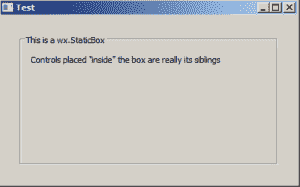
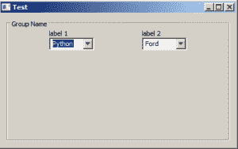

# StaticBox 和 StaticBoxSizers 简介

> 原文：<https://www.blog.pythonlibrary.org/2019/05/09/an-intro-to-staticbox-and-staticboxsizers/>

wxPython GUI 工具包中包含了许多小部件。其中之一是一个相当方便的叫做 **wx 的小部件。静态箱**。这个小部件接受一个字符串，然后用这个字符串在盒子的左上角画一个盒子。然而，这只有在你和 **wx 一起使用时才有效。StaticBoxSizer** 。

下面是一个可能的例子:



现在让我们继续编写您将用来创建上述示例的代码:

```

import wx

class MyPanel(wx.Panel):

    def __init__(self, parent):
        super().__init__(parent)
        box = wx.StaticBox(self, -1, "This is a wx.StaticBox")
        bsizer = wx.StaticBoxSizer(box, wx.VERTICAL)

        t = wx.StaticText(self, -1, "Controls placed \"inside\" the box are really its siblings")
        bsizer.Add(t, 0, wx.TOP|wx.LEFT, 10)

        border = wx.BoxSizer()
        border.Add(bsizer, 1, wx.EXPAND|wx.ALL, 25)
        self.SetSizer(border)

class MyFrame(wx.Frame):

    def __init__(self):
        super().__init__(None, title='Test')
        panel = MyPanel(self)
        self.Show()

if __name__ == '__main__':
    app = wx.App(False)
    frame = MyFrame()
    app.MainLoop()

```

这段代码基于 **wx。来自 wxPython 的[演示应用](https://extras.wxpython.org/wxPython4/extras/)的 StaticBox** 演示代码。基本上你创建了 **wx。StaticBox** ，将其添加到 **wx 的一个实例中。StaticBoxSizer** ，然后将其添加到一个 **wx 中。BoxSizer** 就大功告成了。

但是如果你想要一个更复杂的盒子布局呢？

接下来让我们看看这个用例！

* * *

### 在 wx 中嵌套 Sizers。静态框尺寸仪

通常情况下，您会希望在您的 box 小部件中包含不止一个小部件。当这种情况发生时，你将需要在你的 **wx 里面使用 sizers。StaticBoxSizer** 。

这里有一个例子:



让我们来看看这个例子的代码:

```

import wx

class MyPanel(wx.Panel):

    def __init__(self, parent):
        super().__init__(parent)

        box = wx.StaticBox(self, -1, "Group Name")
        bsizer = wx.StaticBoxSizer(box, wx.VERTICAL)

        hsizer = wx.BoxSizer()

        vsizer = wx.BoxSizer(wx.VERTICAL)
        lbl = wx.StaticText(self, label='label 1')
        vsizer.Add(lbl)
        cbo = wx.ComboBox(self, value='Python', choices=['Python', 'Ruby'],
                          size=(75, -1))
        vsizer.Add(cbo)
        hsizer.Add(vsizer)

        hsizer.AddSpacer(80)

        vsizer = wx.BoxSizer(wx.VERTICAL)
        lbl = wx.StaticText(self, label='label 2')
        vsizer.Add(lbl)
        cbo = wx.ComboBox(self, value='Ford', choices=['Ford', 'Chevrolet'],
                          size=(75, -1))
        vsizer.Add(cbo)
        hsizer.Add(vsizer)

        bsizer.Add(hsizer, 0, wx.CENTER)

        main_sizer = wx.BoxSizer()
        main_sizer.Add(bsizer, 1, wx.EXPAND | wx.ALL, 10)
        self.SetSizer(main_sizer)

class MyFrame(wx.Frame):

    def __init__(self):
        super().__init__(None, title='Test')
        panel = MyPanel(self)
        self.Show()

if __name__ == '__main__':
    app = wx.App(False)
    frame = MyFrame()
    app.MainLoop()

```

在这种情况下，你需要创建两个垂直定向的 **wx。box sizer**将四个小部件放在两列中。你将这些尺寸添加到水平定向的 **wx 中。BoxSizer** 也是如此。如果你想简化一点，你可以使用一个 **wx。GridSizer** 而不是这些 BoxSizers。

不管采用哪种方法，您最终都会得到一个布局良好的应用程序。

* * *

### 包扎

使用 **wx。StaticBox** 小部件总体上非常简单。我认为如果将 widget 和 sizer 合并到一个类中会更简单。无论如何，如果你想了解更多关于这个小部件的信息，你应该看看[文档](https://wxpython.org/Phoenix/docs/html/wx.StaticBox.html)。开心快乐编码！