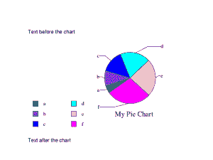

# ReportLab:使用 Python 向 PDF 添加图表

> 原文：<https://www.blog.pythonlibrary.org/2019/04/08/reportlab-adding-a-chart-to-a-pdf-with-python/>

ReportLab 工具包支持向 pdf 添加许多不同的图表和图形。事实上，我在之前的[文章](https://www.blog.pythonlibrary.org/2016/02/18/reportlab-how-to-add-charts-graphs/)中已经谈到了其中的一些。然而，我看到的大多数例子，包括我自己文章中的例子，都没有显示如何将图表作为可流动的对象插入。

这意味着大多数示例向您展示了如何创建包含图表的单页 PDF。大多数开发人员都希望能够创建一些文本，可能是一个表格，并将图表与这些元素一起插入。图表后面通常还会有附加文本。

在本文中，您将学习如何做到这一点。

* * *

### 添加图表

让我们创建一个简单的饼图，并将其添加到一个简单的 PDF 中。您将创建的这个 PDF 将在图表前后有一个句子。

代码如下:

```
from reportlab.lib.styles import getSampleStyleSheet
from reportlab.lib.validators import Auto
from reportlab.graphics.charts.legends import Legend
from reportlab.graphics.charts.piecharts import Pie
from reportlab.graphics.shapes import Drawing, String
from reportlab.platypus import SimpleDocTemplate, Paragraph

def add_legend(draw_obj, chart, data):
    legend = Legend()
    legend.alignment = 'right'
    legend.x = 10
    legend.y = 70
    legend.colorNamePairs = Auto(obj=chart)
    draw_obj.add(legend)

def pie_chart_with_legend():
    data = list(range(15, 105, 15))
    drawing = Drawing(width=400, height=200)
    my_title = String(170, 40, 'My Pie Chart', fontSize=14)
    pie = Pie()
    pie.sideLabels = True
    pie.x = 150
    pie.y = 65
    pie.data = data
    pie.labels = [letter for letter in 'abcdefg']
    pie.slices.strokeWidth = 0.5
    drawing.add(my_title)
    drawing.add(pie)
    add_legend(drawing, pie, data)
    return drawing

def main():
    doc = SimpleDocTemplate('flowable_with_chart.pdf')

    elements = []
    styles = getSampleStyleSheet()
    ptext = Paragraph('Text before the chart', styles["Normal"])
    elements.append(ptext)

    chart = pie_chart_with_legend()
    elements.append(chart)

    ptext = Paragraph('Text after the chart', styles["Normal"])
    elements.append(ptext)
    doc.build(elements)

if __name__ == '__main__':
    main()

```

需要大量的进口。请随意在 ReportLab 的文档中查找这些内容。相反，我将把重点放在函数上。第一个函数将为图表创建一个**图例**。它设置图表的 x/y 坐标，并使用 chart 对象自动确定图例中的颜色。

第二个函数将创建饼图本身。ReportLab 中的图表放在**绘图**对象中。因此，您先创建一个绘图对象，然后创建一个饼图对象。接下来，设置它的位置，并向图表中添加一些数据。在将图表添加到绘图中之前，还需要添加标签并设置图表的描边宽度。

最后一个功能叫做 **main()** 。在这里，您将使用 ReportLab 的**段落**对象创建一个文档模板并添加一串文本。然后，您调用饼图创建函数来获取可以添加到您正在调用的**元素列表**中的图形。最后，您添加另一个段落，然后构建文档并将其写入磁盘。

PDF 的内容应该是这样的:



* * *

### 包扎

这是一篇相当短的文章，但我希望它能帮助您了解如何使用 Python 和 ReportLab 将图表插入到 pdf 中。如果您对添加其他类型的图表感兴趣，您应该查看 ReportLab 的[文档](https://www.reportlab.com/documentation/)或查看下面的文章之一。

* * *

### 相关阅读

*   Reportlab 如何添加图表/图形
*   简单的分步指南[报告实验室教程](https://www.blog.pythonlibrary.org/2010/03/08/a-simple-step-by-step-reportlab-tutorial/)