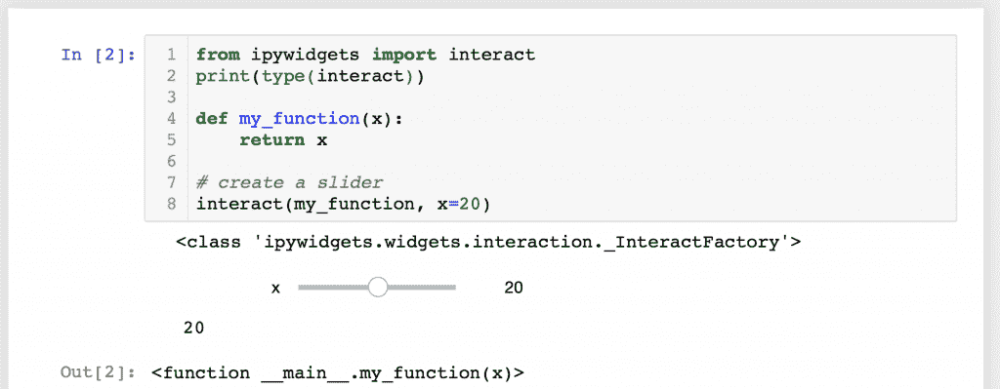
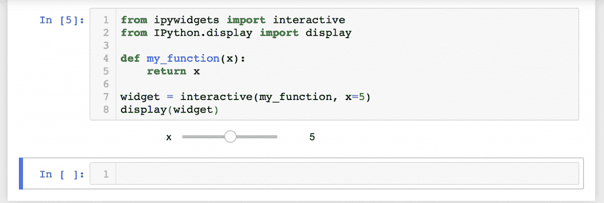

# 使用 interact 创建 Jupyter 笔记本小部件

> 原文：<https://www.blog.pythonlibrary.org/2018/10/23/creating-jupyter-notebook-widgets-with-interact/>

Jupyter 笔记本有一个被称为 **widgets** 的功能。如果您曾经创建过桌面用户界面，您可能已经知道并理解了小部件的概念。它们基本上是构成用户界面的控件。在你的 Jupyter 笔记本中，你可以创建滑块、按钮、文本框等等。

在本章中，我们将学习创建窗口小部件的基础知识。如果你想看一些预制的部件，你可以去下面的网址:

*   [http://jupyter.org/widgets](http://jupyter.org/widgets)

这些小部件是笔记本扩展，可以按照我在 Jupyter extensions [文章](https://www.blog.pythonlibrary.org/2018/10/02/jupyter-notebook-extension-basics/)中了解到的相同方式安装。如果你想通过查看它们的源代码来研究更复杂的小部件是如何工作的，它们真的很有趣，非常值得你花时间去研究。

* * *

### 入门指南

要创建自己的小部件，您需要安装 **ipywidgets** 扩展。

#### 使用 pip 安装

下面是如何使用 pip 安装小部件扩展的方法:

```

pip install ipywidgets
jupyter nbextension enable --py widgetsnbextension

```

如果您正在使用 virtualenv，您可能需要使用`--sys-prefix option to keep your environment isolated.`

#### 使用 conda 安装

下面是如何用 conda 安装 widgets 扩展:

```

conda install -c conda-forge ipywidgets

```

请注意，当安装 conda 时，扩展将自动启用。

* * *

### 学习如何互动

在 Jupyter Notebook 中创建小部件有多种方法。第一种也是最简单的方法是使用来自 **ipywidgets.interact** 的 **interact** 函数，它将自动生成用户界面控件(或小部件),然后您可以使用这些控件来探索您的代码并与数据进行交互。

让我们从创建一个简单的滑块开始。启动一个新的 Jupyter 笔记本，并在第一个单元格中输入以下代码:

```

from ipywidgets import interact

def my_function(x):
    return x

# create a slider
interact(my_function, x=20)

```

这里我们从 **ipywidgets** 导入 **interact** 类。然后我们创建一个名为 **my_function** 的简单函数，它接受一个参数，然后返回它。最后，我们通过传递一个函数以及我们希望 interact 传递给它的值来实例化 **interact** 。由于我们传入了一个整数(即 20)，interact 类将自动创建一个滑块。

尝试运行包含上述代码的单元格，您应该会得到类似如下的结果:



那真是太棒了！尝试用鼠标移动滑块。如果这样做，您将看到滑块以交互方式更新，并且函数的输出也自动更新。

您还可以通过传递浮点数而不是整数来创建一个 **FloatSlider** 。试试看它是如何改变滑块的。

#### 复选框

一旦你玩完了滑块，让我们来看看我们还能用 interact 做些什么。使用以下代码在同一个 Jupyter 笔记本中添加一个新单元格:

```

interact(my_function, x=True)

```

当您运行这段代码时，您会发现 interact 已经为您创建了一个复选框。因为您将“x”设置为**True**，所以复选框处于选中状态。这是它在我的机器上的样子:


您也可以通过选中和取消选中复选框来使用这个小部件。您将看到它的状态发生了变化，并且函数调用的输出也将打印在屏幕上。

#### 文本框

让我们稍微改变一下，尝试向我们的函数传递一个字符串。创建一个新单元格，并输入以下代码:

```

interact(my_function, x='Jupyter Notebook!')

```

当您运行这段代码时，您会发现 interact 生成了一个 textbox，它的值是我们传入的字符串:


尝试编辑文本框的值。当我尝试这样做时，我发现输出文本也发生了变化。

#### 组合框/下拉框

您还可以通过向 interact 中的函数传递列表或字典来创建组合框或下拉小部件。让我们试着传入一个元组列表，看看它的表现如何。回到笔记本，在新的单元格中输入以下代码:

```

languages = [('Python', 'Rocks!'), ('C++', 'is hard!')]
interact(my_function, x=languages)

```

当您运行这段代码时，您应该看到“Python”和“C++”作为组合框中的项目。如果您选择了一个，笔记本会将元组的第二个元素显示到屏幕上。下面是我运行这个例子时我的矿是如何渲染的:


如果你想试试字典而不是列表，这里有一个例子:

```

languages = {'Python': 'Rocks!', 'C++': 'is hard!'}
interact(my_function, x=languages)

```

运行这个单元的输出与前面的例子非常相似。

* * *

### 关于滑块的更多信息

让我们倒回去一分钟，这样我们就可以更多地讨论滑块。实际上，我们可以利用它们做得比我最初透露的多一点。当你第一次创建滑块的时候，你需要做的就是给我们的函数传递一个整数。下面是再次复习的代码:

```

from ipywidgets import interact

def my_function(x):
    return x

# create a slider
interact(my_function, x=20)

```

这里的值 20 在技术上是创建整数值滑块的缩写。代码:

```

interact(my_function, x=20)

```

实际上相当于以下内容:

```

interact(my_function, x=widgets.IntSlider(value=20))

```

从技术上讲，Bools 是复选框的缩写，list/dicts 是 Comboboxes 的缩写，等等。

无论如何，回到滑块。实际上还有另外两种创建整数值滑块的方法。您也可以传入两个或三个项目的元组:

*   (最小值，最大值)
*   (最小、最大、步长)

这使我们能够使滑块更有用，因为现在我们可以控制滑块的最小值和最大值，以及设置步长。步长是我们改变滑块时滑块的变化量。如果您想设置一个初始值，那么您需要像这样更改您的代码:

```

def my_function(x=5):
    return x

interact(my_function, x=(0, 20, 5))

```

函数中的 **x=5** 就是设置初始值的部分。我个人发现有点反直觉，因为 **IntSlider** 本身似乎被定义为这样工作:

```

IntSlider(min, max, step, value)

```

interact 类不会像您自己创建 IntSlider 那样实例化它。

请注意，如果您想要创建一个 FloatSlider，您所需要做的就是将一个 float 传递给三个参数中的任何一个:min、max 或 step。将函数的参数设置为 float 不会将滑块更改为 FloatSlider。

* * *

### 使用 interact 作为装饰器

**interact** 类也可以用作 Python 装饰器。对于这个例子，我们还将在函数中添加第二个参数。回到正在运行的笔记本，使用以下代码添加一个新单元格:

```

from ipywidgets import interact

@interact(x=5, y='Python')
def my_function(x, y):
    return (x, y)

```

你会注意到，在这个例子中，我们不需要显式地传递函数名。事实上，如果您这样做，您会看到一个错误。装饰者隐式调用函数。这里需要注意的另一点是，我们传入了两个参数，而不是一个:一个整数和一个字符串。您可能已经猜到，这将分别创建一个滑块和一个文本框:


与前面的所有示例一样，您可以在浏览器中与这些小部件进行交互，并查看它们的输出。

* * *

### 固定参数

很多时候，您会希望将其中一个参数设置为固定值，而不是允许通过小部件来操作它。Jupyter 笔记本 ipywidgets 包通过**固定**函数支持这一点。让我们来看看如何使用它:

```

from ipywidgets import interact, fixed

@interact(x=5, y=fixed('Python'))
def my_function(x, y):
    return (x, y)

```

这里我们从 **ipywidgets** 导入**固定**函数。然后在我们的 interact 装饰器中，我们将第二个参数设置为“fixed”。当您运行这段代码时，您会发现它只创建了一个小部件:一个滑块。这是因为我们不希望或不需要一个小部件来操纵第二个参数。


在这个截图中，你可以看到我们只有一个滑块，输出是一个元组。如果您更改滑块的值，您将只看到元组中的第一个值发生变化。

* * *

### 互动功能

本章中还有第二个值得讨论的功能，叫做交互。当您想要重用小部件或访问绑定到所述小部件的数据时，这个函数非常有用。**互动**和**互动**的最大区别在于，有了互动，小工具不会自动显示在屏幕上。如果您希望显示小部件，那么您需要明确地这样做。

让我们看一个简单的例子。在 Jupyter 笔记本中打开一个新单元格，输入以下代码:

```

from ipywidgets import interactive

def my_function(x):
    return x

widget = interactive(my_function, x=5)
type(widget)

```

运行此代码时，您应该会看到以下输出:

```

ipywidgets.widgets.interaction.interactive

```

但是你不会像使用交互功能时那样看到一个滑块部件。为了演示，下面是我运行该单元时得到的截图:


如果您想要显示小部件，您需要导入 **display** 函数。让我们将单元格中的代码更新如下:

```

from ipywidgets import interactive
from IPython.display import display

def my_function(x):
    return x

widget = interactive(my_function, x=5)
display(widget)

```

这里我们从 **IPython.display** 导入 **display** 函数，然后在代码的最后调用它。当我运行这个单元格时，我得到了滑块小部件:



为什么这很有帮助？为什么不直接使用 interact 而不是通过额外的关卡呢？答案是交互功能给了你交互所没有的额外信息。您可以访问小部件的关键字参数及其结果。将以下两行添加到您刚刚编辑的单元格的末尾:

```

print(widget.kwargs)
print(widget.result)

```

现在，当您运行单元格时，它将打印出传递给函数的参数和调用函数的返回值(即结果)。

* * *

### 包扎

在本章中，我们学习了很多关于 Jupyter 笔记本小部件的知识。我们讨论了使用“交互”功能和“互动”功能的基础知识。然而，通过查看[文档](https://ipywidgets.readthedocs.io/en/stable/examples/Using%20Interact.html)，你可以了解更多关于这些函数的信息。

即便如此，这也只是你在 Jupyter 中使用小部件所能做事情的皮毛。在下一章中，我们将深入研究除了使用我们在本章中学到的交互/互动功能之外，如何手工创建小部件。我们将了解更多关于小工具的工作原理，以及如何使用它们让你的笔记本变得更有趣、功能更强大。

* * *

### 相关阅读

*   Jupyter 笔记本[扩展基础知识](https://www.blog.pythonlibrary.org/2018/10/02/jupyter-notebook-extension-basics/)
*   使用 [Jupyter 笔记本](https://www.blog.pythonlibrary.org/2018/09/25/creating-presentations-with-jupyter-notebook/)创建演示文稿