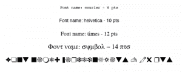
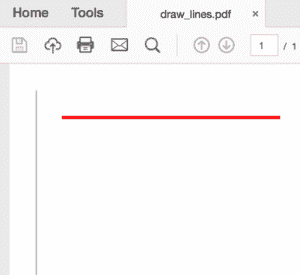
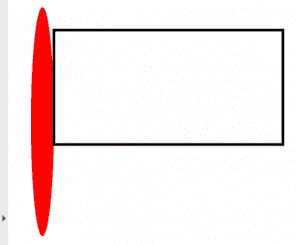
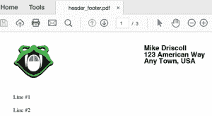
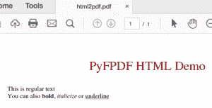

# 使用 fpdf2 和 Python 创建 pdf

> 原文：<https://www.blog.pythonlibrary.org/2018/06/05/creating-pdfs-with-pyfpdf-and-python/>

ReportLab 是我用来从头开始生成 pdf 的主要工具包。不过我发现还有一个叫 **fpdf2** 。fpdf2 包实际上是用 PHP 编写的“免费”pdf 包的一个端口。

**注:PyFPDF 现已死亡。本文最初就是考虑到这个包而写的。已经换成了[fpdf 2](https://pypi.org/project/fpdf2/)**

本文对 fpdf2 封装的介绍并不详尽。然而，它将涵盖足够多的，让你开始有效地使用它。请注意，如果您想了解更多关于这个库的信息，而不是本章或包的文档中所涵盖的内容，那么在 Leanpub 上有一本关于 PyFPDF 的短文，书名是“Python does PDF: pyFPDF ”,作者是 Edwood Ocasio。

* * *

### 装置

安装 fpdf2 很容易，因为它是为 pip 设计的。方法如下:

 `python -m pip install fpdf2` 

当你安装这个包时，你会发现它没有依赖项，这很好。

| [](https://leanpub.com/reportlab) | Want to learn more about working with PDFs in Python? Then check out my book:

### ReportLab:使用 Python 处理 PDF

**[在 Leanpub](https://leanpub.com/reportlab) 上立即购买** |

* * *

### 基本用法

现在您已经安装了 fpdf2，让我们试着用它来创建一个简单的 pdf。打开 Python 编辑器，创建一个名为 **simple_demo.py** 的新文件。然后在其中输入以下代码:

```
# simple_demo.py

from fpdf import FPDF

pdf = FPDF()
pdf.add_page()
pdf.set_font("Arial", size=12)
pdf.cell(200, 10, txt="Welcome to Python!", ln=1, align="C")
pdf.output("simple_demo.pdf")

```

我们需要谈的第一项是进口。这里我们从 **fpdf** 包中导入 **FPDF** 类。此类别的默认设置是以纵向模式创建 PDF，使用毫米作为度量单位，并使用 A4 页面大小。如果您想要更明确，您可以像这样编写实例化行:

```
pdf = FPDF(orientation='P', unit='mm', format='A4')

```

我不喜欢用字母“P”来告诉同学们它的方向。如果你喜欢横向多于纵向，你也可以用 L。

fpdf2 封装支持“pt”、“cm”和“in”作为替代测量单位。

如果深入研究源代码，您会发现 fpdf2 包仅支持以下页面大小:

*   A3 号
*   A4 号
*   A5 号
*   信
*   合法的

与 ReportLab 相比，这是一个小小的限制，在 ReportLab 中，您可以支持多种额外的大小，并且您还可以将页面大小设置为自定义大小。

无论如何，下一步是使用 **add_page** 方法创建一个页面。然后我们通过 **set_font** 方法设置页面的字体。你会注意到我们传入了字体的族名和我们想要的大小。您也可以使用**样式**参数设置字体的样式。如果您想这样做，请注意，它需要一个字符串，如' B '表示粗体，或' BI '表示**粗体斜体**。

接下来，我们创建一个 200 毫米宽、10 毫米高的**单元格**。单元格基本上是一个容纳文本的可流动体，可以启用边框。如果启用了自动分页符，并且单元格超出了页面的大小限制，它将自动拆分。 **txt** 参数是您想要在 PDF 中打印的文本。 **ln** 参数告诉 PyFPDF 如果设置为 1，就添加一个换行符，这就是我们在这里所做的。最后，我们可以将文本的对齐方式设置为对齐(默认)或居中(C)。我们在这里选择了后者。

最后，我们通过使用我们想要保存的文件的路径调用 **output** 方法将文档保存到磁盘。

当我运行这段代码时，我得到了一个如下所示的 PDF:


现在让我们了解一点 fpdf2 如何使用字体。

* * *

### 使用字体

fpdf2 有一组硬编码到其 fpdf 类中的核心字体:

```
self.core_fonts={'courier': 'Courier',
    'courierB': 'Courier-Bold',
    'courierBI': 'Courier-BoldOblique',
    'courierI': 'Courier-Oblique',
    'helvetica': 'Helvetica',
    'helveticaB': 'Helvetica-Bold', 
    'helveticaBI': 'Helvetica-BoldOblique',
    'helveticaI': 'Helvetica-Oblique',
    'symbol': 'Symbol',
    'times': 'Times-Roman',
    'timesB': 'Times-Bold',
    'timesBI': 'Times-BoldItalic',
    'timesI': 'Times-Italic',
    'zapfdingbats': 'ZapfDingbats'}

```

您会注意到，尽管我们在前面的示例中使用了 Arial，但它并没有在这里列出。Arial 在实际的源代码中被重新映射到 Helvetica，所以你根本没有真正使用 Arial。无论如何，让我们学习如何使用 fpdf2 改变字体:

```
# change_fonts.py

from fpdf import FPDF

def change_fonts():
    pdf = FPDF()
    pdf.add_page()
    font_size = 8
    for font in pdf.core_fonts:
        if any([letter for letter in font if letter.isupper()]):
            # skip this font
            continue
        pdf.set_font(font, size=font_size)
        txt = "Font name: {} - {} pts".format(font, font_size)
        pdf.cell(0, 10, txt=txt, ln=1, align="C")
        font_size += 2

    pdf.output("change_fonts.pdf")

if __name__ == '__main__':
    change_fonts()

```

这里我们创建了一个简单的函数叫做 **change_fonts** ，然后我们创建了一个 FPDF 类的实例。下一步是创建一个页面，然后遍历核心字体。当我尝试这样做时，我发现 fpdf2 不认为其核心字体的变体名称是有效的字体(例如 helveticaB、helveticaBI 等)。所以为了跳过这些变体，我们创建一个列表理解并检查字体名称中的任何大写字符。如果有，我们跳过这个字体。否则，我们设置字体和字体大小，并把它写出来。我们还通过循环每次增加两个点的字体大小。如果你想改变字体的颜色，那么你可以调用 **set_text_color** 并传入你需要的 RGB 值。

运行这段代码的结果如下所示:



我喜欢在 fpdf2 中改变字体是如此容易。然而，核心字体的数量非常少。您可以通过 **add_font** 方法使用 fpdf2 添加 TrueType、OpenType 或 Type1 字体。此方法采用以下参数:

*   系列(字体系列)
*   样式(字体样式)
*   fname(字体文件名或字体文件的完整路径)
*   uni (TTF Unicode 标志)

fpdf2 文档使用的示例如下:

```
pdf.add_font('DejaVu', '', 'DejaVuSansCondensed.ttf', uni=True)

```

在试图通过 **set_font** 方法使用它之前，您将调用 **add_font** 。我在 Windows 上试了一下，发现了一个错误，因为 Windows 找不到这种字体，这是我预料中的。这是添加字体的一个非常简单的方法，而且可能会奏效。请注意，它使用以下搜索路径:

*   FPDF_FONTPATH
*   系统 _ 字体

这些似乎是在您的环境或 PyFPDF 包本身中定义的常量。文档没有解释如何设置或修改它们。相反，你应该使用 **set_global()** 和你想要使用的字体的路径。：

```
import fpdf

fpdf_mod.set_global("SYSTEM_TTFONTS", os.path.join(os.path.dirname(__file__),'fonts'))

```

否则 **SYSTEM_TTFONTS** 默认设置为 **None** 。

* * *

### 图画

fpdf2 封装对绘图的支持有限。你可以画直线、椭圆和矩形。我们先来看看如何画线:

```
# draw_lines.py

from fpdf import FPDF

def draw_lines():
    pdf = FPDF()
    pdf.add_page()
    pdf.line(10, 10, 10, 100)
    pdf.set_line_width(1)
    pdf.set_draw_color(255, 0, 0)
    pdf.line(20, 20, 100, 20)
    pdf.output('draw_lines.pdf')

if __name__ == '__main__':
    draw_lines()

```

这里我们调用 **line** 方法，并传递给它两对 x/y 坐标。线宽默认为 0.2 毫米，所以我们通过调用 **set_line_width** 方法将第二行的线宽增加到 1 毫米。我们还通过调用 **set_draw_color** 将第二行的颜色设置为等同于红色的 RGB 值。输出如下所示:



现在我们可以继续画几个形状:

```
# draw_shapes.py

from fpdf import FPDF

def draw_shapes():
    pdf = FPDF()
    pdf.add_page()
    pdf.set_fill_color(255, 0, 0)
    pdf.ellipse(10, 10, 10, 100, 'F')

    pdf.set_line_width(1)
    pdf.set_fill_color(0, 255, 0)
    pdf.rect(20, 20, 100, 50)
    pdf.output('draw_shapes.pdf')

if __name__ == '__main__':
    draw_shapes()

```

当你画一个类似于**椭圆**或**矩形**的形状时，你将需要传入代表绘图左上角的 x 和 y 坐标。然后，您将需要传入形状的宽度和高度。您可以传入的最后一个参数是用于**样式**的，它可以是“D”或空字符串(默认)、“F”用于填充或“DF”用于绘制和填充。在这个例子中，我们填充椭圆并使用默认的矩形。结果看起来像这样:



现在让我们了解一下图像支持。

* * *

### 添加图像

fpdf2 软件包支持将 JPEG、PNG 和 GIF 格式添加到您的 pdf 中。如果您碰巧尝试使用动画 GIF，则只使用第一帧。同样值得注意的是，如果您多次向文档中添加相同的图像，fpdf2 足够智能，可以只嵌入图像的一个实际副本。下面是一个使用 fpdf2 向 PDF 添加图像的非常简单的示例:

```
# add_image.py

from fpdf import FPDF

def add_image(image_path):
    pdf = FPDF()
    pdf.add_page()
    pdf.image(image_path, x=10, y=8, w=100)
    pdf.set_font("Arial", size=12)
    pdf.ln(85)  # move 85 down
    pdf.cell(200, 10, txt="{}".format(image_path), ln=1)
    pdf.output("add_image.pdf")

if __name__ == '__main__':
    add_image('snakehead.jpg')

```

这里的新代码是对 **image** 方法的调用。它的签名看起来像这样:

```
image(name, x = None, y = None, w = 0, h = 0, type = '', link = '')

```

您可以指定图像文件路径、x 和 y 坐标以及宽度和高度。如果您只指定宽度或高度，另一个会自动计算，并尝试保持图像的原始比例。也可以显式指定文件类型，否则是根据文件名猜测的。最后，您可以在添加图像时添加链接/ URL。

当您运行这段代码时，您应该会看到如下所示的内容:


现在让我们了解 fpdf2 如何支持多页文档。

* * *

### 多页文档

fpdf2 默认启用多页支持。如果您在页面中添加了足够多的单元格，它会自动创建一个新页面，并继续将您的新文本添加到下一页。这里有一个简单的例子:

```
# multipage_simple.py

from fpdf import FPDF

def multipage_simple():
    pdf = FPDF()
    pdf.set_font("Arial", size=12)
    pdf.add_page()
    line_no = 1
    for i in range(100):
        pdf.cell(0, 10, txt="Line #{}".format(line_no), ln=1)
        line_no += 1
    pdf.output("multipage_simple.pdf")

if __name__ == '__main__':
    multipage_simple()

```

这只是创建了 100 行文本。当我运行这段代码时，我得到了一个包含 4 页文本的 PDF 文件。

* * *

### 页眉和页脚

fpdf2 软件包内置了对添加页眉、页脚和页码的支持。FPDF 的**类只需要被子类化，而**页眉**和**页脚**的方法被覆盖以使它们工作。让我们来看看:**

```
# header_footer.py

from fpdf import FPDF

class CustomPDF(FPDF):

    def header(self):
        # Set up a logo
        self.image('snakehead.jpg', 10, 8, 33)
        self.set_font('Arial', 'B', 15)

        # Add an address
        self.cell(100)
        self.cell(0, 5, 'Mike Driscoll', ln=1)
        self.cell(100)
        self.cell(0, 5, '123 American Way', ln=1)
        self.cell(100)
        self.cell(0, 5, 'Any Town, USA', ln=1)

        # Line break
        self.ln(20)

    def footer(self):
        self.set_y(-10)

        self.set_font('Arial', 'I', 8)

        # Add a page number
        page = 'Page ' + str(self.page_no()) + '/{nb}'
        self.cell(0, 10, page, 0, 0, 'C')

def create_pdf(pdf_path):
    pdf = CustomPDF()
    # Create the special value {nb}
    pdf.alias_nb_pages()
    pdf.add_page()
    pdf.set_font('Times', '', 12)
    line_no = 1
    for i in range(50):
        pdf.cell(0, 10, txt="Line #{}".format(line_no), ln=1)
        line_no += 1
    pdf.output(pdf_path)

if __name__ == '__main__':
    create_pdf('header_footer.pdf')

```

因为这是一段相当长的代码，所以让我们一段一段地看。我们想看的第一部分是**头**方法:

```
def header(self):
    # Set up a logo
    self.image('snakehead.jpg', 10, 8, 33)
    self.set_font('Arial', 'B', 15)

    # Add an address
    self.cell(100)
    self.cell(0, 5, 'Mike Driscoll', ln=1)
    self.cell(100)
    self.cell(0, 5, '123 American Way', ln=1)
    self.cell(100)
    self.cell(0, 5, 'Any Town, USA', ln=1)

    # Line break
    self.ln(20)

```

在这里，我们只是硬编码的标志图像，我们想使用，然后我们设置字体，我们将在我们的标题中使用。接下来，我们添加一个地址，并将该地址放在图像的右侧。您会注意到，当您使用 fpdf2 时，原点在页面的左上角。因此，如果我们想将我们的文本向右移动，那么我们需要创建一个具有多个度量单位的单元格。在这种情况下，我们通过添加一个 100 mm 的单元格，将接下来的三行向右移动。然后，我们在末尾添加一个换行符，这将增加 20 mm 的垂直空间。

接下来，我们想要覆盖**页脚**方法:

```
def footer(self):
    self.set_y(-10)

    self.set_font('Arial', 'I', 8)

    # Add a page number
    page = 'Page ' + str(self.page_no()) + '/{nb}'
    self.cell(0, 10, page, 0, 0, 'C')

```

我们在这里做的第一件事是将页面上原点的 y 位置设置为-10 mm 或-1 cm。这将页脚的原点放在页面底部的正上方。然后我们为页脚设置字体。最后，我们创建页码文本。你会注意到对 **{nb}** 的引用。这是 fpdf2 中的一个特殊值，在您调用 **alias_nb_pages** 时插入，表示文档中的总页数。页脚的最后一步是在页面上书写页面文本并居中。

最后一段代码在 **create_pdf** 函数中:

```
def create_pdf(pdf_path):
    pdf = CustomPDF()
    # Create the special value {nb}
    pdf.alias_nb_pages()
    pdf.add_page()
    pdf.set_font('Times', '', 12)
    line_no = 1
    for i in range(50):
        pdf.cell(0, 10, txt="Line #{}".format(line_no), ln=1)
        line_no += 1
    pdf.output(pdf_path)

```

这就是我们调用有点神奇的 **alias_nb_pages** 方法的地方，该方法将帮助我们获得总页数。我们还为页面中没有被页眉或页脚占据的部分设置了字体。然后，我们向文档中写入 50 行文本，使其创建一个多页 PDF。

当您运行这段代码时，您应该会看到一个如下所示的页面:



现在让我们看看如何用 PyFPDF 创建表。

* * *

### 桌子

fpdf2 包没有表格控件。相反，您必须使用单元格或 HTML 来构建表格。让我们先来看看如何使用单元格创建表格:

```
# simple_table.py

from fpdf import FPDF

def simple_table(spacing=1):
    data = [['First Name', 'Last Name', 'email', 'zip'],
            ['Mike', 'Driscoll', 'mike@somewhere.com', '55555'],
            ['John', 'Doe', 'jdoe@doe.com', '12345'],
            ['Nina', 'Ma', 'inane@where.com', '54321']
            ]

    pdf = FPDF()
    pdf.set_font("Arial", size=12)
    pdf.add_page()

    col_width = pdf.w / 4.5
    row_height = pdf.font_size
    for row in data:
        for item in row:
            pdf.cell(col_width, row_height*spacing,
                     txt=item, border=1)
        pdf.ln(row_height*spacing)

    pdf.output('simple_table.pdf')

if __name__ == '__main__':
    simple_table()

```

这里我们只是创建一个简单的列表列表，然后循环遍历它。对于列表中的每一行和嵌套行中的每个元素，我们向 PDF 对象添加一个单元格。请注意，我们打开了这些单元格的边框。当我们完成一行的迭代后，我们添加一个换行符。如果您希望单元格中有更多的空间，那么您可以传入一个间距值。当我运行这个脚本时，我得到了一个如下所示的表:


尽管这是一种非常粗糙的创建表格的方法。我个人更喜欢 ReportLab 在这里的方法论。

另一种方法是使用 HTML 创建表格:

```
# simple_table_html.py

from fpdf import FPDF, HTMLMixin

class HTML2PDF(FPDF, HTMLMixin):
    pass

def simple_table_html():
    pdf = HTML2PDF()

    table = """
```

| 标题 1 | 标题 2 |
| --- | --- |
| 单元格 1 | 细胞 2 |
| 细胞 2 | 3 号牢房 |

" " " pdf . add _ page()pdf . write _ html(table)pdf . output(' simple _ table _ html . pdf ')if _ _ name _ _ = ' _ _ main _ _ ':simple _ table _ html()

这里我们使用 fpdf2 的 **HTMLMixin** 类来允许它接受 HTML 作为输入并将其转换成 pdf。当您运行此示例时，您将得到以下结果:


网站上有一些使用 Web2Py 框架和 PyFPDF 创建更好看的表格的例子，但是代码不完整，所以我在这里不做演示。

* * *

### 将 HTML 转换为 PDF

fpdf2 包对 HTML 标签有一些有限的支持。您可以使用 HTML 创建标题、段落和基本文本样式。您还可以添加超链接、图像、列表和表格。有关受支持的标签和属性的完整列表，请查看文档。然后，您可以使用我们在上一节创建表格时看到的 **HTMLMixin** 将基本 HTML 转换成 PDF。

```
# html2fpdf.py

from fpdf import FPDF, HTMLMixin

class HTML2PDF(FPDF, HTMLMixin):
    pass

def html2pdf():
    html = '''
```

# fpdf2 HTML 演示

这是常规文本

也可以**粗体**、*斜体*或下划线' ' ' pdf = html 2 pdf()pdf . add _ page()pdf . write _ html(html)pdf . output(' html 2 pdf ')if _ _ name _ _ = ' _ _ main _ _ ':html 2 pdf()

在这里，我们只是使用非常标准的 HTML 标记来设计 PDF。当您运行这段代码时，它实际上看起来相当不错:



* * *

### Web2Py

Web2Py 框架包括 fpdf2 包，使在框架中创建报告变得更加容易。这允许您在 Web2Py 中创建 PDF 模板。关于这个主题的文档有点少，所以我不会在本书中涉及这个主题。然而，看起来您确实可以通过这种方式使用 Web2Py 做一些不太好的报告。

* * *

### 模板

您也可以使用 fpdf2 创建模板。这个包甚至包括一个设计器脚本，它使用 wxPython 作为它的用户界面。您可以创建的模板将是您想要指定每个元素在页面上出现的位置、它的样式(字体、大小等)以及要使用的默认文本。模板系统支持使用 CSV 文件或数据库。然而，在关于这个主题的文档中只有一个例子，这有点令人失望。虽然我确实认为这个库的这一部分很有前途，但是由于缺乏文档，我不太愿意大范围地写它。

* * *

### 包扎

fpdf2 包是一个相当不错的项目，可以让您进行基本的 pdf 生成。他们在 FAQ 中指出，他们不支持图表或小部件，也不支持像 ReportLab 这样的“灵活的页面布局系统”。它们也不支持 PDF 文本提取或转换，如 PDFMiner 或 PyPDF2。然而，如果您需要的只是生成 PDF 的基本框架，那么这个库可能适合您。我认为它的学习曲线比 ReportLab 的要简单。然而，fpdf2 的功能远不如 ReportLab 丰富，我觉得在页面上放置元素时，你没有相同的控制粒度。

* * *

### 相关阅读

*   使用 Python 在 [ReportLab 中创建交互式 PDF 表单](https://www.blog.pythonlibrary.org/2018/05/29/creating-interactive-pdf-forms-in-reportlab-with-python/)
*   用 Python 填充 PDF [表单](https://www.blog.pythonlibrary.org/2018/05/22/filling-pdf-forms-with-python/)
*   [使用 Python 从 pdf 中导出数据](https://www.blog.pythonlibrary.org/2018/05/03/exporting-data-from-pdfs-with-python/)

* * *

### 源代码

*   [pyfpdf_examples.tar](https://www.blog.pythonlibrary.org/wp-content/uploads/2018/06/pyfpdf_examples.tar.gz)