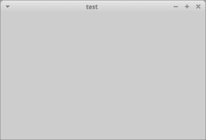
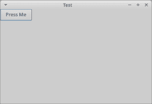

# wxPython 101:简单框架

> 原文：<https://www.blog.pythonlibrary.org/2015/04/14/wxpython-101-simple-frames/>

在本教程中，我们将看看创建 wxPython 框架的三种简单方法。如果你是视觉学习者，我还创建了这篇文章的截屏版本，你可以在下面查看:

[https://www.youtube.com/embed/j0OY7obzFsw](https://www.youtube.com/embed/j0OY7obzFsw)

* * *

### “愚蠢”的简单例子

[](https://www.blog.pythonlibrary.org/wp-content/uploads/2015/04/wx_frame_test.png)

我把下面的例子称为“愚蠢”的例子，因为它不是很有用。您不能很容易地扩展这个示例，但我将它作为一个示例，因为您仍然可以找到像这样的 wxPython 片段。它们确实有效，但不推荐使用。

```

import wx

app = wx.App(False)
frame = wx.Frame(None, title='test')
frame.Show()
app.MainLoop()

```

我们来看一个更现实的例子！

* * *

### 更好的框架示例

[](https://www.blog.pythonlibrary.org/wp-content/uploads/2015/04/wx_frame_test2.png)

在这个例子中，我们子类化了 **wx。帧**并添加一个 **wx。面板**对象。面板在小部件之间添加了正确的跳转和正确的外观。例如，如果你的窗户上没有嵌板，你的框架看起来会有点奇怪。

```

import wx

########################################################################
class MyFrame(wx.Frame):
    """"""

    #----------------------------------------------------------------------
    def __init__(self):
        """Constructor"""
        wx.Frame.__init__(self, None, title='Test')
        panel = wx.Panel(self)
        btn = wx.Button(panel, label='Press Me')
        self.Show()

if __name__ == '__main__':
    app = wx.App(False)
    frame = MyFrame()
    app.MainLoop()

```

您会注意到，在这个例子中，我还添加了一个按钮小部件。这只是为了向您展示向您的框架添加额外的小部件是多么容易。现在，我们将继续前进，将面板分成自己的类。

* * *

### 分离类

对于这个例子，我们将把面板分离到它自己的类中。我们来看看吧！

```

import wx

########################################################################
class MyPanel(wx.Panel):
    """"""

    #----------------------------------------------------------------------
    def __init__(self, parent):
        """Constructor"""
        wx.Panel.__init__(self, parent)
        btn = wx.Button(self, label='Press Me')

########################################################################
class MyFrame(wx.Frame):
    """"""

    #----------------------------------------------------------------------
    def __init__(self):
        """Constructor"""
        wx.Frame.__init__(self, None, title='Test')
        panel = MyPanel(self)
        self.Show()

if __name__ == '__main__':
    app = wx.App(False)
    frame = MyFrame()
    app.MainLoop()

```

我喜欢这样做的原因是它有助于减少每个类的代码行数。如果 panel 类变得太大，也可以很容易地将它移到自己的模块中。然后我就可以导入面板了！当然，这是有代价的，因为现在你必须找到一种方法在两个类之间进行交流。这通常很容易做到，为此我通常使用 pubsub，但是我在 wxPython 邮件列表上看到过其他方法。

* * *

### 包扎

现在您知道如何在 wxPython 中创建自己的框架。创建小部件和管理代码有很多不同的方法。我希望这些例子有助于你理解如何设计你自己的代码。

### 相关阅读

*   [wxPython 101:使用框架样式](https://www.blog.pythonlibrary.org/2013/11/06/wxpython-101-using-frame-styles/)
*   wxPython [文档](http://wxpython.org/Phoenix/docs/html/Frame.html#frame)关于 wx。基本框架