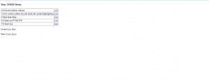

# 瓶子-创建 Python 待办事项列表 Web 应用程序

> 原文：<https://www.blog.pythonlibrary.org/2013/07/22/bottle-creating-a-python-todo-list-web-app/>

Python 有很多 web 框架。Bottle 就是其中之一，被认为是一个 WSGI 框架。它有时也被称为“微框架”，可能是因为 Bottle 只包含一个 Python 文件，除了 Python 本身之外没有任何依赖关系。我一直在努力学习它，并且在他们的网站上使用官方的[待办事项教程](http://bottlepy.org/docs/dev/tutorial_app.html)。在本文中，我们将检查这个应用程序，并对 UI 做一点改进。然后在另一篇后续文章中，我们将更改应用程序以使用 SQLAlchemy，而不是直接的 sqlite。如果你想跟着去，你可能会想去安装[瓶](http://bottlepy.org/docs/dev/index.html)。

### 入门指南

您总是需要从某个地方开始，因此对于这个应用程序，我们将从创建数据库的代码开始。我们将从一开始就导入所有内容，而不是一点一点地添加额外的导入内容。与原始代码相比，我们还将对代码进行一些编辑。让我们开始吧:

```

import sqlite3

con = sqlite3.connect('todo.db') # Warning: This file is created in the current directory
con.execute("CREATE TABLE todo (id INTEGER PRIMARY KEY, task char(100) NOT NULL, status bool NOT NULL)")
con.execute("INSERT INTO todo (task,status) VALUES ('Read Google News',0)")
con.execute("INSERT INTO todo (task,status) VALUES ('Visit the Python website',1)")
con.execute("INSERT INTO todo (task,status) VALUES ('See how flask differs from bottle',1)")
con.execute("INSERT INTO todo (task,status) VALUES ('Watch the latest from the Slingshot Channel',0)")
con.commit()

```

这段代码将创建一个有 4 个条目的小数据库。被设置为 0 的项目是“完成的”,而被设置为 1 的项目仍然是待办事项。在继续之前，请确保首先运行该程序，以便在我们对该数据库进行查询时，其余的代码能够正常工作。现在我们准备看看主页的代码。

### 创建主页

[](https://www.blog.pythonlibrary.org/wp-content/uploads/2013/07/bottle_main.png)

```

import sqlite3
from bottle import route, run, debug
from bottle import redirect, request, template, validate

#----------------------------------------------------------------------
@route("/")
@route("/todo")
def todo_list():
    """
    Show the main page which is the current TODO list
    """
    conn = sqlite3.connect("todo.db")
    c = conn.cursor()
    c.execute("SELECT id, task FROM todo WHERE status LIKE '1'")
    result = c.fetchall()
    c.close()

    output = template("make_table", rows=result)
    return output

if __name__ == "__main__":
    debug(True)
    run()

```

在这里，我们导入整个应用程序的所有必要部分。接下来，我们创建一些**route**decorator。瓶中的路由是对函数调用映射的请求。看看上面的代码，看看这是什么意思。第一条路线将主页面“/”映射到 **todo_list** 函数。请注意，我们还有第二条路线。这个函数将“/todo”页面映射到同一个函数。是的，Bottle 支持多路径映射。如果您要运行这段代码，您可以访问 http://127.0.0.1:8080/todo，或者只访问 http://127.0.0.1:8080/该页面上的 SQL 命令只是从数据库中获取所有仍需完成的项目。我们将该结果集(元组列表)传递给 Bottle 的模板函数。如您所见，它接受模板的名称和结果。最后，我们返回呈现的模板。

请注意，我们已经打开了调试。这将返回一个完整的 stacktrace 来帮助调试问题。如果将它放在您的生产服务器上，您不会希望让它保持启用状态。

现在，让我们来看看模板代码:

```

%#template to generate a HTML table from a list of tuples (or list of lists, or tuple of tuples or ...)
您的待办事项:

```

%for row in rows: %id, title = row %for col in row: %end %end

| {{col}} | [编辑](/edit/{{id}}) |

创建[新的](/new)项目

显示[已完成的项目](/done)

现在瓶中的模板以。tpl 扩展，所以这个应该保存为 **make_table.tpl** 任何以百分号(%)开头的都是 Python。剩下的就是 HTML 了。在这段代码中，我们创建了一个表，在第一列和第二列中包含行的 id 字段和任务。我们还添加了第三列，以允许编辑。最后，我们添加一个链接来添加一个新项目和另一个链接，以便显示所有“完成”或完成的项目。

现在我们准备继续编辑我们的待办事项！

### 编辑我们的项目

使用 Bottle 时，编辑待办事项非常容易。但是，这里涉及的代码比主脚本多，因为它显示要编辑的项目，还处理保存更改请求。这段代码与原始代码基本相同:

```

#----------------------------------------------------------------------
@route('/edit/:no', method='GET')
@validate(no=int)
def edit_item(no):
    """
    Edit a TODO item
    """

    if request.GET.get('save','').strip():
        edit = request.GET.get('task','').strip()
        status = request.GET.get('status','').strip()

        if status == 'open':
            status = 1
        else:
            status = 0

        conn = sqlite3.connect('todo.db')
        c = conn.cursor()
        c.execute("UPDATE todo SET task = ?, status = ? WHERE id LIKE ?", (edit, status, no))
        conn.commit()

        redirect("/")
    else:
        conn = sqlite3.connect('todo.db')
        c = conn.cursor()
        c.execute("SELECT task FROM todo WHERE id LIKE ?", (str(no)))
        cur_data = c.fetchone()

        return template('edit_task', old=cur_data, no=no)

```

您会注意到第一个 route decorator 的格式与我们之前看到的不同。“:no”部分意味着我们将向这个路由映射到的方法传递一个值。在这种情况下，我们将传递要编辑的条目的编号(id)。我们还设置了方法来使编辑表单正确工作。如果您想执行该操作，也可以将其设置为 POST。如果用户按下**保存**按钮，那么 If 语句的第一部分将执行；否则，如果用户只是加载编辑页面，语句的第二部分将加载并预填充表单。还有第二个装饰器叫做 **validate** ，我们可以用它来验证 URL 中传递的数据。在这种情况下，我们检查该值是否是一个整数。您还会注意到，一旦我们保存了更改，我们会使用重定向将用户返回到主网页。

现在，让我们花点时间看看模板代码:

```

%#template for editing a task
%#the template expects to receive a value for "no" as well a "old", the text of the selected ToDo item
编辑 ID 为{{no}}的任务

```

<form action="/edit/{{no}}" method="get"><input type="text" name="task" value="{{old[0]}}" size="100" maxlength="100"> <select name="status"><option>open</option> <option>closed</option></select> 
<input type="submit" name="save" value="save"></form>

如您所见，这创建了一个简单的输入控件来编辑文本和一个组合框来更改状态。你应该将这段代码保存为 **edit_task.tpl** 。下一部分也是最后一部分，我们将讨论如何为我们的待办事项列表创建一个新项目。

### 创建新的待办事项列表项

正如您到目前为止所看到的，Bottle 非常容易使用。向我们的待办事项列表添加一个新项目也非常简单。让我们看一下代码:

```

#----------------------------------------------------------------------
@route("/new", method="GET")
def new_item():
    """
    Add a new TODO item
    """
    if request.GET.get("save", "").strip():
        new = request.GET.get("task", "").strip()

        conn = sqlite3.connect("todo.db")
        c = conn.cursor()
        c.execute("INSERT INTO todo (task,status) VALUES (?,?)", (new,1))
        new_id = c.lastrowid

        conn.commit()
        c.close()

        redirect("/")
    else:
        return template("new_task.tpl")

```

这段代码还在其路由定义中使用了 GET 请求，我们在这里使用了与编辑函数相同的思想，即当页面加载时，我们在 if 语句的 else 部分中执行代码，如果我们保存表单，我们将 todo 项保存到数据库并重定向到主页，主页已被适当更新。为了完整起见，我们将快速查看一下 **new_task.tpl** 模板:

```

向待办事项列表添加新任务:

```

<form action="/new" method="GET"><input type="text" size="100" maxlength="100" name="task"> <input type="submit" name="save" value="save"></form>

### 包扎

至此，您应该知道如何创建一个全功能的 todo 应用程序。如果您下载了源代码，您会看到它包含了几个其他函数，用于显示单个项目或显示“完成”(或已完成)项目的表格。这段代码可能应该添加额外的错误处理，它可以使用一个好的网页设计师用一些 CSS 或图像来美化它。如果你觉得有启发，我们会把这些项目留给读者去做。

### 下载源代码

*   [todo_app.zip](https://www.blog.pythonlibrary.org/wp-content/uploads/2013/07/todo_app.zip)