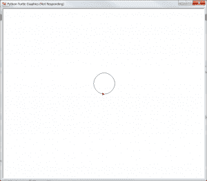
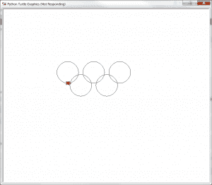
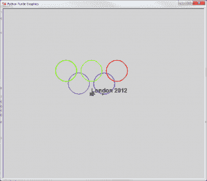

# Python:用乌龟画圆

> 原文：<https://www.blog.pythonlibrary.org/2012/08/06/python-using-turtles-for-drawing/>

我目前正在撰写一本大学课程 Python 书籍的书评，该书使用 Python turtle 模块和 Tkinter 来帮助教授 Python 编程语言。希望我能在月底前写完那本书。同时，这让我决定尝试一下海龟模块。在这篇文章中，我们将看看如何让乌龟画出典型的奥运会标志，然后尝试在添加新功能的同时清理代码。

### 海龟入门

[](https://www.blog.pythonlibrary.org/wp-content/uploads/2012/08/turtle_ex.png)

幸运的是，没有需要安装的包。Python 中包含了 turtle 模块。你要做的就是导入它。这是一个非常简单的脚本，它会在屏幕上画一个圆。

```

import turtle

myTurtle = turtle.Turtle()
myTurtle.circle(50)
turtle.getscreen()._root.mainloop()

```

如您所见，您需要创建一个乌龟实例，然后让它画一个圆。可悲的是，默认的海龟实际上看起来像一个鼠标箭头。幸运的是，您可以通过简单地传递一个形状字符串来改变这种情况: **turtle。龟(shape="turtle")** 。让我们继续前进，创造一个真正简单的奥林匹克标志！

### 海龟奥运会

[](https://www.blog.pythonlibrary.org/wp-content/uploads/2012/08/turtle_olympics.png)

当你第一次开始使用海龟模块的时候，很容易就设置好位置，随意画圈。然而，你很快就会发现海龟在圆圈之间画线，通常会把事情搞得一团糟，所以你要确保处理好这一点。这是我们制作这个符号的第一次尝试:

```

import turtle

myTurtle = turtle.Turtle(shape="turtle")
myTurtle.circle(50)

myTurtle.penup()
myTurtle.setposition(-120, 0)
myTurtle.pendown()
myTurtle.circle(50)

myTurtle.penup()
myTurtle.setposition(60,60)
myTurtle.pendown()
myTurtle.circle(50)

myTurtle.penup()
myTurtle.setposition(-60, 60)
myTurtle.pendown()
myTurtle.circle(50)

myTurtle.penup()
myTurtle.setposition(-180, 60)
myTurtle.pendown()
myTurtle.circle(50)

turtle.getscreen()._root.mainloop()

```

是的，这个脚本中有很多冗余代码。幸运的是，这也是非常明显的事情。你必须记住，你基本上是在一个 x/y 网格上绘制，屏幕的正中心是(0，0)。让我们试着让这段代码不那么混乱。在这个重构的例子中，我们将代码转换成了一个类:

```

import turtle

class MyTurtle(turtle.Turtle):
    """"""

    def __init__(self):
        """Turtle Constructor"""
        turtle.Turtle.__init__(self, shape="turtle")

    def drawCircle(self, x, y, radius=50):
        """
        Moves the turtle to the correct position and draws a circle
        """
        self.penup()
        self.setposition(x, y)
        self.pendown()
        self.circle(radius)

    def drawOlympicSymbol(self):
        """
        Iterates over a set of positions to draw the Olympics logo
        """
        positions = [(0, 0), (-120, 0), (60,60),
                     (-60, 60), (-180, 60)]
        for position in positions:
            self.drawCircle(position[0], position[1])

if __name__ == "__main__":
    t = MyTurtle()
    t.drawOlympicSymbol()
    turtle.getscreen()._root.mainloop()

```

这允许我们创建一个 **drawCircle** 方法，在这里我们可以放置所有的定位和笔的移动，这使得代码更加简洁。然而，输出仍然很平淡。让我们添加一些颜色的符号，并添加一些文字！

### 让爬行动物改变颜色

[](https://www.blog.pythonlibrary.org/wp-content/uploads/2012/08/turtle_color_olympics.png)

turtle 模块非常灵活，给了我们足够的余地来改变它的颜色和绘制各种字体的文本，因为它是基于 Tkinter 的。让我们来看看一些代码，看看它到底有多简单:

```

import turtle

class MyTurtle(turtle.Turtle):
    """"""

    def __init__(self):
        """Turtle Constructor"""
        turtle.Turtle.__init__(self, shape="turtle")
        screen = turtle.Screen()
        screen.bgcolor("lightgrey")
        self.pensize(3)

    def drawCircle(self, x, y, color, radius=50):
        """
        Moves the turtle to the correct position and draws a circle
        """
        self.penup()
        self.setposition(x, y)
        self.pendown()
        self.color(color)
        self.circle(radius)

    def drawOlympicSymbol(self):
        """
        Iterates over a set of positions to draw the Olympics logo
        """
        positions = [(0, 0, "blue"), (-120, 0, "purple"), (60,60, "red"),
                     (-60, 60, "yellow"), (-180, 60, "green")]
        for x, y, color in positions:
            self.drawCircle(x, y, color)

        self.drawText()

    def drawText(self):
        """
        Draw text to the screen
        """
        self.penup()
        self.setposition(-60, 0)
        self.setheading(0)
        self.pendown()
        self.color("black")
        self.write("London 2012", font=("Arial", 16, "bold"))

if __name__ == "__main__":
    t = MyTurtle()
    t.drawOlympicSymbol()
    turtle.getscreen()._root.mainloop()

```

为了添加颜色，我们向我们的 **drawCircle** 方法添加了一个新的参数，并向元组的位置列表添加了后续的颜色(现在它实际上应该被命名为其他名称)。你会注意到，要改变颜色，我们所要做的就是调用 **color** 方法并传递给它我们想要的东西。我们还添加了一个 **drawText** 方法来添加文本绘制功能。注意，当我们绘制文本时，我们使用 turtle 的 **write** 方法，该方法允许我们设置字体系列、字体大小等等。另请注意，需要设置标题，以便文本以正确的方向绘制。在这种情况下，零(0)等于东。我们还改变了背景颜色和笔的宽度，使标志更加突出。黄色在白色的背景下看起来很淡。

### 包扎

你现在对真正有趣的海龟模块有了一点了解。如果你稍微挖掘一下，你会发现有一堆脚本可以让海龟画出各种复杂的东西。我个人希望玩得更多，看看我偶然发现的一些海龟方面的项目。玩得开心！

### 附加阅读

*   海龟[文档](http://docs.python.org/library/turtle.html)
*   海龟的一个 wxPython 端口[学习环境](http://pythonturtle.org/)
*   如何像计算机科学家一样思考，[第三章](http://openbookproject.net/thinkcs/python/english3e/hello_little_turtles.html)

### 源代码

*   [turtles.zip](https://www.blog.pythonlibrary.org/wp-content/uploads/2012/08/turtles.zip)