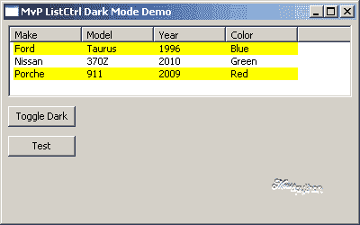
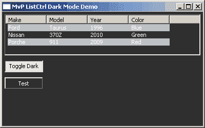

# wxPython:创建“黑暗模式”

> 原文：<https://www.blog.pythonlibrary.org/2011/11/05/wxpython-creating-a-dark-mode/>

上个月的一天，有人告诉我，我的一个程序有一个功能需求。当他们在晚上使用我的应用程序时，他们想要一个“黑暗模式”,因为正常的颜色有点刺眼。我的程序在警车的笔记本电脑上使用，所以我能理解他们的沮丧。我花了一些时间研究这个问题，并得到了一个基本可行的脚本，我将与我的读者分享。当然，如果您是一个长期读者，您可能知道我在谈论一个 wxPython 程序。我几乎用 wxPython 编写了所有的 GUI。不管怎样，我们继续讲故事吧！

## 陷入黑暗

让小部件在 wxPython 中改变颜色非常容易。你只需要两个方法 **SetBackgroundColour** 和 **SetForegroundColour** 。我在这样做时遇到的唯一主要问题是让我的 ListCtrl / ObjectListView 小部件适当地改变颜色。您需要循环遍历每个 ListItem 并分别更改它们的颜色。我改变行的颜色，使事情变得更有趣。另一个问题是恢复 ListCtrl 的背景色。通常你可以设置一个小部件的背景颜色为 wx。NullColour(或 wx。NullColor ),它将恢复到默认颜色。然而，有些小部件不是这样工作的，你必须实际指定一种颜色。还需要注意的是，有些小部件似乎根本不关注 SetBackgroundColour。我发现的一个这样的小部件是 wx.ToggleButton。

现在你知道我所知道的，所以让我们看看我想出的解决我的问题的代码:

```

import wx
try:
    from ObjectListView import ObjectListView
except:
    ObjectListView = False

#----------------------------------------------------------------------
def getWidgets(parent):
    """
    Return a list of all the child widgets
    """
    items = [parent]
    for item in parent.GetChildren():
        items.append(item)
        if hasattr(item, "GetChildren"):
            for child in item.GetChildren():
                items.append(child)
    return items

#----------------------------------------------------------------------
def darkRowFormatter(listctrl, dark=False):
    """
    Toggles the rows in a ListCtrl or ObjectListView widget. 
    Based loosely on the following documentation:
    http://objectlistview.sourceforge.net/python/recipes.html#recipe-formatter
    and http://objectlistview.sourceforge.net/python/cellEditing.html
    """

    listItems = [listctrl.GetItem(i) for i in range(listctrl.GetItemCount())]
    for index, item in enumerate(listItems):
        if dark:
            if index % 2:
                item.SetBackgroundColour("Dark Grey")
            else:
                item.SetBackgroundColour("Light Grey")
        else:
            if index % 2:
                item.SetBackgroundColour("Light Blue")
            else:
                item.SetBackgroundColour("Yellow")
        listctrl.SetItem(item)

#----------------------------------------------------------------------
def darkMode(self, normalPanelColor):
    """
    Toggles dark mode
    """
    widgets = getWidgets(self)
    panel = widgets[0]
    if normalPanelColor == panel.GetBackgroundColour():
        dark_mode = True
    else:
        dark_mode = False
    for widget in widgets:
        if dark_mode:
            if isinstance(widget, ObjectListView) or isinstance(widget, wx.ListCtrl):
                darkRowFormatter(widget, dark=True)
            widget.SetBackgroundColour("Dark Grey")
            widget.SetForegroundColour("White")
        else:
            if isinstance(widget, ObjectListView) or isinstance(widget, wx.ListCtrl):
                darkRowFormatter(widget)
                widget.SetBackgroundColour("White")
                widget.SetForegroundColour("Black")
                continue
            widget.SetBackgroundColour(wx.NullColor)
            widget.SetForegroundColour("Black")
    self.Refresh()
    return dark_mode

```

这段代码有点复杂，但是它完成了任务。让我们把它分解一下，看看它是如何工作的。首先，我们尝试导入 ObjectListView，这是一个很酷的包装 wx 的第三方小部件。ListCtrl 并使它更容易使用。然而，它现在不是 wxPython 的一部分，所以您需要测试它是否存在。如果它不存在，我就把它设置为 False。

**GetWidgets** 函数接受一个父参数，通常是一个 wx。框架或 wx。面板，并遍历它的所有子面板来创建一个小部件列表，然后返回给调用函数。主要功能是**黑暗模式**。它还带有两个参数，一个是名不副实的“self”，指的是父窗口小部件，另一个是默认的面板颜色。它调用 GetWidgets，然后使用一个条件语句来决定是否应该启用黑暗模式。接下来，它遍历小部件并相应地改变颜色。完成后，它将刷新传入的父节点，并返回一个 bool 让您知道黑暗模式是开还是关。

还有一个名为 **darkRowFormatter** 的函数，仅用于设置 wx 中列表项的颜色。ListCtrl 或 ObjectListView 小工具。这里我们使用列表理解来创建一个 wx 列表。然后我们迭代列表项，改变它们的颜色。为了实际应用颜色变化，我们需要调用 SetItem 并向它传递一个 wx。ListItem 对象实例。

## 尝试黑暗模式

所以现在你可能想知道如何实际使用上面的脚本。这一节将向您展示如何做到这一点。这是一个简单的程序，里面有一个列表控件和一个切换按钮！

```

import wx
import darkMode

########################################################################
class MyPanel(wx.Panel):
    """"""

    #----------------------------------------------------------------------
    def __init__(self, parent):
        """Constructor"""
        wx.Panel.__init__(self, parent)
        self.defaultColor = self.GetBackgroundColour()

        rows = [("Ford", "Taurus", "1996", "Blue"),
                ("Nissan", "370Z", "2010", "Green"),
                ("Porche", "911", "2009", "Red")
                ]
        self.list_ctrl = wx.ListCtrl(self, style=wx.LC_REPORT)

        self.list_ctrl.InsertColumn(0, "Make")
        self.list_ctrl.InsertColumn(1, "Model")
        self.list_ctrl.InsertColumn(2, "Year")
        self.list_ctrl.InsertColumn(3, "Color")

        index = 0
        for row in rows:
            self.list_ctrl.InsertStringItem(index, row[0])
            self.list_ctrl.SetStringItem(index, 1, row[1])
            self.list_ctrl.SetStringItem(index, 2, row[2])
            self.list_ctrl.SetStringItem(index, 3, row[3])
            if index % 2:
                self.list_ctrl.SetItemBackgroundColour(index, "white")
            else:
                self.list_ctrl.SetItemBackgroundColour(index, "yellow")
            index += 1

        btn = wx.ToggleButton(self, label="Toggle Dark")
        btn.Bind(wx.EVT_TOGGLEBUTTON, self.onToggleDark)
        normalBtn = wx.Button(self, label="Test")

        sizer = wx.BoxSizer(wx.VERTICAL)
        sizer.Add(self.list_ctrl, 0, wx.ALL|wx.EXPAND, 5)
        sizer.Add(btn, 0, wx.ALL, 5)
        sizer.Add(normalBtn, 0, wx.ALL, 5)
        self.SetSizer(sizer)

    #----------------------------------------------------------------------
    def onToggleDark(self, event):
        """"""
        darkMode.darkMode(self, self.defaultColor)

########################################################################
class MyFrame(wx.Frame):
    """"""

    #----------------------------------------------------------------------
    def __init__(self):
        """Constructor"""
        wx.Frame.__init__(self, None, wx.ID_ANY,
                          "MvP ListCtrl Dark Mode Demo")
        panel = MyPanel(self)
        self.Show()

#----------------------------------------------------------------------
if __name__ == "__main__":
    app = wx.App(False)
    frame = MyFrame()
    app.MainLoop()

```

如果您运行上面的程序，您应该会看到类似这样的内容:

[](https://www.blog.pythonlibrary.org/wp-content/uploads/2011/11/listctrlDark1.png)

如果您单击 toggle 按钮，您应该会看到类似这样的内容:

[](https://www.blog.pythonlibrary.org/wp-content/uploads/2011/11/listctrlDark2.png)

注意切换按钮是如何不受 SetBackgroundColour 方法影响的。还要注意，列表控件的列标题也没有改变颜色。不幸的是，wxPython 没有公开对列标题的访问，所以没有办法控制它们的颜色。

无论如何，让我们花一点时间来看看黑暗模式代码是如何使用的。首先我们需要导入它。在这种情况下，该模块被称为**黑暗模式**。为了实际调用它，我们需要查看 ToggleButton 的事件处理程序:

```

darkMode.darkMode(self, self.defaultColor)

```

正如你所看到的，我们所做的只是用面板对象(“self ”)和我们在 wx 开头设置的 defaultColor 调用 darkMode.darkMode。面板的 init 方法。这也是我们必须做的。我们可能应该用一个变量来设置它，以捕捉返回值，但是对于这个例子，我们并不关心。

## 包扎

现在我们完成了，你也可以为你的应用程序创建一个“黑暗模式”。在某种程度上，我想把它更一般化一些，做成一个颜色改变器脚本，我可以把我想要的任何颜色传递给它。真正酷的是把它做成 mixin。但那是未来的事。现在，享受吧！

## 进一步阅读

*   对象列表视图[文档](http://objectlistview.sourceforge.net/python/)
*   一个 ObjectListView [教程](https://www.blog.pythonlibrary.org/2009/12/23/wxpython-using-objectlistview-instead-of-a-listctrl/)
*   wx。列表控件[文档](http://www.wxpython.org/docs/api/wx.ListCtrl-class.html)

## 源代码

*   [2011-11-5-wxPython-dark-mode](https://www.blog.pythonlibrary.org/wp-content/uploads/2011/11/2011-11-5-wxPython-dark-mode.zip)
*   您也可以从[位桶](https://bitbucket.org/driscollis/mousevspython/src/4794d34444ad/Published/2011-11-5-wxPython-dark-mode)中提取源