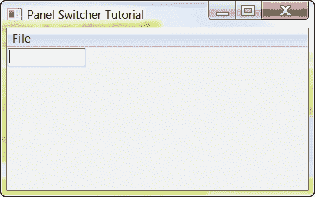
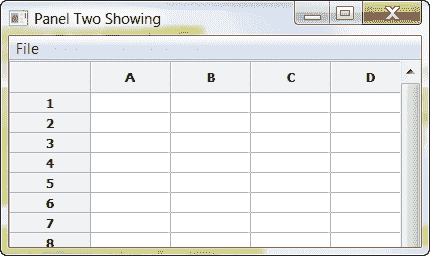

# wxPython:如何在面板之间切换

> 原文：<https://www.blog.pythonlibrary.org/2010/06/16/wxpython-how-to-switch-between-panels/>

每隔几个月，我都会看到有人询问如何在他们正在开发的 wxPython 应用程序的两个视图或面板之间切换。因为这是一个非常常见的问题，而且因为我上周在 IRC 的 wxPython 频道上被问到过，所以我写了一个简短的脚本来展示如何做到这一点。请注意，在大多数情况下，用户可能会发现许多笔记本小部件中的一个足以满足他们的需求。不管怎样，我们来看看这个东西是怎么做的吧！

[](https://www.blog.pythonlibrary.org/wp-content/uploads/2010/06/panelswitcherOne.png)

[](https://www.blog.pythonlibrary.org/wp-content/uploads/2010/06/panelswitcherTwo.png)

在这个例子中，我们将使用一个菜单在两个面板之间切换。第一个面板上只有一个文本控件，第二个面板上只有一个网格小部件。

```

import wx
import wx.grid as gridlib

########################################################################
class PanelOne(wx.Panel):
    """"""

    #----------------------------------------------------------------------
    def __init__(self, parent):
        """Constructor"""
        wx.Panel.__init__(self, parent=parent)
        txt = wx.TextCtrl(self)

########################################################################
class PanelTwo(wx.Panel):
    """"""

    #----------------------------------------------------------------------
    def __init__(self, parent):
        """Constructor"""
        wx.Panel.__init__(self, parent=parent)

        grid = gridlib.Grid(self)
        grid.CreateGrid(25,12)

        sizer = wx.BoxSizer(wx.VERTICAL)
        sizer.Add(grid, 0, wx.EXPAND)
        self.SetSizer(sizer)

########################################################################
class MyForm(wx.Frame):

    #----------------------------------------------------------------------
    def __init__(self):
        wx.Frame.__init__(self, None, wx.ID_ANY, 
                          "Panel Switcher Tutorial")

        self.panel_one = PanelOne(self)
        self.panel_two = PanelTwo(self)
        self.panel_two.Hide()

        self.sizer = wx.BoxSizer(wx.VERTICAL)
        self.sizer.Add(self.panel_one, 1, wx.EXPAND)
        self.sizer.Add(self.panel_two, 1, wx.EXPAND)
        self.SetSizer(self.sizer)

        menubar = wx.MenuBar()
        fileMenu = wx.Menu()
        switch_panels_menu_item = fileMenu.Append(wx.ID_ANY, 
                                                  "Switch Panels", 
                                                  "Some text")
        self.Bind(wx.EVT_MENU, self.onSwitchPanels, 
                  switch_panels_menu_item)
        menubar.Append(fileMenu, '&File')
        self.SetMenuBar(menubar)

    #----------------------------------------------------------------------
    def onSwitchPanels(self, event):
        """"""
        if self.panel_one.IsShown():
            self.SetTitle("Panel Two Showing")
            self.panel_one.Hide()
            self.panel_two.Show()
        else:
            self.SetTitle("Panel One Showing")
            self.panel_one.Show()
            self.panel_two.Hide()
        self.Layout()

# Run the program
if __name__ == "__main__":
    app = wx.App(False)
    frame = MyForm()
    frame.Show()
    app.MainLoop()

```

我们唯一关心的代码位于 *onSwitchPanels* 事件处理程序中。这里我们使用一个条件来检查哪个面板正在显示，然后隐藏当前面板并显示另一个面板。我们还设置了框架的标题，使哪个面板是哪个面板变得很明显。我们还需要调用框架的 Layout()方法来使面板可见。否则，您可能会看到一些奇怪的视觉异常，就像没有任何东西真正显示在框架中，除非您稍微调整它的大小。

现在你也知道如何切换面板了。如果您计划做大量的可视化工作，比如添加或删除小部件，那么您可能希望研究冻结和解冻方法，然后使用 Layout。它们有助于隐藏当您修改面板的子面板时可以看到的闪烁。