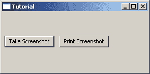
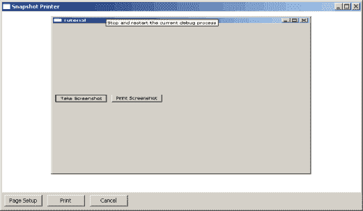

# 如何截图并打印你的 wxPython 应用程序

> 原文：<https://www.blog.pythonlibrary.org/2010/04/16/how-to-take-a-screenshot-of-your-wxpython-app-and-print-it/>

你有没有想过让你的 wxPython 代码自己截图会很酷？嗯， [Andrea Gavana](http://thedoomedcity.blogspot.com/) 想出了一个很酷的方法来做到这一点，根据他在 wxPython 邮件列表上告诉我们的内容和我从其他来源了解到的内容，你很快就会知道如何不仅截取屏幕截图，而且如何将它发送到你的打印机！

[](https://www.blog.pythonlibrary.org/wp-content/uploads/2010/04/snapshot_taker.png)

我们先来看看如何截图:

```

import sys
import wx
import snapshotPrinter

class MyForm(wx.Frame):

    #----------------------------------------------------------------------
    def __init__(self):
        wx.Frame.__init__(self, None, wx.ID_ANY, "Tutorial", size=(500,500))

        # Add a panel so it looks the correct on all platforms
        panel = wx.Panel(self, wx.ID_ANY)
        screenshotBtn = wx.Button(panel, wx.ID_ANY, "Take Screenshot")
        screenshotBtn.Bind(wx.EVT_BUTTON, self.onTakeScreenShot)
        printBtn = wx.Button(panel, label="Print Screenshot")
        printBtn.Bind(wx.EVT_BUTTON, self.onPrint)

        sizer = wx.BoxSizer(wx.HORIZONTAL)
        sizer.Add(screenshotBtn, 0, wx.ALL|wx.CENTER, 5)
        sizer.Add(printBtn, 0, wx.ALL|wx.CENTER, 5)
        panel.SetSizer(sizer)

    def onTakeScreenShot(self, event):
        """ Takes a screenshot of the screen at give pos & size (rect). """
        print 'Taking screenshot...'
        rect = self.GetRect()
        # see http://aspn.activestate.com/ASPN/Mail/Message/wxpython-users/3575899
        # created by Andrea Gavana

        # adjust widths for Linux (figured out by John Torres 
        # http://article.gmane.org/gmane.comp.python.wxpython/67327)
        if sys.platform == 'linux2':
            client_x, client_y = self.ClientToScreen((0, 0))
            border_width = client_x - rect.x
            title_bar_height = client_y - rect.y
            rect.width += (border_width * 2)
            rect.height += title_bar_height + border_width

        #Create a DC for the whole screen area
        dcScreen = wx.ScreenDC()

        #Create a Bitmap that will hold the screenshot image later on
        #Note that the Bitmap must have a size big enough to hold the screenshot
        #-1 means using the current default colour depth
        bmp = wx.EmptyBitmap(rect.width, rect.height)

        #Create a memory DC that will be used for actually taking the screenshot
        memDC = wx.MemoryDC()

        #Tell the memory DC to use our Bitmap
        #all drawing action on the memory DC will go to the Bitmap now
        memDC.SelectObject(bmp)

        #Blit (in this case copy) the actual screen on the memory DC
        #and thus the Bitmap
        memDC.Blit( 0, #Copy to this X coordinate
                    0, #Copy to this Y coordinate
                    rect.width, #Copy this width
                    rect.height, #Copy this height
                    dcScreen, #From where do we copy?
                    rect.x, #What's the X offset in the original DC?
                    rect.y  #What's the Y offset in the original DC?
                    )

        #Select the Bitmap out of the memory DC by selecting a new
        #uninitialized Bitmap
        memDC.SelectObject(wx.NullBitmap)

        img = bmp.ConvertToImage()
        fileName = "myImage.png"
        img.SaveFile(fileName, wx.BITMAP_TYPE_PNG)
        print '...saving as png!'

    #----------------------------------------------------------------------
    def onPrint(self, event):
        """
        Send screenshot to the printer
        """
        printer = snapshotPrinter.SnapshotPrinter()
        printer.sendToPrinter()

# Run the program
if __name__ == "__main__":
    app = wx.App(False)
    frame = MyForm()
    frame.Show()
    app.MainLoop()

```

这段代码创建了一个相当大框架，其中有两个按钮。是的，很无聊，但这是演示，不是艺术展。我们最关心的部分是 *onTakeScreenShot* 方法。如果你去第一个[评论链接](http://aspn.activestate.com/ASPN/Mail/Message/wxpython-users/3575899)，你会找到安德里亚·加瓦那的这个剧本的原始版本。我们添加了一个来自 John Torres 的[条件](http://article.gmane.org/gmane.comp.python.wxpython/67327)，使得这个脚本在 Linux 上表现得更好，因为它最初是为 Windows 编写的。注释讲述了代码的故事，所以请花点时间阅读它们，当您完成后，我们可以继续讨论如何将结果发送到打印机。

## 快照打印机脚本

[](https://www.blog.pythonlibrary.org/wp-content/uploads/2010/04/snapshot_printer.png)

```

#######################################################################
# snapshotPrinter.py
#
# Created: 12/26/2007 by mld
#
# Description: Displays screenshot image using html and then allows
#              the user to print it.
#######################################################################

import os
import wx
from wx.html import HtmlEasyPrinting, HtmlWindow

class SnapshotPrinter(wx.Frame):

    #----------------------------------------------------------------------
    def __init__(self, title='Snapshot Printer'):
        wx.Frame.__init__(self, None, wx.ID_ANY, title, size=(650,400))

        self.panel = wx.Panel(self, wx.ID_ANY)
        self.printer = HtmlEasyPrinting(name='Printing', parentWindow=None)

        self.html = HtmlWindow(self.panel)
        self.html.SetRelatedFrame(self, self.GetTitle())

        if not os.path.exists('screenshot.htm'):
            self.createHtml()
        self.html.LoadPage('screenshot.htm')

        pageSetupBtn = wx.Button(self.panel, wx.ID_ANY, 'Page Setup')
        printBtn = wx.Button(self.panel, wx.ID_ANY, 'Print')
        cancelBtn = wx.Button(self.panel, wx.ID_ANY, 'Cancel')

        self.Bind(wx.EVT_BUTTON, self.onSetup, pageSetupBtn)
        self.Bind(wx.EVT_BUTTON, self.onPrint, printBtn)
        self.Bind(wx.EVT_BUTTON, self.onCancel, cancelBtn)

        sizer = wx.BoxSizer(wx.VERTICAL)
        btnSizer = wx.BoxSizer(wx.HORIZONTAL)

        sizer.Add(self.html, 1, wx.GROW)
        btnSizer.Add(pageSetupBtn, 0, wx.ALL, 5)
        btnSizer.Add(printBtn, 0, wx.ALL, 5)
        btnSizer.Add(cancelBtn, 0, wx.ALL, 5)
        sizer.Add(btnSizer)

        self.panel.SetSizer(sizer)
        self.panel.SetAutoLayout(True)

    #----------------------------------------------------------------------
    def createHtml(self):
        '''
        Creates an html file in the home directory of the application
        that contains the information to display the snapshot
        '''
        print 'creating html...'

        html = '\n\n\n\n'
        f = file('screenshot.htm', 'w')
        f.write(html)
        f.close()

    #----------------------------------------------------------------------
    def onSetup(self, event):
        self.printer.PageSetup()

    #----------------------------------------------------------------------
    def onPrint(self, event):
        self.sendToPrinter()

    #----------------------------------------------------------------------
    def sendToPrinter(self):
        """"""
        self.printer.GetPrintData().SetPaperId(wx.PAPER_LETTER)
        self.printer.PrintFile(self.html.GetOpenedPage())

    #----------------------------------------------------------------------
    def onCancel(self, event):
        self.Close()

class wxHTML(HtmlWindow):
    #----------------------------------------------------------------------
    def __init__(self, parent, id):
        html.HtmlWindow.__init__(self, parent, id, style=wx.NO_FULL_REPAINT_ON_RESIZE)

if __name__ == '__main__':
    app = wx.App(False)
    frame = SnapshotPrinter()
    frame.Show()
    app.MainLoop()

```

这个小脚本使用 HtmlWindow 小部件和 HtmlEasyPrinting 方法向打印机发送内容。基本上，您可以创建一些非常简单的 HTML 代码(参见 createHtml 方法)，然后使用 HtmlWindow 查看它。接下来，您使用 HtmlEasyPrinting 将其发送到打印机。它实际上会显示打印机对话框，让您选择要将文档发送到哪台打印机。

我希望这篇文章对您的编程有所帮助。希望能在评论里听到你的声音！