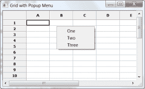
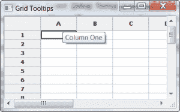
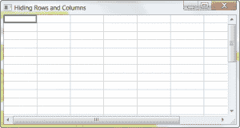
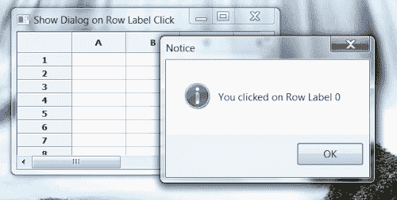
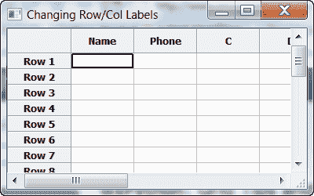

# wxPython:网格技巧和窍门

> 原文：<https://www.blog.pythonlibrary.org/2010/04/04/wxpython-grid-tips-and-tricks/>

上个月我提到我们将开始一段旅程，学习 wxPython 的网格小部件的一些技巧和窍门。好了，编码完成了，我想是时候实际做这件事了。在下面的文章中，您将学习如何:

*   在单元格中创建右键弹出菜单
*   如何在右键单击时获得列/行
*   在行和列标签以及单元格上放置工具提示
*   如何使用键盘箭头键移出正在编辑的单元格
*   隐藏行/列标签/标题
*   单击行标签时显示弹出窗口
*   更改行/列标签

你还在等什么？点击“更多”链接，开始阅读！

## 如何在网格单元格中创建弹出菜单

[](https://www.blog.pythonlibrary.org/wp-content/uploads/2010/04/grid_popup_menu.png)

这是一个非常容易实现的技巧。让我们来看一些代码，这样您就可以看到它是多么简单！

```

import wx
import wx.grid as  gridlib

class MyForm(wx.Frame):

    def __init__(self):
        wx.Frame.__init__(self, None, wx.ID_ANY, 
                          "Grid with Popup Menu")

        # Add a panel so it looks the correct on all platforms
        panel = wx.Panel(self, wx.ID_ANY)
        self.grid = gridlib.Grid(panel)
        self.grid.CreateGrid(25,8)
        self.grid.Bind(gridlib.EVT_GRID_CELL_RIGHT_CLICK,
                       self.showPopupMenu)

        sizer = wx.BoxSizer(wx.VERTICAL)
        sizer.Add(self.grid, 1, wx.EXPAND, 5)
        panel.SetSizer(sizer)

    #----------------------------------------------------------------------
    def showPopupMenu(self, event):
        """
        Create and display a popup menu on right-click event
        """
        if not hasattr(self, "popupID1"):
            self.popupID1 = wx.NewId()
            self.popupID2 = wx.NewId()
            self.popupID3 = wx.NewId()
            # make a menu

        menu = wx.Menu()
        # Show how to put an icon in the menu
        item = wx.MenuItem(menu, self.popupID1,"One")
        menu.AppendItem(item)
        menu.Append(self.popupID2, "Two")
        menu.Append(self.popupID3, "Three")

        # Popup the menu.  If an item is selected then its handler
        # will be called before PopupMenu returns.
        self.PopupMenu(menu)
        menu.Destroy()

# Run the program
if __name__ == "__main__":
    app = wx.PySimpleApp()
    frame = MyForm().Show()
    app.MainLoop()

```

这里我们真正关心的只有两件事:事件绑定和事件处理程序。绑定很简单:gridlib。EVT _ 网格 _ 单元格 _ 右键单击。请注意，您需要使用网格的事件，而不是一般的 EVT 右键单击。事件处理程序来自 wxPython 演示。在其中，您只需动态构建菜单，然后通过调用 PopupMenu 方法显示它。当您在菜单外单击时，或者当您做出选择并且所述选择的方法调用已经完成时，菜单将被销毁。

## 如何在右键单击时获得列/行

有时候你想知道你具体右击的是哪个单元格。为什么？如果你想做一个上下文菜单，你需要知道你点击了哪个单元格。上面的代码并没有真正告诉你这些。它只是创建了一个小小的弹出菜单。因此，您可以使用下面的代码片段，并将它与前面的代码片段结合起来，创建一个上下文菜单。

```

import wx
import wx.grid as gridlib

########################################################################
class MyForm(wx.Frame):
    """"""

    #----------------------------------------------------------------------
    def __init__(self):
        """Constructor"""
        wx.Frame.__init__(self, parent=None, title="Getting the Row/Col")
        panel = wx.Panel(self)

        myGrid = gridlib.Grid(panel)
        myGrid.CreateGrid(12, 8)
        self.myGrid = myGrid
        self.myGrid.GetGridWindow().Bind(wx.EVT_RIGHT_DOWN, self.onRightClick)

        sizer = wx.BoxSizer(wx.VERTICAL)
        sizer.Add(myGrid, 1, wx.EXPAND)
        panel.SetSizer(sizer)

    #----------------------------------------------------------------------
    def onRightClick(self, event):
        """"""
        x, y = self.myGrid.CalcUnscrolledPosition(event.GetX(),
                                                  event.GetY())
        row, col = self.myGrid.XYToCell(x, y)
        print row, col

if __name__ == "__main__":
    app = wx.App(False)
    frame = MyForm().Show()
    app.MainLoop()

```

你可能想知道为什么我们绑定到通用的 wx。EVT _ 右 _ 下而不是网格的 EVT _ 网格 _ 单元格 _ 右键 _ 单击。原因是网格的右键单击事件没有给我们 X/Y 坐标。我们需要将这些坐标传递给网格的 **CalcUnscrolledPosition** 方法。这将依次给我们相对于网格的 X/Y 位置，以传递给另一个网格方法，即 **XYToCell** ，它将返回我们右键单击的行和列。如果我们想要基于特定的单元格创建上下文菜单，这将为我们提供所需的信息。

更新:有些人可能认为这是一种艰难的方式，他们可能是对的。为什么？因为虽然 EVT _ 网格 _ 单元格 _ 右键单击发送的事件对象没有 GetX/GetY 方法，但它有 GetRow 和 GetCol 方法。所以你还是可以用它。如果你想从一个任意的像素点平移，上面的方法是可行的。如果你想成为一个小清洁工，那么你可能想绑定到 EVT。

## 网格和工具提示

[](https://www.blog.pythonlibrary.org/wp-content/uploads/2010/04/grid_tooltips.png)

在网格中放置工具提示可能有点难以理解。在最终向 wxPython 邮件列表寻求帮助之前，我在这上面花了很多时间。我想知道如何在某一列中放置工具提示，并让它们随着我浏览不同的单元格而改变。建议的第一种方法非常有效，直到我不得不滚动网格。幸运的是，Robin Dunn(wxPython 的创始人)也有这个问题的答案。下面的代码还将展示如何在列和行标签上放置工具提示。

```

import wx
import wx.grid as  gridlib

class MyForm(wx.Frame):

    #----------------------------------------------------------------------
    def __init__(self):
        wx.Frame.__init__(self, None, wx.ID_ANY, "Grid Tooltips")

        # Add a panel so it looks the correct on all platforms
        panel = wx.Panel(self, wx.ID_ANY)

        self.grid = gridlib.Grid(panel)
        self.grid.CreateGrid(25,8)

        # put a tooltip on the cells in a column
        self.grid.GetGridWindow().Bind(wx.EVT_MOTION, self.onMouseOver)
        # the following is equivalent to the above mouse binding
##        for child in self.grid.GetChildren():
##             if child.GetName() == 'grid window':
##                 child.Bind(wx.EVT_MOTION, self.onMouseOver)

        # put a tooltip on a column label
        self.grid.GetGridColLabelWindow().Bind(wx.EVT_MOTION, 
                                               self.onMouseOverColLabel)
        # put a tooltip on a row label
        self.grid.GetGridRowLabelWindow().Bind(wx.EVT_MOTION, 
                                               self.onMouseOverRowLabel)

        sizer = wx.BoxSizer(wx.VERTICAL)
        sizer.Add(self.grid, 1, wx.EXPAND, 5)
        panel.SetSizer(sizer)

    #----------------------------------------------------------------------
    def onMouseOver(self, event):
        """
        Displays a tooltip over any cell in a certain column
        """
        # Use CalcUnscrolledPosition() to get the mouse position within the 
        # entire grid including what's offscreen
        # This method was suggested by none other than Robin Dunn
        x, y = self.grid.CalcUnscrolledPosition(event.GetX(),event.GetY())
        coords = self.grid.XYToCell(x, y)
        col = coords[1]
        row = coords[0]

        # Note: This only sets the tooltip for the cells in the column
        if col == 1:
            msg = "This is Row %s, Column %s!" % (row, col)
            event.GetEventObject().SetToolTipString(msg)
        else:
            event.GetEventObject().SetToolTipString('')

    #----------------------------------------------------------------------
    def onMouseOverColLabel(self, event):
        """
        Displays a tooltip when mousing over certain column labels
        """
        x = event.GetX()
        y = event.GetY()
        col = self.grid.XToCol(x, y)

        if col == 0:
            self.grid.GetGridColLabelWindow().SetToolTipString('Column One')
        elif col == 1:
            self.grid.GetGridColLabelWindow().SetToolTipString('Column Two')
        else:
            self.grid.GetGridColLabelWindow().SetToolTipString('')
        event.Skip()

    #----------------------------------------------------------------------
    def onMouseOverRowLabel(self, event):
        """
        Displays a tooltip on a row label
        """
        x = event.GetX()
        y = event.GetY()
        row = self.grid.YToRow(y)
        print row
        if row == 0:
            self.grid.GetGridRowLabelWindow().SetToolTipString("Row One")
        elif row == 1:
            self.grid.GetGridRowLabelWindow().SetToolTipString('Row Two')
        else:
            self.grid.GetGridRowLabelWindow().SetToolTipString("")
        event.Skip()

#----------------------------------------------------------------------
# Run the program
if __name__ == "__main__":
    app = wx.PySimpleApp()
    frame = MyForm().Show()
    app.MainLoop()

```

我最初在某一列的单元格上放置工具提示的用例是，一些用户希望我显示的数据转换 10%，以反映计算相同事物的不同方式。我有更多的用户希望它保持原样。所以我妥协了，制作了工具提示，可以对单元格的内容进行计算，并在工具提示中显示其他有争议的值。烦人，但将来可能会很方便。实现这种效果的第一步是找出正确的绑定。这是:

```

self.grid.GetGridWindow().Bind(wx.EVT_MOTION, self.onMouseOver)

```

事件处理程序通过一个三步过程来处理等式的下一部分。让我们仔细看看:

```

def onMouseOver(self, event):
    """
    Displays a tooltip over any cell in a certain column
    """
    # Use CalcUnscrolledPosition() to get the mouse position within the 
    # entire grid including what's offscreen
    # This method was suggested by none other than Robin Dunn
    x, y = self.grid.CalcUnscrolledPosition(event.GetX(),event.GetY())
    coords = self.grid.XYToCell(x, y)
    col = coords[1]
    row = coords[0]

    # Note: This only sets the tooltip for the cells in the column
    if col == 1:
        msg = "This is Row %s, Column %s!" % (row, col)
        event.GetEventObject().SetToolTipString(msg)
    else:
        event.GetEventObject().SetToolTipString('')

```

第一步需要使用 *CalcUnscrolledPosition(事件)获取单元格的行和列坐标。GetX()，事件。GetY())* /这将返回 x/y 坐标，我们可以使用 *XYToCell* 来访问实际的行/列。第三步是使用 *GetCellValue* 来获取单元格的内容，但是因为我在这个示例中不关心这个，所以我只是使用这个:*事件来设置工具提示。GetEventObject()。SetToolTipString(msg)* 。我觉得这很棒。还要注意我注释掉的事件的原始绑定的替代方法。这是一个丑陋的黑客，但只要我没有滚动条，它就能工作(我想)。

下一个与工具提示相关的技巧是相关的，因为它们都处理在标签上放置工具提示；具体来说，您将学习如何在行和列标签上放置工具提示。绑定和处理程序本质上是相同的，您只需要指定与行或列相关的方法调用。例如，列绑定是 *GetGridColLabelWindow* ，行绑定是*getgridrolabelwindow*。下一步是获取鼠标悬停的列或行，因此我们对列使用 *XToCol* ，对行使用 *YToRow* 。最后，我们调用 *GetGridColLabelWindow()。SetToolTipString* 设置列的标签工具提示。这一行几乎一模一样。

## 使用箭头键导航出单元格编辑

在 Microsoft Excel 中，您可以使用键盘的箭头键来停止编辑，并移动到另一个单元格，而不是按 tab 或 enter 键。因为大多数用户已经习惯了这个功能，我们应该在我们的应用程序中使用它。有一种方法可以做到:

```

import wx
import wx.grid as  gridlib

class MyForm(wx.Frame):

    #----------------------------------------------------------------------
    def __init__(self):
        wx.Frame.__init__(self, None, wx.ID_ANY, "Navigating out of a cell")

        # Add a panel so it looks the correct on all platforms
        panel = wx.Panel(self, wx.ID_ANY)
        self.grid = gridlib.Grid(panel)
        self.grid.CreateGrid(25,8)

        self.grid.Bind(gridlib.EVT_GRID_EDITOR_CREATED, self.onCellEdit)

        sizer = wx.BoxSizer(wx.VERTICAL)
        sizer.Add(self.grid, 1, wx.EXPAND, 5)
        panel.SetSizer(sizer)

    #----------------------------------------------------------------------
    def onCellEdit(self, event):
        '''
        When cell is edited, get a handle on the editor widget
        and bind it to EVT_KEY_DOWN
        '''        
        editor = event.GetControl()        
        editor.Bind(wx.EVT_KEY_DOWN, self.onEditorKey)
        event.Skip()

    #----------------------------------------------------------------------
    def onEditorKey(self, event):
        '''
        Handler for the wx.grid's cell editor widget's keystrokes. Checks for specific
        keystrokes, such as arrow up or arrow down, and responds accordingly. Allows
        all other key strokes to pass through the handler.
        '''
        keycode = event.GetKeyCode() 
        if keycode == wx.WXK_UP:
            print 'you pressed the UP key!'
            self.grid.MoveCursorUp(False)
        elif keycode == wx.WXK_DOWN:
            print 'you pressed the down key!'
            self.grid.MoveCursorDown(False)
        elif keycode == wx.WXK_LEFT:
            print 'you pressed the left key!'
            self.grid.MoveCursorLeft(False)
        elif keycode == wx.WXK_RIGHT:
            print 'you pressed the right key'
            self.grid.MoveCursorRight(False)
        else:
            pass
        event.Skip()

#----------------------------------------------------------------------
# Run the program
if __name__ == "__main__":
    app = wx.PySimpleApp()
    frame = MyForm().Show()
    app.MainLoop()

```

捕捉网格单元中的关键事件有点棘手。首先你需要像这样绑定一个句柄到 EVT 网格编辑器创建的事件: *self.grid.Bind(gridlib。EVT_GRID_EDITOR_CREATED，self.onCellEdit)。然后，在处理程序中，您需要获得单元格编辑器的句柄，该编辑器是在您开始编辑单元格时创建的。为此，你需要使用*事件。GetControl()* 。一旦你有了那个句柄，你就可以绑定 *wx 了。EVT_KEY_DOWN* 给它抓拍关键事件。在上面的代码中，我们将该事件绑定到 *onEditorKey* ，在其中我们检查用户是否按下了某个箭头键。如果用户确实按了其中的一个，那么我们使用 *MoveCursorXX* 方法在指定的方向上移动选中的单元格。如果用户没有按下箭头键，那么我们什么也不做。注意，我们需要调用*事件。Skip()* 不管不顾。原因是我们希望密钥继续被处理。如果你不调用 Skip()，那么你的大部分输入将不会做任何事情。*

## 如何隐藏行和列标签

[](https://www.blog.pythonlibrary.org/wp-content/uploads/2010/04/grid_hide_labels.png)

隐藏行或列标签非常简单。事实上，该信息在 [wxPython FAQ](http://wiki.wxpython.org/Frequently%20Asked%20Questions#How_do_I_hide_the_row_and_column_labels_in_a_wxGrid_window.3F) 中提供。《达波》的创作者之一保罗·麦克内特向维基贡献了这些信息。以下是维基的内容:

```

grid.SetRowLabelSize(0)
grid.SetColLabelSize(0)

```

我决定创建一个示例应用程序来展示上下文中的示例:

```

import wx
import wx.grid as  gridlib

class MyForm(wx.Frame):

    def __init__(self):
        wx.Frame.__init__(self, None, wx.ID_ANY, "Changing Row/Col Labels")

        # Add a panel so it looks the correct on all platforms
        panel = wx.Panel(self, wx.ID_ANY)
        grid = gridlib.Grid(panel)
        grid.CreateGrid(25,8)

        # http://bit.ly/aXbeNF - link to FAQ
        grid.SetRowLabelSize(0) # hide the rows
        grid.SetColLabelSize(0) # hide the columns

        sizer = wx.BoxSizer(wx.VERTICAL)
        sizer.Add(grid, 1, wx.EXPAND, 5)
        panel.SetSizer(sizer)

# Run the program
if __name__ == "__main__":
    app = wx.PySimpleApp()
    frame = MyForm().Show()
    app.MainLoop()

```

## 当用户点击行标签时显示一些东西(对话框/框架/无论什么)

[](https://www.blog.pythonlibrary.org/wp-content/uploads/2010/04/grid_popup_dlg2.png)

不久前，我在工作中创建了一个使用网格小部件的时间表应用程序，我收到了一个请求，请求允许用户使用网格的行标签从程序的一部分导航到另一部分。你看，我有一个概览屏幕，显示每周的总数，用户希望能够从这个屏幕到工作表屏幕，以防他们需要能够编辑他们一天的小时总数。无论如何，以下示例显示了如何使行标签对点击敏感:

```

import wx
import wx.grid as  gridlib

class MyForm(wx.Frame):

    #----------------------------------------------------------------------
    def __init__(self):
        wx.Frame.__init__(self, None, wx.ID_ANY,
                          "Show Dialog on Row Label Click")

        # Add a panel so it looks the correct on all platforms
        panel = wx.Panel(self, wx.ID_ANY)
        self.grid = gridlib.Grid(panel)
        self.grid.CreateGrid(25,8)

        self.grid.Bind(gridlib.EVT_GRID_LABEL_LEFT_CLICK, self.onRowClick)

        sizer = wx.BoxSizer(wx.VERTICAL)
        sizer.Add(self.grid, 1, wx.EXPAND, 5)
        panel.SetSizer(sizer)

    #----------------------------------------------------------------------
    def onRowClick(self, event):
        """
        Displays a message dialog to the user which displays which row
        label the user clicked on
        """
        # Note that rows are zero-based
        row = event.GetRow()
        dlg = wx.MessageDialog(None, "You clicked on Row Label %s" % row,
                               "Notice",
                               wx.OK|wx.ICON_INFORMATION)
        dlg.ShowModal()
        dlg.Destroy()

# Run the program
if __name__ == "__main__":
    app = wx.PySimpleApp()
    frame = MyForm().Show()
    app.MainLoop()

```

在上面的代码中，我们需要做的就是绑定到网格的 LEFT _ 网格 _ 标签 _ 左击事件，然后在事件处理程序中创建或显示一个对话框。我希望简单易懂。

## 如何更改列/行标签

[](https://www.blog.pythonlibrary.org/wp-content/uploads/2010/04/grid_change_labels.png)

更改网格的行或列标签非常容易；但是不要相信我的话。而是看代码！

```

import wx
import wx.grid as  gridlib

class MyForm(wx.Frame):

    def __init__(self):
        wx.Frame.__init__(self, None, wx.ID_ANY, "Hiding Rows and Columns")

        # Add a panel so it looks the correct on all platforms
        panel = wx.Panel(self, wx.ID_ANY)
        grid = gridlib.Grid(panel)
        grid.CreateGrid(25,8)

        # change a couple column labels
        grid.SetColLabelValue(0, "Name")
        grid.SetColLabelValue(1, "Phone")

        # change the row labels
        for row in range(25):
            rowNum = row + 1
            grid.SetRowLabelValue(row, "Row %s" % rowNum)

        sizer = wx.BoxSizer(wx.VERTICAL)
        sizer.Add(grid, 1, wx.EXPAND, 5)
        panel.SetSizer(sizer)

# Run the program
if __name__ == "__main__":
    app = wx.PySimpleApp()
    frame = MyForm().Show()
    app.MainLoop()

```

如您所见，要更改列的标签，您只需调用 *SetColLabelValue* 。网格对行也有类似的方法: *SetRowLabelValue* 。只要传入你想改变的行和你想让它显示的字符串，你就应该设置好了。

## 包扎

好吧，那有很多代码。我希望你已经学到了很多很酷的技巧，可以用在你现在和未来的项目中。请在评论中告诉我你的想法！

## 下载

*   [tips_and_tricks.zip](https://www.blog.pythonlibrary.org/wp-content/uploads/2010/04/tips_and_tricks.zip)
*   [tips_and_tricks.tar](https://www.blog.pythonlibrary.org/wp-content/uploads/2010/04/tips_and_tricks.tar)

## 进一步阅读

*   [wxGrid 工具提示](http://wiki.wxpython.org/wx.Grid%20ToolTips)
*   [网格简介](https://www.blog.pythonlibrary.org/2010/03/18/wxpython-an-introduction-to-grids/)