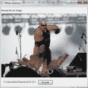

# 用 wxPython 创建简单的照片查看器

> 原文：<https://www.blog.pythonlibrary.org/2010/03/26/creating-a-simple-photo-viewer-with-wxpython/>

有一天，我在 wxPython IRC 频道上和一些 wxPython 新手聊天，其中一个人想知道如何在 wx 中显示图像。有很多不同的方法可以做到这一点，但我有一个预制的解决方案，这是我几年前为了工作拼凑起来的。由于这是一个相当热门的话题，亲爱的读者，我认为让你知道这个秘密是明智的。

## 图像浏览器拿一个

[](https://www.blog.pythonlibrary.org/wp-content/uploads/2010/03/imageViewer1.png)

在 wxPython 中显示图像的最简单的方法之一是使用 wx。StaticBitmap 来做你的脏活。在这个例子中，我们想要一个图像的占位符，所以我们将使用 wx。空白图片。最后，如果图像对于我们的分辨率或应用程序来说太大，我们需要一种方法来缩小图像。为此，我们将使用我从杰出的安德里亚·加瓦那(AGW 图书馆的创建者)那里得到的一个提示。介绍到此为止，让我们看看代码:

```

import os
import wx

class PhotoCtrl(wx.App):
    def __init__(self, redirect=False, filename=None):
        wx.App.__init__(self, redirect, filename)
        self.frame = wx.Frame(None, title='Photo Control')

        self.panel = wx.Panel(self.frame)

        self.PhotoMaxSize = 240

        self.createWidgets()
        self.frame.Show()

    def createWidgets(self):
        instructions = 'Browse for an image'
        img = wx.EmptyImage(240,240)
        self.imageCtrl = wx.StaticBitmap(self.panel, wx.ID_ANY, 
                                         wx.BitmapFromImage(img))

        instructLbl = wx.StaticText(self.panel, label=instructions)
        self.photoTxt = wx.TextCtrl(self.panel, size=(200,-1))
        browseBtn = wx.Button(self.panel, label='Browse')
        browseBtn.Bind(wx.EVT_BUTTON, self.onBrowse)

        self.mainSizer = wx.BoxSizer(wx.VERTICAL)
        self.sizer = wx.BoxSizer(wx.HORIZONTAL)

        self.mainSizer.Add(wx.StaticLine(self.panel, wx.ID_ANY),
                           0, wx.ALL|wx.EXPAND, 5)
        self.mainSizer.Add(instructLbl, 0, wx.ALL, 5)
        self.mainSizer.Add(self.imageCtrl, 0, wx.ALL, 5)
        self.sizer.Add(self.photoTxt, 0, wx.ALL, 5)
        self.sizer.Add(browseBtn, 0, wx.ALL, 5)        
        self.mainSizer.Add(self.sizer, 0, wx.ALL, 5)

        self.panel.SetSizer(self.mainSizer)
        self.mainSizer.Fit(self.frame)

        self.panel.Layout()

    def onBrowse(self, event):
        """ 
        Browse for file
        """
        wildcard = "JPEG files (*.jpg)|*.jpg"
        dialog = wx.FileDialog(None, "Choose a file",
                               wildcard=wildcard,
                               style=wx.OPEN)
        if dialog.ShowModal() == wx.ID_OK:
            self.photoTxt.SetValue(dialog.GetPath())
        dialog.Destroy() 
        self.onView()

    def onView(self):
        filepath = self.photoTxt.GetValue()
        img = wx.Image(filepath, wx.BITMAP_TYPE_ANY)
        # scale the image, preserving the aspect ratio
        W = img.GetWidth()
        H = img.GetHeight()
        if W > H:
            NewW = self.PhotoMaxSize
            NewH = self.PhotoMaxSize * H / W
        else:
            NewH = self.PhotoMaxSize
            NewW = self.PhotoMaxSize * W / H
        img = img.Scale(NewW,NewH)

        self.imageCtrl.SetBitmap(wx.BitmapFromImage(img))
        self.panel.Refresh()

if __name__ == '__main__':
    app = PhotoCtrl()
    app.MainLoop()

```

你可能认为这个例子有点复杂。嗯，实际上并没有那么糟糕，因为代码只有 76 行长！让我们检查一下各种方法，看看发生了什么。

```

def __init__(self, redirect=False, filename=None):
        wx.App.__init__(self, redirect, filename)
        self.frame = wx.Frame(None, title='Photo Control')

        self.panel = wx.Panel(self.frame)

        self.PhotoMaxSize = 500

        self.createWidgets()
        self.frame.Show()

```

__init__ 初始化 wx。App 对象，实例化一个框架并添加一个面板作为该框架的唯一子级。我们将照片的最大尺寸设置为 500 像素，以便于查看，但不会对我们的显示器太大。然后我们调用我们的 *createWidgets* 方法，最后通过调用 Show()显示该帧。因为我们之前已经讨论过 EmptyImage 小部件，所以我认为跳过 *createWidgets* 方法是安全的，并且继续讨论一个警告。注意来自 *createWidgets* 的最后三行:

```

self.panel.SetSizer(self.mainSizer)
self.mainSizer.Fit(self.frame)
self.panel.Layout()

```

这将设置面板的 sizer，然后使框架适合 sizer 中包含的小部件。这将保持应用程序看起来整洁，因为我们不会有一堆额外的像素价值的面板突出在奇怪的地方。试试没有这些线，看看如果你不能想象会发生什么！

接下来是我们的 *onBrowse* 方法:

```

def onBrowse(self, event):
    """ 
    Browse for file
    """
    wildcard = "JPEG files (*.jpg)|*.jpg"
    dialog = wx.FileDialog(None, "Choose a file",
                           wildcard=wildcard,
                           style=wx.OPEN)
    if dialog.ShowModal() == wx.ID_OK:
        self.photoTxt.SetValue(dialog.GetPath())
    dialog.Destroy() 
    self.onView()

```

首先，我们创建一个仅指定 JPEG 文件的通配符，然后将它传递给我们的 wx。FileDialog 构造函数。这将限制对话框，使其只显示 JPEG 文件。如果用户按下 OK(或 Open)按钮，那么我们将*photo XT*控件的值设置为所选文件的路径。我们可能应该添加一些错误检查，以确保该文件是一个有效的 JPEG 文件，但我们将把它作为读者的练习。设置好值后，对话框被破坏，调用 *onView* ，将显示图片。让我们看看它是如何工作的:

```

def onView(self):
    filepath = self.photoTxt.GetValue()
    img = wx.Image(filepath, wx.BITMAP_TYPE_ANY)
    # scale the image, preserving the aspect ratio
    W = img.GetWidth()
    H = img.GetHeight()
    if W > H:
        NewW = self.PhotoMaxSize
        NewH = self.PhotoMaxSize * H / W
    else:
        NewH = self.PhotoMaxSize
        NewW = self.PhotoMaxSize * W / H
    img = img.Scale(NewW,NewH)

    self.imageCtrl.SetBitmap(wx.BitmapFromImage(img))
    self.panel.Refresh()
    self.mainSizer.Fit(self.frame)

```

首先，我们从 photo text 控件中获取图像的路径，并创建一个 wx 实例。使用该信息成像。接下来，我们获取文件的宽度和高度，并使用简单的计算将图片缩小到我们在开始时指定的大小。然后我们调用 StaticBitmap 的 SetBitmap()方法来显示图像。最后，我们刷新面板，以便重新绘制所有内容，我们调用 sizer 的 Fit 方法，以便调整框架大小，以适当的方式适应新照片。现在我们有一个全功能的图像浏览器！

## 打造更好的照片浏览器

[](https://www.blog.pythonlibrary.org/wp-content/uploads/2010/03/imageViewer2_2.jpg)

如果你是我的一个敏锐的读者，你会注意到每次你想在你的图片文件夹中查看一张新图片，你需要浏览它。这不是一个好的用户体验，是吗？让我们尝试扩展我们的控制，这样我们可以做到以下几点:

*   添加“上一页”和“下一页”按钮，在图片上向前和向后移动
*   创建一个可以“播放”照片的按钮(即经常更换照片)
*   让“上一个”和“下一个”按钮足够“智能”,当它们到达文件列表的末尾时可以重新开始

对于我们的第一个技巧，我们将把框架和面板放入单独的类中，并且只使用 PySimpleApp 而不是 App。这使得我们的代码更加有序，尽管它也有一些缺点(比如框架和面板之间的通信)。面板将容纳我们的大部分小部件，所以让我们先看看 frame 类，因为它简单得多:

```

import glob
import wx

from wx.lib.pubsub import Publisher

########################################################################
class ViewerFrame(wx.Frame):
    """"""

    #----------------------------------------------------------------------
    def __init__(self):
        """Constructor"""
        wx.Frame.__init__(self, None, title="Image Viewer")
        panel = ViewerPanel(self)
        self.folderPath = ""
        Publisher().subscribe(self.resizeFrame, ("resize"))

        self.initToolbar()
        self.sizer = wx.BoxSizer(wx.VERTICAL)
        self.sizer.Add(panel, 1, wx.EXPAND)
        self.SetSizer(self.sizer)

        self.Show()
        self.sizer.Fit(self)
        self.Center()

    #----------------------------------------------------------------------
    def initToolbar(self):
        """
        Initialize the toolbar
        """
        self.toolbar = self.CreateToolBar()
        self.toolbar.SetToolBitmapSize((16,16))

        open_ico = wx.ArtProvider.GetBitmap(wx.ART_FILE_OPEN, wx.ART_TOOLBAR, (16,16))
        openTool = self.toolbar.AddSimpleTool(wx.ID_ANY, open_ico, "Open", "Open an Image Directory")
        self.Bind(wx.EVT_MENU, self.onOpenDirectory, openTool)

        self.toolbar.Realize()

    #----------------------------------------------------------------------
    def onOpenDirectory(self, event):
        """
        Opens a DirDialog to allow the user to open a folder with pictures
        """
        dlg = wx.DirDialog(self, "Choose a directory",
                           style=wx.DD_DEFAULT_STYLE)

        if dlg.ShowModal() == wx.ID_OK:
            self.folderPath = dlg.GetPath()
            print self.folderPath
            picPaths = glob.glob(self.folderPath + "\\*.jpg")
            print picPaths
        Publisher().sendMessage("update images", picPaths)

    #----------------------------------------------------------------------
    def resizeFrame(self, msg):
        """"""
        self.sizer.Fit(self)

```

如果你读过很多 wxPython 代码，那么上面的代码对你来说应该很熟悉。我们像往常一样构造框架，然后创建我们的 *ViewerPanel* 的一个实例，并将其传递给 *self* ，这样面板将有一个对框架的引用。下一个要点是创建我们的 Pubsub 监听器 singleton。这将调用框架的 *resizeFrame* 方法，该方法仅在我们显示新图片时被调用。下一个重要的部分是对 initToolbar 的调用，它在我们的框架上创建了一个工具栏。框架的另一个方法是 *onOpenDirectory* ，它与我们第一个应用程序中的浏览功能非常相似。在这种情况下，我们希望选择整个文件夹，并且只从中提取 JPEG 文件的路径。因此，我们使用 Python 的 glob 文件来完成这项工作。完成后，它会向面板发送一条 pubsub 消息，以及图片路径列表。

现在我们可以看看最重要的一段代码:ViewerPanel。

```

import wx

from wx.lib.pubsub import Publisher

########################################################################
class ViewerPanel(wx.Panel):
    """"""

    #----------------------------------------------------------------------
    def __init__(self, parent):
        """Constructor"""
        wx.Panel.__init__(self, parent)

        width, height = wx.DisplaySize()
        self.picPaths = []
        self.currentPicture = 0
        self.totalPictures = 0
        self.photoMaxSize = height - 200
        Publisher().subscribe(self.updateImages, ("update images"))

        self.slideTimer = wx.Timer(None)
        self.slideTimer.Bind(wx.EVT_TIMER, self.update)

        self.layout()

    #----------------------------------------------------------------------
    def layout(self):
        """
        Layout the widgets on the panel
        """

        self.mainSizer = wx.BoxSizer(wx.VERTICAL)
        btnSizer = wx.BoxSizer(wx.HORIZONTAL)

        img = wx.EmptyImage(self.photoMaxSize,self.photoMaxSize)
        self.imageCtrl = wx.StaticBitmap(self, wx.ID_ANY, 
                                         wx.BitmapFromImage(img))
        self.mainSizer.Add(self.imageCtrl, 0, wx.ALL|wx.CENTER, 5)
        self.imageLabel = wx.StaticText(self, label="")
        self.mainSizer.Add(self.imageLabel, 0, wx.ALL|wx.CENTER, 5)

        btnData = [("Previous", btnSizer, self.onPrevious),
                   ("Slide Show", btnSizer, self.onSlideShow),
                   ("Next", btnSizer, self.onNext)]
        for data in btnData:
            label, sizer, handler = data
            self.btnBuilder(label, sizer, handler)

        self.mainSizer.Add(btnSizer, 0, wx.CENTER)
        self.SetSizer(self.mainSizer)

    #----------------------------------------------------------------------
    def btnBuilder(self, label, sizer, handler):
        """
        Builds a button, binds it to an event handler and adds it to a sizer
        """
        btn = wx.Button(self, label=label)
        btn.Bind(wx.EVT_BUTTON, handler)
        sizer.Add(btn, 0, wx.ALL|wx.CENTER, 5)

    #----------------------------------------------------------------------
    def loadImage(self, image):
        """"""
        image_name = os.path.basename(image)
        img = wx.Image(image, wx.BITMAP_TYPE_ANY)
        # scale the image, preserving the aspect ratio
        W = img.GetWidth()
        H = img.GetHeight()
        if W > H:
            NewW = self.photoMaxSize
            NewH = self.photoMaxSize * H / W
        else:
            NewH = self.photoMaxSize
            NewW = self.photoMaxSize * W / H
        img = img.Scale(NewW,NewH)

        self.imageCtrl.SetBitmap(wx.BitmapFromImage(img))
        self.imageLabel.SetLabel(image_name)
        self.Refresh()
        Publisher().sendMessage("resize", "")

    #----------------------------------------------------------------------
    def nextPicture(self):
        """
        Loads the next picture in the directory
        """
        if self.currentPicture == self.totalPictures-1:
            self.currentPicture = 0
        else:
            self.currentPicture += 1
        self.loadImage(self.picPaths[self.currentPicture])

    #----------------------------------------------------------------------
    def previousPicture(self):
        """
        Displays the previous picture in the directory
        """
        if self.currentPicture == 0:
            self.currentPicture = self.totalPictures - 1
        else:
            self.currentPicture -= 1
        self.loadImage(self.picPaths[self.currentPicture])

    #----------------------------------------------------------------------
    def update(self, event):
        """
        Called when the slideTimer's timer event fires. Loads the next
        picture from the folder by calling th nextPicture method
        """
        self.nextPicture()

    #----------------------------------------------------------------------
    def updateImages(self, msg):
        """
        Updates the picPaths list to contain the current folder's images
        """
        self.picPaths = msg.data
        self.totalPictures = len(self.picPaths)
        self.loadImage(self.picPaths[0])

    #----------------------------------------------------------------------
    def onNext(self, event):
        """
        Calls the nextPicture method
        """
        self.nextPicture()

    #----------------------------------------------------------------------
    def onPrevious(self, event):
        """
        Calls the previousPicture method
        """
        self.previousPicture()

    #----------------------------------------------------------------------
    def onSlideShow(self, event):
        """
        Starts and stops the slideshow
        """
        btn = event.GetEventObject()
        label = btn.GetLabel()
        if label == "Slide Show":
            self.slideTimer.Start(3000)
            btn.SetLabel("Stop")
        else:
            self.slideTimer.Stop()
            btn.SetLabel("Slide Show")        

```

我们不打算在这堂课中复习每一个方法，我们只是浏览一下重点。放心吧！我们跳过的方法非常容易掌握，如果你不明白，请随意评论这篇文章或者在 [wxPython 邮件列表](http://wxpython.org/maillist.php)上提问。我们的第一项任务是查看 init。在很大程度上，这是一个非常正常的初始化，但是我们也有一些愚蠢的行:

```

width, height = wx.DisplaySize()
self.photoMaxSize = height - 200

```

这是怎么回事？这里的想法是获得用户的显示器分辨率，然后将应用程序调整到合适的高度。我们希望它位于任务栏的上方和屏幕顶部的下方。这就是我们在这里做的一切。请注意，这是在 Windows 7 上测试的，因此您可能需要根据您选择的操作系统进行相应的调整。 *loadImage* 与我们在第一个例子中看到的几乎完全相同。唯一不同的是，我们使用 pubsub 来告诉框架调整大小。从技术上讲，你也可以这样做:self . frame . sizer . fit(self . frame)。这就是所谓的坏代码。请改用 pubsub 方法。

*下一张图片*和*前一张图片*的方法非常相似，可能应该合并，但现在我们将让它们保持原样。在这两种方法中，我们使用 currentPicture 属性，并根据需要增加或减少，以转到下一张或上一张图片。我们还检查是否达到了上限或下限(即零或总图片数)，并相应地重置 currentPicture。这允许我们永远循环所有的照片。既然我们已经讨论了自行车，我们需要想出如何做一个幻灯片。这其实很简单。

首先，我们创建一个 wx。Timer 对象，并将其绑定到 *update* 方法。当按下“幻灯片放映”按钮时，计时器启动或停止。如果它被启动，那么计时器将每 3 秒触发一次(1000 = 1 秒)，这将调用*更新*方法，该方法调用*下一张图片*方法。如您所见，Python 使得一切都变得非常简单。其余的方法都是简单的实用方法，由其他方法调用。

## 包扎

我希望你觉得这很有趣。我将努力把这个例子扩展成更酷的东西，我一定会在这里分享我想到的任何东西。就在几天前，wxPython IRC 频道上有人认为，如果有一系列关于简单工作的 wxPython 应用程序的文章，那会很酷。把这当成第一次(或者第二次，如果你算上 [wxPyMail](https://www.blog.pythonlibrary.org/2008/08/27/packaging-wxpymail-for-distribution/) )。希望我能想出一些其他有趣的。

**注意:这段代码已经在 Windows 7 家庭版(32 位)、wxPython 2.8.10.1、Python 2.6 上测试过**

## 下载

*   [ImageViewer.zip](https://www.blog.pythonlibrary.org/wp-content/uploads/2010/03/ImageViewer.zip)
*   [ImageViewer.tar](https://www.blog.pythonlibrary.org/wp-content/uploads/2010/03/ImageViewer.tar)